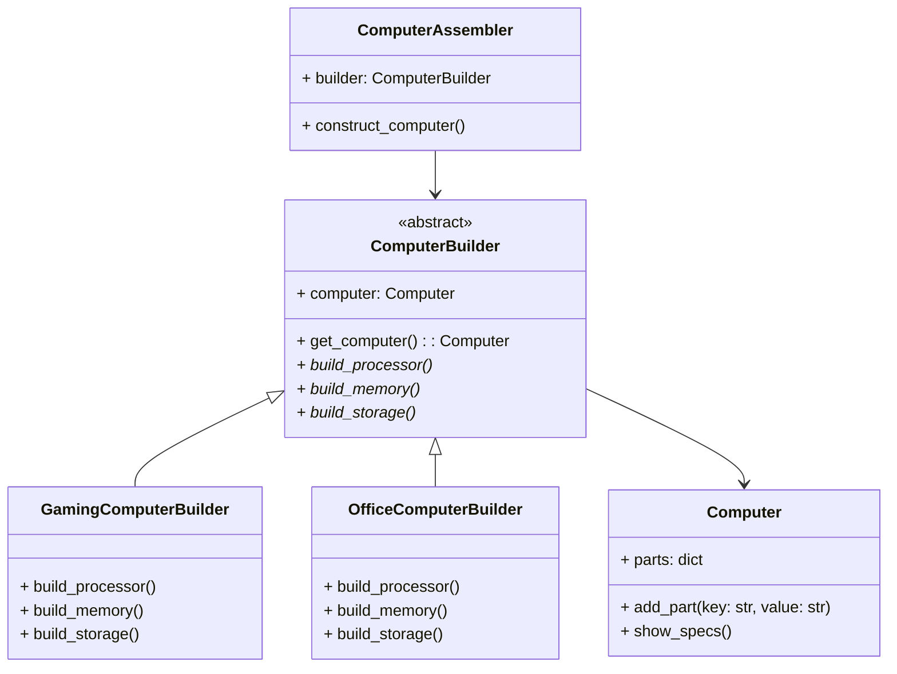

## Львівський Національний Університет Природокористування
## Кафедра інформаційних систем та технологій

### Звіт про виконання лабораторної роботи №1
# "Твірні шаблони проєктування"

| Виконав: Студент групи : Кн-31 Бойчук Андрій |
|-----------------------------------------------|
| Перевірив: Татомир Андрій Володимирович       |

**Мета: ознайомитись з породжувальними патернами ,а саме з будівельником.**

## Що таке патерн проектування

Патерн проектування представляє собою перевірене часом архітектурне рішення для типових проблем, що виникають при розробці програмного забезпечення. Це не просто фрагмент коду, а концептуальний шаблон, який описує спосіб вирішення проблеми, що може бути використаний у різних ситуаціях. Патерни допомагають створювати гнучкі та підтримувані програмні системи, сприяють повторному використанню коду та забезпечують єдину термінологію для спілкування між розробниками.

## Твірні шаблони

Твірні шаблони - це категорія патернів проектування, які фокусуються на механізмах створення об'єктів. Вони допомагають зробити систему незалежною від способу створення, композиції та представлення об'єктів. Ці шаблони інкапсулюють знання про конкретні класи, які використовує система, і приховують деталі того, як ці класи створюються та поєднуються. Це забезпечує більшу гнучкість у вирішенні питань: що створюється, хто це створює, як це створюється і коли.

## Що таке шаблон Будівельник

Шаблон Будівельник (Builder Pattern) - це твірний патерн проектування, який дозволяє створювати складні об'єкти крок за кроком. Він дає можливість використовувати один і той же код будівництва для отримання різних представлень об'єктів. Будівельник особливо корисний, коли потрібно створити об'єкт з великою кількістю можливих конфігурацій. Замість того, щоб створювати підклас для кожної можливої конфігурації, Будівельник надає чистий код для покрокової побудови об'єкта з можливістю контролю над процесом конструювання.

## Опис програми

У представленій програмі реалізовано шаблон проектування Будівельник для створення різних конфігурацій комп'ютерів. Програма складається з декількох класів:

- Клас `Computer` представляє кінцевий продукт (комп'ютер) з його характеристиками
- Абстрактний клас `ComputerBuilder` визначає інтерфейс для створення частин комп'ютера
- Конкретні будівельники `GamingComputerBuilder` та `OfficeComputerBuilder` реалізують створення ігрових та офісних комп'ютерів відповідно
- Клас `ComputerAssembler` керує процесом побудови комп'ютера

**Проблема, з якою я стикнувся:** 
При створенні програми для збірки комп'ютерів різних конфігурацій виникла потреба в гнучкій структурі, яка дозволяла б створювати різні типи комп'ютерів, зберігаючи при цьому єдиний інтерфейс створення.

**Рішення:** 
Використання шаблону Будівельник дозволило відокремити процес конструювання складного об'єкта від його представлення. Це дає можливість використовувати один і той же процес побудови для створення різних конфігурацій комп'ютерів.

## Висновок

При вивченні патерну Будівельник я зрозумів важливість розділення процесу конструювання складного об'єкта та його представлення. Цей патерн дозволяє створювати різні варіації об'єкта, використовуючи один і той же процес побудови. На практиці це значно спрощує додавання нових конфігурацій продукту без зміни існуючого коду. Реалізація програми для створення комп'ютерів різних конфігурацій показала, як Будівельник допомагає організувати код таким чином, щоб він був більш зрозумілим, підтримуваним та розширюваним. Цей досвід допоміг мені краще зрозуміти принципи об'єктно-орієнтованого проектування та важливість вибору правильного патерну для конкретної задачі.
