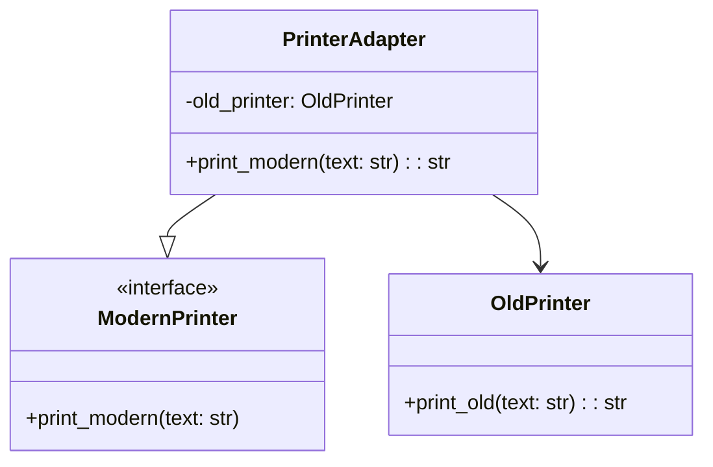

## Львівський Національний Університет Природокористування
## Кафедра інформаційних систем та технологій

### Звіт про виконання лабораторної роботи №2
# "Структурні шаблони проєктування"

| Виконав: Студент групи : Кн-31 Бойчук Андрій |
|-----------------------------------------------|
| Перевірив: Татомир Андрій Володимирович       |

**Мета: ознайомитись зі структурними патернами, а саме з адаптером.**

## Структурні шаблони

Структурні шаблони - це шаблони проєктування, які спрощують проєктування програми шляхом виявлення простого способу реалізації відносин між об'єктами. Вони допомагають забезпечити, щоб при зміні одної частини системи не потрібно було змінювати інші частини. Структурні патерни особливо корисні для забезпечення того, щоб незалежно розроблені частини програми працювали разом.

## Що таке шаблон Адаптер

Шаблон Адаптер (Adapter Pattern) - це структурний патерн проєктування, який дозволяє об'єктам з несумісними інтерфейсами працювати разом. Він діє як міст між двома несумісними інтерфейсами. Цей патерн включає клас, який відповідає за об'єднання функціональності незалежних або несумісних інтерфейсів. Адаптер перетворює інтерфейс одного класу в інтерфейс іншого класу, який очікують клієнти.

## Опис програми

У представленій програмі реалізовано шаблон проєктування Адаптер для роботи з різними системами друку. Програма складається з наступних класів:

- Клас `OldPrinter` представляє стару систему друку з методом `print_old`
- Інтерфейс `ModernPrinter` визначає новий стандарт друку з методом `print_modern`
- Клас `PrinterAdapter` адаптує старий принтер до нового інтерфейсу
- Функція `client_code` демонструє використання нового інтерфейсу

**Проблема, з якою я стикнувся:** 
Необхідність інтеграції старої системи друку з новим інтерфейсом без зміни існуючого коду старої системи.

**Рішення:** 
Використання шаблону Адаптер дозволило "обгорнути" стару систему друку новим інтерфейсом, забезпечуючи сумісність між різними системами. Це дозволяє клієнтському коду працювати з єдиним інтерфейсом, не знаючи про відмінності в реалізації.

## Висновок

При вивченні патерну Адаптер я зрозумів його важливість у забезпеченні сумісності між різними системами та інтерфейсами. Цей патерн особливо корисний при роботі з legacy-кодом або при інтеграції різних систем. Реалізація програми для адаптації старої системи друку до нового інтерфейсу показала, як можна ефективно вирішувати проблеми несумісності інтерфейсів без зміни існуючого коду. Цей досвід допоміг мені краще зрозуміти принципи структурного проєктування та важливість створення гнучких і розширюваних систем.