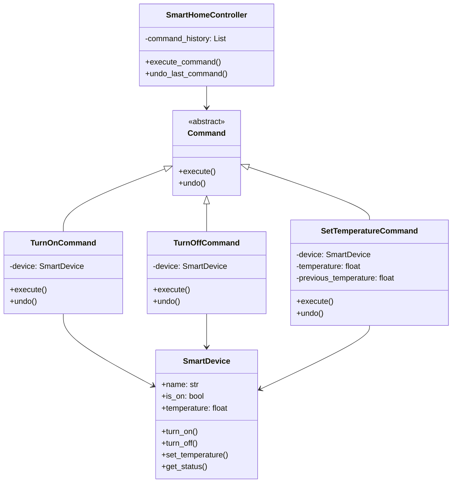

## Львівський Національний Університет Природокористування
## Кафедра інформаційних систем та технологій

### Звіт про виконання лабораторної роботи №3
# "Поведінкові шаблони проєктування"

| Виконав: Студент групи : Кн-31 Бойчук Андрій |
|-----------------------------------------------|
| Перевірив: Татомир Андрій Володимирович       |

**Мета: ознайомитись з поведінковими патернами, а саме з патерном Команда (Command).**

## Поведінкові шаблони

Поведінкові шаблони (Behavioral patterns) визначають взаємодію між об'єктами, тобто способи комунікації між ними. Вони допомагають зробити цю взаємодію більш гнучкою та слабо зв'язаною.

## Що таке шаблон Команда

Шаблон Команда (Command Pattern) - це поведінковий патерн проєктування, який перетворює запит на окремий об'єкт-команду, що містить всю інформацію про запит. Це дозволяє параметризувати об'єкти різними запитами, ставити операції в чергу або протоколювати їх, а також підтримувати скасування операцій.

## Опис програми

У представленій програмі реалізовано систему керування розумним будинком з використанням патерну Команда. Програма складається з наступних компонентів:

### Основні класи:

1. **SmartDevice (Receiver):**
   - Представляє пристрій розумного будинку
   - Має стан (увімкнено/вимкнено) та температуру
   - Виконує базові операції: вмикання, вимикання, встановлення температури

2. **Command (Abstract Command):**
   - Абстрактний клас для всіх команд
   - Визначає інтерфейс execute() та undo()

3. **Конкретні команди:**
   - TurnOnCommand - вмикання пристрою
   - TurnOffCommand - вимикання пристрою
   - SetTemperatureCommand - встановлення температури

4. **SmartHomeController (Invoker):**
   - Керує виконанням команд
   - Зберігає історію команд
   - Забезпечує можливість скасування команд

### Функціональність програми:

- Керування кількома пристроями розумного будинку
- Вмикання та вимикання пристроїв
- Встановлення температури
- Перегляд статусу всіх пристроїв
- Скасування останньої виконаної команди
- Інтерактивне меню для користувача

## Висновок

При виконанні лабораторної роботи я ознайомився з патерном Команда та його практичним застосуванням. Цей патерн виявився особливо корисним для:
- Відокремлення об'єкта, що виконує команду, від об'єкта, що ініціює команду
- Реалізації скасування операцій
- Створення черги команд
- Логування змін

Реалізація системи керування розумним будинком продемонструвала, як патерн Команда допомагає створювати гнучкі системи з можливістю розширення функціональності та підтримкою скасування операцій.
