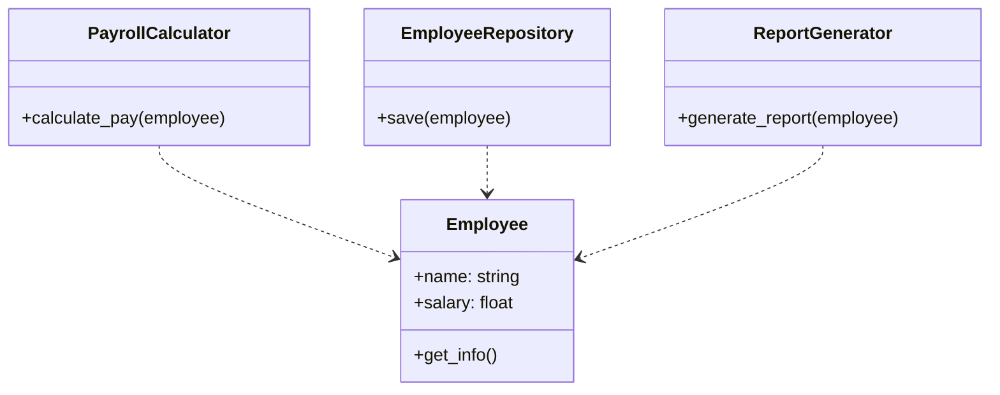

# Львівський Національний Університет Природокористування
## Кафедра Інформаційних систем та Технологій

### Звіт про виконання лабораторної роботи №4
### Тема: "Принципи проєктування програмного забезпечення"

| Виконав: студент групи КН-31 Бойчук Андрій |  
| ------------------------------------------ |  
| Перевірив: Татомир Андрій Володимирович    |  

---

### Мета
Познайомитися з найбільш поширеними сучасними принципами проєктування програмного забезпечення.

---

## SOLID Принципи

SOLID - це акронім п'яти основних принципів об'єктно-орієнтованого програмування та дизайну, запропонованих Робертом Мартіном. Ці принципи допомагають створювати більш зрозуміле, гнучке та підтримуване програмне забезпечення.

### 1. Single Responsibility Principle (SRP)
- Принцип єдиної відповідальності
- Кожен клас повинен мати лише одну причину для змін
- Клас повинен виконувати лише одну конкретну задачу

### 2. Open/Closed Principle (OCP)
- Принцип відкритості/закритості
- Програмні сутності повинні бути відкриті для розширення, але закриті для модифікації
- Нову функціональність слід додавати через створення нових класів, а не зміну існуючих

### 3. Liskov Substitution Principle (LSP)
- Принцип підстановки Лісков
- Об'єкти базового класу можуть бути замінені об'єктами його похідних класів без зміни коректності програми
- Підкласи повинні доповнювати, а не замінювати поведінку базового класу

### 4. Interface Segregation Principle (ISP)
- Принцип розділення інтерфейсу
- Клієнти не повинні залежати від методів, які вони не використовують
- Краще мати багато спеціалізованих інтерфейсів, ніж один універсальний

### 5. Dependency Inversion Principle (DIP)
- Принцип інверсії залежностей
- Модулі високого рівня не повинні залежати від модулів низького рівня
- Обидва типи модулів повинні залежати від абстракцій
- Абстракції не повинні залежати від деталей реалізації

---

# Single Responsibility Principle (Принцип єдиної відповідальності)

## Теоретичний опис

Принцип єдиної відповідальності (Single Responsibility Principle, SRP) — це перший принцип SOLID, який стверджує, що кожен клас повинен мати лише одну причину для змін. Іншими словами, клас повинен виконувати лише одну конкретну задачу.

### Основні переваги SRP:

1. **Простота підтримки**: Коли клас відповідає за одну функцію, його легше модифікувати та підтримувати
2. **Краща організація коду**: Кожен компонент має чітке призначення
3. **Легше тестування**: Можна окремо протестувати кожну функціональність
4. **Зменшення зв'язності**: Компоненти менше залежать один від одного

## Практична реалізація

У нашому коді ми розділили функціональність роботи з працівником на окремі класи:

1. **Employee**: відповідає лише за зберігання даних працівника
2. **PayrollCalculator**: відповідає тільки за розрахунок зарплати
3. **EmployeeRepository**: відповідає тільки за роботу з базою даних
4. **ReportGenerator**: відповідає тільки за генерацію звітів

### UML-діаграма архітектури:

## Висновок

Реалізований код демонструє правильне застосування принципу єдиної відповідальності. Замість одного великого класу з багатьма обов'язками, ми створили кілька спеціалізованих класів, кожен з яких відповідає за конкретну функціональність. Це робить код більш організованим, легшим для розуміння, тестування та подальшої підтримки.