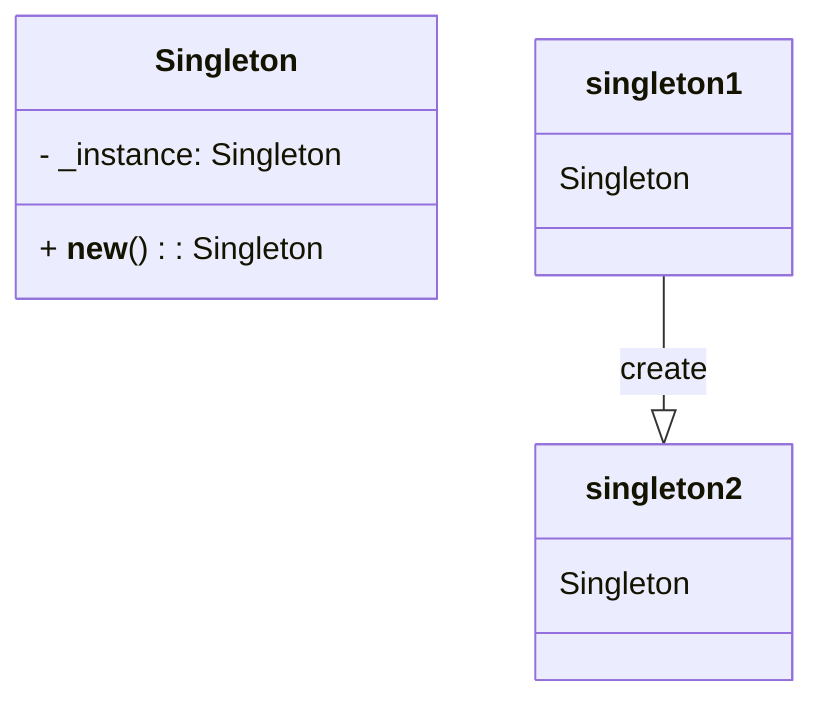

## Львівський Національний Університет Природокористування
## Кафедра Інформаційних систем та Технологій

### Звіт про виконання лабораторної роботи №11
# "Твірні шаблони проєктування"

| Виконав: студент групи КН-31 Кушнір Денис |
|------------------------------------------|
| Перевірив: Татомир Андрій                |

**Мета:** Ознайомитися з групою творених шаблонів

### Хід роботи

1. Надати теоретичний опис групи твірних шаблонів.
2. Описати вибраний шаблон.
3. Привести приклад коду, що реалізує даний шаблон.
4. Скласти UML-діаграму.

Твірні патерни проєктування — це шаблони, які допомагають ефективно та безпечно створювати нові об'єкти або цілі їхні сімейства.

**Основні типи твірних патернів:**

- **Фабричний метод** — це патерн, що дозволяє визначити загальний інтерфейс для створення об’єктів у суперкласі, при цьому підкласи можуть змінювати тип створюваних об’єктів.

- **Абстрактна фабрика** — це патерн, який забезпечує можливість створення сімейств пов’язаних об’єктів, не прив’язуючись до конкретних класів.

- **Будівельник** — це патерн, що дозволяє поетапно створювати складні об’єкти. Він дозволяє використовувати один і той самий код для отримання різних варіантів об’єктів.

- **Прототип** — це патерн, що дає змогу копіювати об’єкти без детального розуміння їхньої реалізації.

- **Одинак** — це патерн, який гарантує, що клас має лише один екземпляр, і надає глобальну точку доступу до нього.

**Для чого використовують шаблони проєктування:**

- На відміну від стандартних функцій чи бібліотек, патерни не можна просто скопіювати в програму. Це загальні принципи вирішення певних проблем, які зазвичай потрібно адаптувати під конкретні вимоги проекту.

- Патерни часто плутають з алгоритмами, адже обидва концепти описують типові рішення для відомих проблем. Але алгоритм — це чіткий набір дій, тоді як патерн — це загальний опис рішення, реалізація якого може відрізнятися в різних програмах.

- Якщо провести аналогію, алгоритм можна порівняти з кулінарним рецептом, що містить конкретні інструкції, а патерн — з інженерним кресленням, яке демонструє рішення без детальних кроків.

**Коли доцільно використовувати певний шаблон:**

- **Фабричний метод:** якщо необхідно створювати об'єкти різних класів залежно від певних умов.

- **Абстрактна фабрика:** коли потрібно створювати пов'язані об'єкти, які взаємодіють між собою.

- **Будівельник:** якщо процес створення об'єкта є складним і має багато варіацій.

- **Прототип:** коли необхідно швидко генерувати багато схожих об'єктів.

- **Одинак:** якщо потрібен єдиний глобальний об'єкт у програмі.

**Опис коду у файлі Lab_11:**
[Посилання на реалізацію](main.py)

Клас **House:** Представляє будинок з основними характеристиками.
- **Атрибут floors:** Кількість поверхів у будинку.
- **Атрибут rooms:** Кількість кімнат у будинку.
- **Атрибут garage:** Інформація про наявність гаража (істинне або хибне значення).
- **Метод __str__:** Повертає рядок з даними про будинок, включаючи кількість поверхів, кімнат і наявність гаража.

Клас **HouseBuilder:** Відповідає за створення об'єкта **House**.
- **Атрибут house:** Об'єкт класу **House**, який будується.
- **Метод __init__:** Ініціалізує новий об'єкт **HouseBuilder** та створює новий об'єкт **House**.
- **Метод set_floors(floors):** Встановлює кількість поверхів у будинку та повертає об'єкт **HouseBuilder** для можливості ланцюгового виклику методів.
- **Метод set_rooms(rooms):** Встановлює кількість кімнат у будинку та повертає об'єкт **HouseBuilder** для можливості ланцюгового виклику методів.
- **Метод set_garage(has_garage):** Встановлює наявність гаража та повертає об'єкт **HouseBuilder** для можливості ланцюгового виклику методів.
- **Метод build():** Повертає готовий об'єкт **House** з усіма встановленими параметрами.

**Переваги цього підходу:**

- Підходить для створення різних варіацій одного і того ж об'єкта.
- Зручно використовувати для конструювання складних об'єктів.

### Висновок 

На цій лабораторній роботі я ознайомився з принципами роботи твірних патернів проектування, зокрема, з патерном Будівельник. На практиці я навчився використовувати ітератори для послідовного доступу до елементів складних структур даних, а також зрозумів їхні переваги та недоліки.
