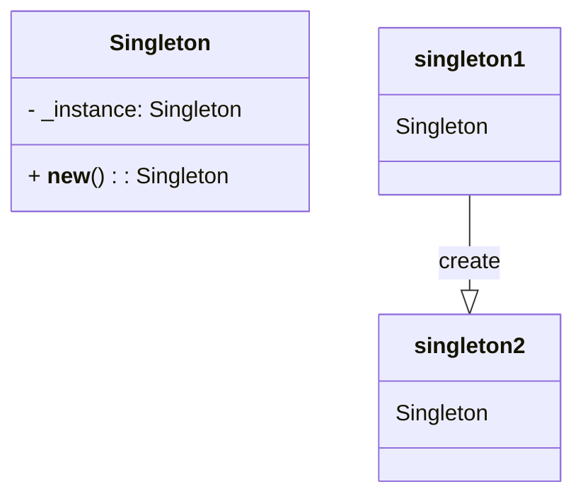

## Львівський Національний Університет Природокористування
## Кафедра Інформаційних систем та Технологій

### Звіт про виконання лабораторної роботи №11
# "Твірні шаблони проєктування"

| Виконав: студент групи КН-31 Кушнір Денис |
|------------------------------------------|
| Перевірив: Татомир Андрій                |

**Мета:** Ознайомитися з групою твірних шаблонів

### Хід роботи

1. Надати теоретичний опис групи твірних шаблонів.
2. Описати вибраний шаблон.
3. Привести приклад коду, що реалізує даний шаблон.
4. Скласти UML-діаграму.

Твірні патерни проєктування — це шаблони, які допомагають ефективно та безпечно створювати нові об'єкти або цілі їхні сімейства.

**Основні типи твірних патернів:**

- **Фабричний метод** — це патерн, що дозволяє визначити загальний інтерфейс для створення об’єктів у суперкласі, при цьому підкласи можуть змінювати тип створюваних об’єктів.

- **Абстрактна фабрика** — це патерн, який забезпечує можливість створення сімейств пов’язаних об’єктів, не прив’язуючись до конкретних класів.

- **Будівельник** — це патерн, що дозволяє поетапно створювати складні об’єкти. Він дозволяє використовувати один і той самий код для отримання різних варіантів об’єктів.

- **Прототип** — це патерн, що дає змогу копіювати об’єкти без детального розуміння їхньої реалізації.

- **Одинак** — це патерн, який гарантує, що клас має лише один екземпляр, і надає глобальну точку доступу до нього.

**Для чого використовують шаблони проєктування:**

- На відміну від стандартних функцій чи бібліотек, патерни не можна просто скопіювати в програму. Це загальні принципи вирішення певних проблем, які зазвичай потрібно адаптувати під конкретні вимоги проекту.

- Патерни часто плутають з алгоритмами, адже обидва концепти описують типові рішення для відомих проблем. Але алгоритм — це чіткий набір дій, тоді як патерн — це загальний опис рішення, реалізація якого може відрізнятися в різних програмах.

- Якщо провести аналогію, алгоритм можна порівняти з кулінарним рецептом, що містить конкретні інструкції, а патерн — з інженерним кресленням, яке демонструє рішення без детальних кроків.

**Коли доцільно використовувати певний шаблон:**

- **Фабричний метод:** якщо необхідно створювати об'єкти різних класів залежно від певних умов.

- **Абстрактна фабрика:** коли потрібно створювати пов'язані об'єкти, які взаємодіють між собою.

- **Будівельник:** якщо процес створення об'єкта є складним і має багато варіацій.

- **Прототип:** коли необхідно швидко генерувати багато схожих об'єктів.

- **Одинак:** якщо потрібен єдиний глобальний об'єкт у програмі.

**Опис коду у файлі main.py:**
[Посилання на реалізацію](main.py)

**Оголошення класу Singleton**
- Клас Singleton містить статичний атрибут _instance, який спочатку дорівнює None. Цей атрибут слугує для зберігання єдиного екземпляра класу.

**Метод __new__:**
- Метод __new__ є спеціальним методом, який викликається при створенні нового об'єкта класу. У цьому методі ми перевіряємо, чи вже існує екземпляр класу (cls._instance).
- Якщо _instance ще не існує (тобто, це перший запит на створення), ми викликаємо super(Singleton, cls).__new__(cls), щоб створити новий об'єкт класу Singleton. Потім ми зберігаємо його в _instance.
- Якщо _instance вже існує, метод просто повертає існуючий екземпляр.

**Переваги цього підходу:**

Глобальна точка доступу: Дозволяє зручно отримати доступ до цього єдиного екземпляра з будь-якої частини програми, що полегшує управління.
Контроль над створенням: Можливість контролювати процес створення об'єкта, що дозволяє реалізувати додаткову логіку.

**Недоліки цього підходу:**

Приховані залежності: Зміна стану сінглтона може призвести до несподіваних наслідків у частинах програми, які його використовують, що ускладнює відстеження помилок.
Складність у розширенні: Сінглтон може ускладнити розширення класу або його підкласів, оскільки він зазвичай обмежує створення об'єктів.

### Висновок 

На цій лабораторній роботі я ознайомився з принципами роботи твірних патернів проектування, зокрема, з патерном Одинак. 
