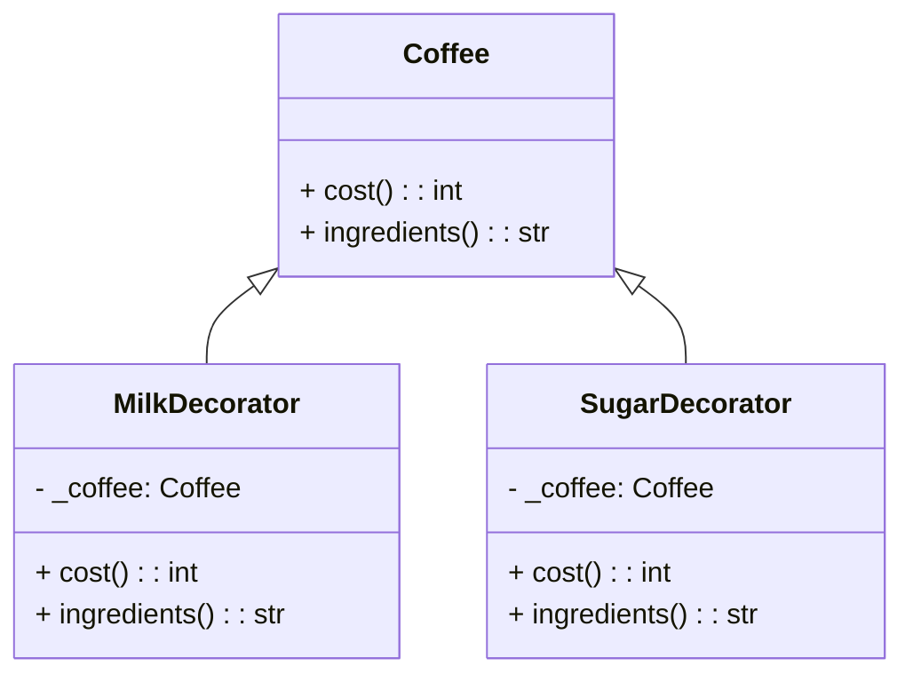

## Львівський Національний Університет Природокористування
## Кафедра Інформаційних систем та Технологій

### Звіт про виконання лабораторної роботи №12
# "Структурні шаблони проектування"

| Виконав: студент групи КН-31 Кушнір Денис |
|------------------------------------------|
| Перевірив: Татомир Андрій                |

**Мета:** Ознайомитися з групою структурних шаблонів проектування.

### Хід роботи

1. Надати теоретичний опис групи структурних шаблонів.
2. Описати вибраний шаблон.
3. Привести приклад коду, що реалізує даний шаблон.
4. Скласти UML-діаграму.

Структурні патерни проектування — це шаблони, які допомагають забезпечити спосіб складання класів та об'єктів у більші структури, зберігаючи при цьому гнучкість та ефективність.

**Основні типи структурних патернів:**

- **Адаптер** — патерн, що дозволяє об'єктам з несумісними інтерфейсами працювати разом.
- **Міст** — патерн, що відокремлює абстракцію від її реалізації, дозволяючи змінювати обидва незалежно.
- **Композит** — патерн, що дозволяє складати об'єкти в ієрархії дерева для роботи з групами об'єктів як з одним.
- **Декоратор** — патерн, що дозволяє динамічно додавати нові функції до об'єктів, обгортуючи їх.
- **Фасад** — патерн, що забезпечує спрощений інтерфейс до складної системи класів.

**Для чого використовують шаблони проектування:**

- Патерни допомагають розв’язувати повторювані проблеми в проектуванні, забезпечуючи стандартні рішення, які можуть бути адаптовані під специфічні вимоги проекту.

- Вони підвищують читабельність коду і полегшують його обслуговування.

**Опис коду у файлі main.py:**
[Посилання на реалізацію](main.py)

**Переваги цього підходу:**

Відокремлення обов'язків: Декоратори дозволяють розділити відповідальність між класами. Основний клас залишається чистим і простим, а додаткова функціональність може бути реалізована в декораторах.
Гнучкість: Декоратор дозволяє динамічно додавати нові функціональності до об'єктів без зміни їхнього коду. Це забезпечує високу гнучкість у розширенні функціональності.

**Недоліки цього підходу:**

Складність: Використання декораторів може призвести до підвищення складності системи, особливо якщо декоратори вкладені один в один. Це може ускладнити відстеження і розуміння коду.
Зменшення продуктивності: Використання декораторів може дещо знижувати продуктивність через додаткові виклики методів, оскільки кожен декоратор додає ще один рівень абстракції.

### Висновок 

На цій лабораторній роботі я ознайомився з принципами роботи структурних патернів проектування, зокрема, з патерном Декоратор, а також реалізацією класу Coffee для створення об'єктів кави з можливістю динамічного додавання інгредієнтів.