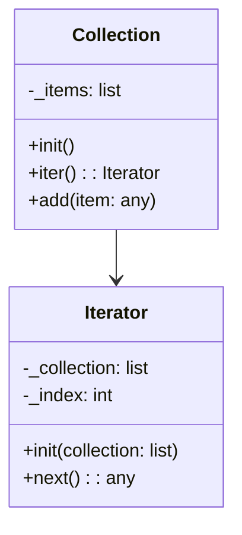

# Львівський Національний Університет Природокористування
## Кафедра Інформаційних систем та Технологій

### Звіт про виконання лабораторної роботи №3
### Тема: "Поведінкові патерни проектування"

| Виконав: студент групи КН-31 Грицків Тарас |  
| ------------------------------------------ |  
| Перевірив: Татомир Андрій                  |  

---

### Мета
Познайомитися з групою поведінкових патернів та дослідити їхнє застосування на практиці.

---

### Хід роботи

1. Теоретичний опис поведінкових патернів.
2. Теоретичний опис вибраного патерну.
3. Приклад коду, що реалізовує вибраний патерн.
4. UML-діаграма для пояснення архітектури.

---

### Опис поведінкових патернів

Поведінкові патерни проектування – це шаблони, які визначають способи взаємодії між об’єктами та розподіляють відповідальність за виконання завдань. Вони дозволяють змінювати поведінку об'єктів під час виконання програми без необхідності змінювати їхню структуру.

Основні цілі поведінкових патернів:

- Гнучкість: дають можливість змінювати поведінку системи без змін її основної структури.
- Повторюваність: використовують готові рішення для типових завдань.
- Зручність у використанні: спрощують розуміння коду завдяки стандартизованим підходам до розв'язання задач.

---

### Приклади поведінкових патернів

- Стратегія: визначає набір алгоритмів, інкапсулює кожен з них і робить їх взаємозамінними.
- Спостерігач: дозволяє об'єктам підписуватись на події в інших об'єктах.
- Ітератор: забезпечує послідовний доступ до елементів агрегованого об'єкта без розкриття його внутрішньої структури.
- Команда: інкапсулює запит як об'єкт, що дозволяє виконувати його пізніше, або відміняти.

---

### Ітератор: 

Ітератор – це поведінковий патерн, який надає механізм для послідовного доступу до елементів складної структури даних (наприклад, списків, дерев) без розкриття її внутрішньої організації.

#### Переваги ітератора:

- Абстрагування: клієнтський код не залежить від внутрішньої структури колекції.
- Гнучкість: ітератори дозволяють різні методи обходу даних, включно з обходом у прямому чи зворотному напрямку.
- Спрощення: деталі обходу даних приховані всередині ітератора, що спрощує роботу з великими структурами даних.

#### Недоліки ітератора:

- **Обмежена підтримка паралельності:** Ітератори часто не призначені для роботи з колекціями, які змінюються під час ітерації. Зміна структури колекції може призвести до помилок.
- **Складність у реалізації:** Для деяких структур даних, таких як збалансовані дерева або графи, реалізація ітератора може бути складною.
- **Витрати на пам'ять:** Ітератори можуть використовувати додаткові ресурси пам'яті для зберігання стану ітерації, особливо якщо колекція велика або складна.

## Опис основних частин коду

### 1. Клас `Iterator`
- Клас ініціалізує список та задає початковий індекс для ітерації. Кожен екземпляр цього класу буде ітератором для переданого списку.
- Ініціалізатор (`__init__()`) приймає список як аргумент і зберігає його в атрибуті класу, а також встановлює початковий індекс на 0.

### 2. Метод `__iter__()`
- Цей метод повертає об'єкт самого себе. Це необхідно для того, щоб зробити клас ітерабельним (тобто, щоб він міг використовуватися в циклі `for` або функції `next()`).

### 3. Метод `__next__()`
- Основний метод ітерації:
  - Перевіряє, чи є ще елементи в списку (якщо індекс менший за довжину списку).
  - Якщо елементи є, отримує значення елемента, множить його на індекс і повертає результат у вигляді кортежа `(індекс, значення)`.
  - Після цього збільшує індекс на 1, щоб перейти до наступного елемента під час наступної ітерації.
  - Якщо всі елементи оброблені, метод піднімає виняток `StopIteration`, який зупиняє ітерацію.

### 4. Використання ітератора
- Щоб використовувати цей ітератор, створюється список, який передається в клас `Iterator`.
- Потім цей ітератор можна використовувати в циклі `for`, щоб отримати індекси та модифіковані значення елементів.

## Як працює цей код
Для кожного елемента списку:
1. Він множиться на свій індекс.
2. Повертається кортеж, який містить індекс і це модифіковане значення.

### Приклад:
Якщо в списку є числа `[10, 20, 30, 40]`, то ітератор поверне наступні пари:

- **Index: 0, Value: 0** (10 * 0 = 0)
- **Index: 1, Value: 20** (20 * 1 = 20)
- **Index: 2, Value: 60** (30 * 2 = 60)
- **Index: 3, Value: 120** (40 * 3 = 120)

#### Пояснення UML-діаграми

На діаграмі показано зв'язок між класами **Collection** та **Iterator**. Клас **Iterator** інкапсулює механізм послідовного доступу до елементів колекції. Клас **Collection** надає методи для додавання елементів та створення ітератора, що дозволяє обійти елементи колекції.

---

### Висновок

На даній лабораторній роботі я навчився принципам роботи з поведінковими патернами проектування, зокрема, з патерном **Ітератор**. На практиці я засвоїв, як використовувати ітератори для послідовного доступу до елементів складних структур даних, а також розібрався з їх перевагами та недоліками.

---

