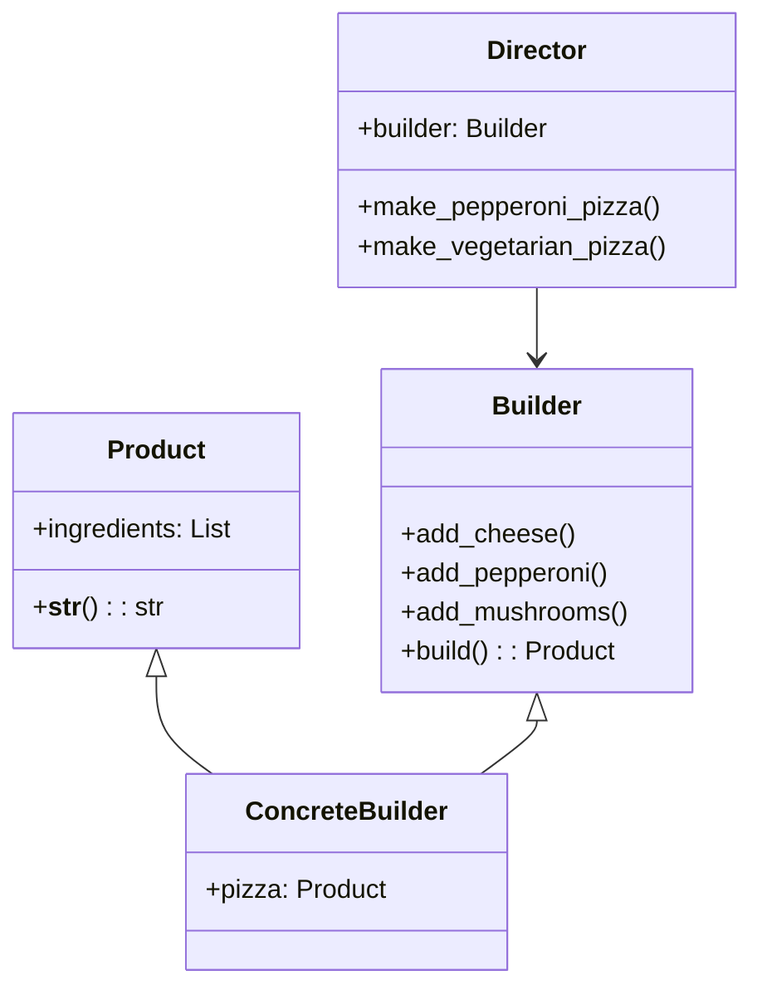

# Львівський Національний Університет Природокористування
## Кафедра Інформаційних систем та Технологій

### Звіт про виконання лабораторної роботи №1
### Тема: "Твірні шаблони проектування"

| Виконав: студент групи КН-31 Колодійчик Назар |  
| ------------------------------------------ |  
| Перевірив: Татомир Андрій                  |  

---

### Мета
Познайомитися з групою твірних шаблонів проектування та дослідити їхнє застосування на практиці.

---

### Хід роботи

1. Теоретичний опис твірної групи шаблонів.
2. Теоретичний опис вибраного шаблону.
3. Приклад коду, що реалізовує вибраний шаблон.
4. UML-діаграма для пояснення архітектури.

---

### Теоретичний опис твірних шаблонів проектування

Твірні шаблони проєктування (Creational Design Patterns) — це група шаблонів, які відповідають за створення об'єктів у програмуванні. Основна мета цих шаблонів — спростити процес створення об'єктів, забезпечити гнучкість та контроль над тим, як і коли об'єкти створюються. Твірні шаблони допомагають уникнути жорсткого кодування, покращують читабельність коду та полегшують його модифікацію.

Основні твірні шаблони включають:

Синглтон (Singleton): Гарантує, що клас має лише один екземпляр і надає до нього глобальну точку доступу.
Фабричний метод (Factory Method): Визначає інтерфейс для створення об'єктів, але дозволяє підкласам змінювати тип створюваних об'єктів.
Абстрактна фабрика (Abstract Factory): Дозволяє створювати сімейства пов'язаних або залежних об'єктів без вказівки їх конкретних класів.
Будівельник (Builder): Відокремлює конструювання складного об'єкта від його представлення, так що той самий процес конструювання може створювати різні представлення.

### Будівельник

Шаблон "Будівельник" (Builder) використовується для створення складних об'єктів покроково. Цей шаблон розділяє процес створення об'єкта від його представлення, що дозволяє однаковому процесу створювати різні представлення. Будівельник контролює процес створення, забезпечуючи простоту в налаштуванні об'єкта через чітко визначений інтерфейс.

#### Основні компоненти шаблону "Будівельник":
1)Продукт (Product): Складний об'єкт, що створюється.
2)Будівельник (Builder): Інтерфейс для створення частин продукту.
3)Конкретний будівельник (ConcreteBuilder): Реалізація інтерфейсу будівельника, що визначає специфічні етапи створення продукту.
4)Директор (Director): Клас, який відповідає за управління побудовою об'єкта за допомогою будівельника.

#### Переваги:
- Чітка структура коду.
- Легкість у додаванні нових продуктів.
- Гнучкість у процесі створення.

---

### Висновок

У ході виконання лабораторної роботи №1 на тему "Твірні шаблони проектування" я ознайомився з основами твірних шаблонів, їхньою метою та застосуванням у програмуванні. Особливу увагу було приділено шаблону "Будівельник", який дозволяє розділити процес створення складних об'єктів на окремі етапи, що забезпечує гнучкість і контроль над створюваними об'єктами.

Я вивчив основні компоненти шаблону "Будівельник", такі як продукт, будівельник, конкретний будівельник і директор. Це допомогло зрозуміти, як можна використовувати цей шаблон для створення різних представлень одного й того ж об'єкта.

Також я реалізував приклад коду, що демонструє роботу шаблону, та створив UML-діаграму, яка ілюструє архітектуру взаємодії між компонентами.

---

