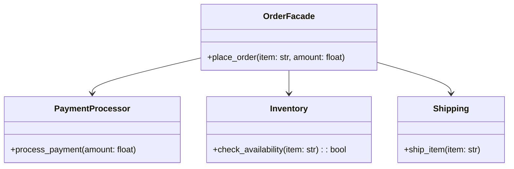

## Львівський Національний Університет Природокористування  
## Кафедра Інформаційних систем та Технологій

### Звіт про виконання лабораторної роботи №2
# "Структурні патерни проектування"

| Виконав: студент групи КН-31 Колодійчик Назар |  
|--------------------------------------------|  
| Перевірив: Татомир Андрій                  |

Мета: Познайомитися з групою структурних патернів.

### Хід роботи

1. Дати теоретичний опис структурних патернів.
2. Дати теоретичний опис вибраного патерну.
3. Навести приклад коду, який реалізовує даний патерн.
4. Скласти його UML-діаграму.

### Теоретичний опис структурної групи шаблонів

Структурні шаблони проектування (Structural Design Patterns) — це категорія шаблонів, які забезпечують спосіб організації класів та об'єктів у системі для формування складних структур. Основною метою структурних шаблонів є забезпечення ефективної взаємодії між об'єктами, а також спрощення створення нових класів, що використовують уже існуючі компоненти.

Структурні шаблони допомагають:

- Спрощувати взаємодію між об'єктами.
- Підвищувати повторне використання коду.
- Покращувати читабельність та організацію коду.

Основні структурні шаблони включають:
- Адаптер (Adapter): Дозволяє сумісність між інтерфейсами, які не можуть бути використані разом.
- Міст (Bridge): Розділяє абстракцію і реалізацію, що дозволяє їм змінюватися незалежно.
- Композит (Composite): Дозволяє обробляти групи об'єктів так само, як і окремі об'єкти.
- Декоратор (Decorator): Додає нові функціональні можливості об'єктам без зміни їхньої структури.
- Фасад (Facade): Надає спрощений інтерфейс до складної системи.

### Патерн "Фасад"

**Фасад** — це структурний патерн проектування, який надає простий інтерфейс до складної системи класів, бібліотеки або фреймворку.

#### Переваги:
Спрощення: Фасад спрощує взаємодію з складними системами, надаючи прості методи для виконання частих завдань.
Ізоляція: Приховує складність системи, що дозволяє змінювати внутрішню реалізацію без впливу на клієнтів.
Зменшення залежностей: Клієнти взаємодіють лише з фасадом, що зменшує їхню залежність від конкретних класів підсистеми.

#### Основні компоненти фасаду:
1) Фасад (Facade): Клас, який містить методи для взаємодії з підсистемою, забезпечуючи простий інтерфейс для користувача.
2) Підсистема (Subsystem): Набір класів або компонентів, які реалізують конкретну функціональність системи. Фасад надає доступ до цих компонентів.

#### Кроки реалізації:
1) Визначте, чи можна створити більш простий інтерфейс, ніж той, який надає складна підсистема. Ви на правильному шляху, якщо цей інтерфейс позбавить клієнта від необхідності знати подробиці підсистеми.
2) Створіть клас фасаду, що реалізує цей інтерфейс. Він повинен переадресовувати виклики клієнта потрібним об’єктам підсистеми. Фасад повинен буде подбати про те, щоб правильно ініціалізувати об’єкти підсистеми.
3) Ви отримаєте максимум користі, якщо клієнт працюватиме тільки з фасадом. В такому випадку зміни в підсистемі стосуватимуться тільки коду фасаду, а клієнтський код залишиться робочим.
4) Якщо відповідальність фасаду стає розмитою, подумайте про введення додаткових фасадів.

#### UML-diagram класу
---

### Висновок

У ході виконання лабораторної роботи на тему "Структурні шаблони проектування", зокрема шаблону "Фасад", я ознайомився з основними концепціями структурних шаблонів та їхньою роллю у програмуванні.

Шаблон "Фасад" продемонстрував, як можна спростити взаємодію з складними системами, надаючи зручний інтерфейс для користувача. Я вивчив, як фасад може приховувати деталі реалізації підсистем і забезпечувати простий доступ до їхніх функцій. Це не лише підвищує читабельність коду, але й полегшує його підтримку та модифікацію.

---
