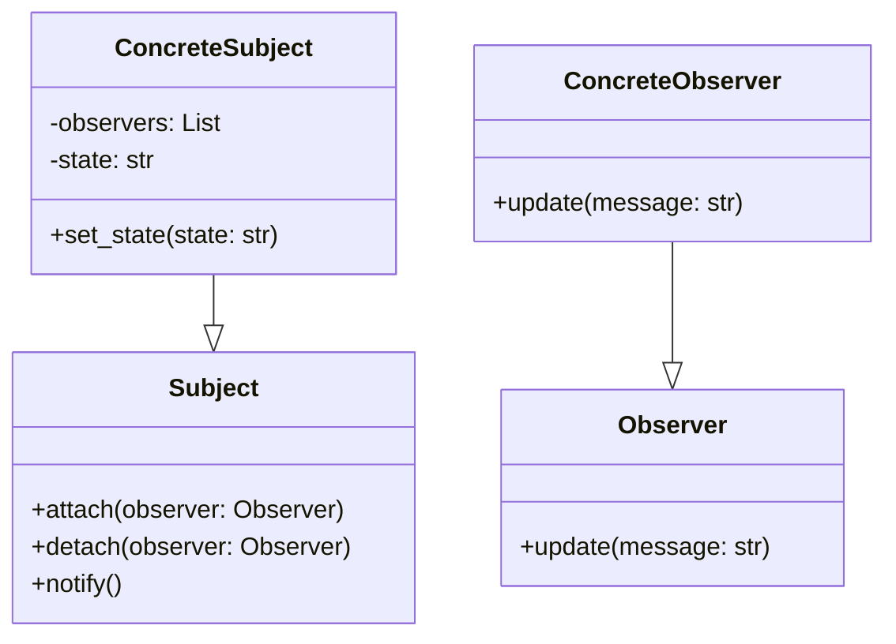

# Львівський Національний Університет Природокористування
## Кафедра Інформаційних систем та Технологій

### Звіт про виконання лабораторної роботи №3
### Тема: "Поведінкові патерни проектування"

| Виконав: студент групи КН-31 Колодійчик Назар |  
| ------------------------------------------ |  
| Перевірив: Татомир Андрій                  |  

---

### Мета
Познайомитися з групою поведінкових патернів та дослідити їхнє застосування на практиці.

---

### Хід роботи

1. Теоретичний опис поведінкових патернів.
2. Теоретичний опис вибраного патерну.
3. Приклад коду, що реалізовує вибраний патерн.
4. UML-діаграма для пояснення архітектури.

---

### Теоретичний опис поведінкової групи шаблонів

Поведінкові шаблони проектування (Behavioral Design Patterns) — це група шаблонів, які зосереджуються на алгоритмах і розподілі відповідальності між об'єктами. Вони визначають, як об'єкти взаємодіють один з одним, що дозволяє спростити комунікацію і зробити її більш гнучкою.

Основні переваги поведінкових шаблонів:
- Зменшення зв'язності: Вони допомагають зменшити залежності між класами, що робить код більш гнучким і простим у модифікації.
- Покращення організації: Вони дозволяють краще організувати код, розділяючи логіку на окремі компоненти.
- Легкість у розширенні: Додатки стають легшими для розширення, оскільки нові поведінки можуть бути додані без значних змін в існуючому коді.

---

### Основні поведінкові шаблони

- Стратегія (Strategy): Визначає набір алгоритмів, які можуть бути замінені під час виконання.
- Спостерігач (Observer): Визначає залежність "один-до-багатьох" між об'єктами, коли один об'єкт сповіщає інші про зміни.
- Команда (Command): Інкапсулює запит як об'єкт, що дозволяє параметризувати клієнти з різними запитами.
- Стан (State): Дозволяє об'єкту змінювати свою поведінку залежно від його внутрішнього стану.

---

### Спостерігач: 

Шаблон Спостерігач (Observer) використовується для визначення залежності "один-до-багатьох" між об'єктами, коли один об'єкт (суб'єкт) змінює свій стан, і всі залежні об'єкти (спостерігачі) отримують повідомлення про ці зміни. Це дозволяє створювати динамічні і гнучкі системи, де спостерігачі можуть підписуватися або відписуватися на зміни.

#### Основні компоненти шаблону "Спостерігач":

- Суб'єкт (Subject): Інтерфейс або абстрактний клас, що визначає методи для додавання, видалення та сповіщення спостерігачів.
- Спостерігач (Observer): Інтерфейс або абстрактний клас, що визначає метод для отримання оновлень від суб'єкта.
- Конкретний суб'єкт (Concrete Subject): Клас, який реалізує суб'єкта і управляє списком спостерігачів.
- Конкретний спостерігач (Concrete Observer): Клас, що реалізує інтерфейс спостерігача та реагує на зміни в суб'єкті.

#### Переваги:

- Дозволяє зменшити зв'язність між об'єктами.
- Легкість в додаванні нових спостерігачів без зміни суб'єкта.
- Спрощує код, зменшуючи кількість прямих викликів між об'єктами.

#### Кроки реалізації:

1) Розбийте вашу функціональність на дві частини: незалежне ядро та опціональні залежні частини. Незалежне ядро стане видавцем. Залежні частини стануть підписниками.

2) Створіть інтерфейс підписників. Зазвичай достатньо визначити в ньому лише один метод сповіщення.

3) Створіть інтерфейс видавців та опишіть у ньому операції керування підпискою. Пам’ятайте, що видавці повинні працювати з підписниками тільки через їхній загальний інтерфейс.

4) Вам потрібно вирішити, куди помістити код ведення підписки, адже він зазвичай буває однаковим для всіх типів видавців. Найочевидніший спосіб — це винесення коду до проміжного абстрактного класу, від якого будуть успадковуватися всі видавці. Якщо ж ви інтегруєте патерн до існуючих класів, то створити новий базовий клас може бути важко. У цьому випадку ви можете помістити логіку підписки в допоміжний об’єкт та делегувати йому роботу з видавцями.

5) Створіть класи конкретних видавців. Реалізуйте їх таким чином, щоб після кожної зміні стану вони слали сповіщення всім своїм підписникам.

6) Реалізуйте метод сповіщення в конкретних підписниках. Не забудьте передбачити параметри, через які видавець міг би відправляти якісь дані, пов’язані з подією, що відбулась. Можливий і інший варіант, коли підписник, отримавши сповіщення, сам візьме потрібні дані з об’єкта видавця. Але в цьому разі ви будете змушені прив’язати клас підписника до конкретного класу видавця.

7) Клієнт повинен створювати необхідну кількість об’єктів підписників та підписувати їх у видавців.

####  UML-діаграма

---

### Висновок

У ході виконання лабораторної роботи на тему "Поведінкові шаблони проектування", зокрема шаблону "Спостерігач", я отримав практичні знання про важливість організації взаємодії між об'єктами в програмному забезпеченні. Шаблон "Спостерігач" надає можливість реалізувати механізм "один-до-багатьох", коли один об'єкт (суб'єкт) може сповіщати кілька залежних об'єктів (спостерігачів) про зміни свого стану.

Під час роботи над шаблоном я вивчив його основні компоненти: суб'єкт, спостерігач, конкретний суб'єкт і конкретний спостерігач. Це дало мені розуміння, як зменшити зв'язність між компонентами системи, що робить код більш гнучким і простим у підтримці. Я реалізував приклад коду, що демонструє роботу шаблону, та створив UML-діаграму, яка візуалізує архітектуру взаємодії.

---

