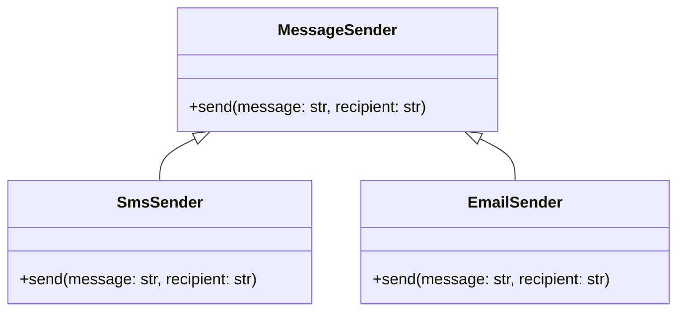

# Львівський Національний Університет Природокористування
## Кафедра Інформаційних систем та Технологій

### Звіт про виконання лабораторної роботи №4
### Тема: "Принципи проєктування програмного забезпечення"

| Виконав: студент групи КН-31 Колодійчик Назар |  
| ------------------------------------------ |  
| Перевірив: Татомир Андрій Володимирович              |  

---

### Мета
Мета роботи - познайомитися з найбільш поширеними сучасними принципами проєктування програмного забезпечення.

---

### Хід роботи

1. Загальний опис принципів проєктування.
2. Детальний опис одного із принципів SOLID з наведення прикладу коду.
3. UML-діаграма для пояснення архітектури.

---

###  Загальний опис принципів проєктування.

Принципи проєктування програмного забезпечення — це загальні правила та рекомендації, що сприяють створенню ефективної, легко підтримуваної, модульної та масштабованої системи.

## Принцип SOLID у Python 

Концепція SOLID була сформована Робертом Мартіном, вона допомагає забезпечити гнучкість, розширюваність та підтримку коду. Кожна літера у слові SOLID представляє один з цих принципів

### Single Responsibility Principle (Принцип єдиної відповідальності)

Цей принцип стверджує, що кожен клас, модуль чи функція повинні виконувати лише одну задачу або відповідати лише за одну частину функціональності. Ідея полягає в тому, що клас або модуль має мати одну чітку причину для змін.

Переваги:
- Спрощує підтримку коду, оскільки одна зміна впливає тільки на один аспект.
- Легше тестувати класи з єдиною відповідальністю, оскільки вони виконують менше функцій.
- Дозволяє легко знаходити та виправляти помилки, оскільки відповідальність ізольована.

#### Open/Closed Principle (Принцип відкритості-закритості)
Цей принцип вимагає, щоб класи та модулі були «відкритими для розширення», але «закритими для модифікації». Іншими словами, поведінку класу можна розширювати, не змінюючи його код.

Переваги:
- Зменшує ризик внесення помилок при розширенні функціональності.
- Дозволяє легко додавати нові можливості, не змінюючи існуючі класи.

#### Liskov Substitution Principle (Принцип підстановки Лісков)
Принцип підстановки Лісков стверджує, що об'єкти підкласу повинні мати можливість заміняти об'єкти суперкласу без порушення логіки програми. Тобто підкласи повинні підтримувати поведінку, визначену в суперкласах.

Переваги:
- Забезпечує стабільність та передбачуваність системи при використанні підкласів.
- Підвищує надійність коду, оскільки можна уникнути несподіваних результатів.

#### Interface Segregation Principle (Принцип поділу інтерфейсу)
Принцип поділу інтерфейсу закликає створювати спеціалізовані інтерфейси, які потрібні конкретним клієнтам, замість одного великого інтерфейсу. Інтерфейси мають бути вузькими та точковими, а не включати функції, які не використовуються всіма реалізаціями.

Переваги:
- Уникає прив'язки класів до непотрібних методів, що робить їх простішими.
- Дозволяє уникати змін в одному класі через зміни в методах, які йому не потрібні.

#### Dependency Inversion Principle (Принцип інверсії залежностей)
Принцип інверсії залежностей стверджує, що високорівневі модулі не повинні залежати від низькорівневих модулів; обидва повинні залежати від абстракцій. Абстракції не повинні залежати від деталей, а деталі мають залежати від абстракцій.

Переваги:
- Знижує жорстку залежність між модулями та спрощує тестування.
- Забезпечує гнучкість, оскільки низькорівневі модулі можна замінити, не змінюючи високорівневі.

---

### Open/Closed Principle (Принцип відкритості-закритості)
Принцип відкритості-закритості (Open/Closed Principle, OCP) є одним із п'яти основних принципів SOLID, що використовуються для написання чистого, зрозумілого та розширюваного коду. Принцип свідчить, що класи, модулі або функції мають бути відкритими для розширення, але закритими для модифікації. Це означає, що ми повинні розробляти програмні компоненти так, щоб їх поведінку можна було змінити або розширити без зміни їх вихідного коду.

### Суть принципу відкритості-закритості
1) Відкритість для розширення: програмний компонент можна доповнювати новою поведінкою чи функціональністю.
2) Закритість для модифікації: існуючий код не повинен змінюватися, оскільки це може порушити вже налагоджену та протестовану роботу системи.

Це досягається через побудову абстракцій та використання спадковості або поліморфізму. Замість того щоб модифікувати клас для нової поведінки, ми створюємо нові класи або об’єкти, які наслідують або розширюють існуючу функціональність.

### Чому важливо дотримуватися принципу OCP?
1) Зменшує ризик помилок: коли код добре протестований, зміни можуть порушити його роботу. Дотримання принципу дозволяє додавати нові функції без зміни існуючого коду.
2) Легше підтримувати: розробникам не потрібно шукати, де саме змінювати код для додавання нової функціональності.
3) Гнучкість: полегшує масштабування та зміни вимог проекту.

___

### Приклад прицнипу
У даному прикладі реалізовано систему відправки повідомлень за допомогою двох типів відправників: SMS і Email. 
Код знаходиться у файлі [`OpenClosed.py`](./OpenClosed.py)

### Пояснення коду
## 1. Інтерфейс MessageSender:
Клас MessageSender є абстракцією для всіх відправників повідомлень. Він визначає метод send, який має бути реалізований в усіх класах, що його успадковують. Однак, сам клас MessageSender не реалізує цей метод. Це дозволяє іншим класам, що успадковують його, реалізувати власний варіант методу send для конкретних типів повідомлень (наприклад, SMS або Email).

## 2. Конкретні реалізації відправників:
Два класи успадковують MessageSender і реалізують метод send по-своєму:

SmsSender: Цей клас реалізує метод send для відправки SMS-повідомлень. Він приймає два параметри — повідомлення та номер телефону, на який необхідно відправити SMS.
EmailSender: Цей клас реалізує метод send для відправки Email-повідомлень. В ньому також приймаються два параметри — повідомлення та електронна адреса отримувача.

## 3. Функція для відправки повідомлень:
Функція send_message приймає три параметри:

sender: об'єкт класу, що реалізує метод send. Це може бути як клас для відправки SMS, так і клас для відправки Email.
message: повідомлення, яке потрібно відправити.
recipient: отримувач повідомлення (номер телефону для SMS або електронна адреса для Email).
Функція викликає метод send на об'єкті sender, що забезпечує поліморфізм. В залежності від того, чи передано об'єкт класу SmsSender, чи EmailSender, буде виконано відповідний варіант відправки повідомлення.

## 4. Використання системи:
Для демонстрації роботи системи створюються два об'єкти — один для відправки SMS, а інший для відправки Email. Обидва об'єкти передаються в функцію send_message для виконання відправки повідомлень.

## 5. Результат виконання:
При виконанні програми на екрані виводяться повідомлення про успішне відправлення:
Для SMS: виводиться повідомлення, що SMS було відправлено на вказаний номер.
Для Email: виводиться повідомлення про відправку email на вказану адресу.
___

## UML діаграма

---

### Висновок

У результаті виконання лабораторної роботи з вивчення принципів SOLID та детальнішого ознайомлення з принципом відкритості/закритості було продемонстровано, як ці принципи сприяють створенню гнучких, масштабованих і підтримуваних програмних систем, де зміни в одній частині програми не впливають на інші, забезпечуючи стабільність, а також можливість легко додавати нові функціональні можливості без модифікації існуючого коду, що сприяє високому рівню якості програмного продукту.

---

