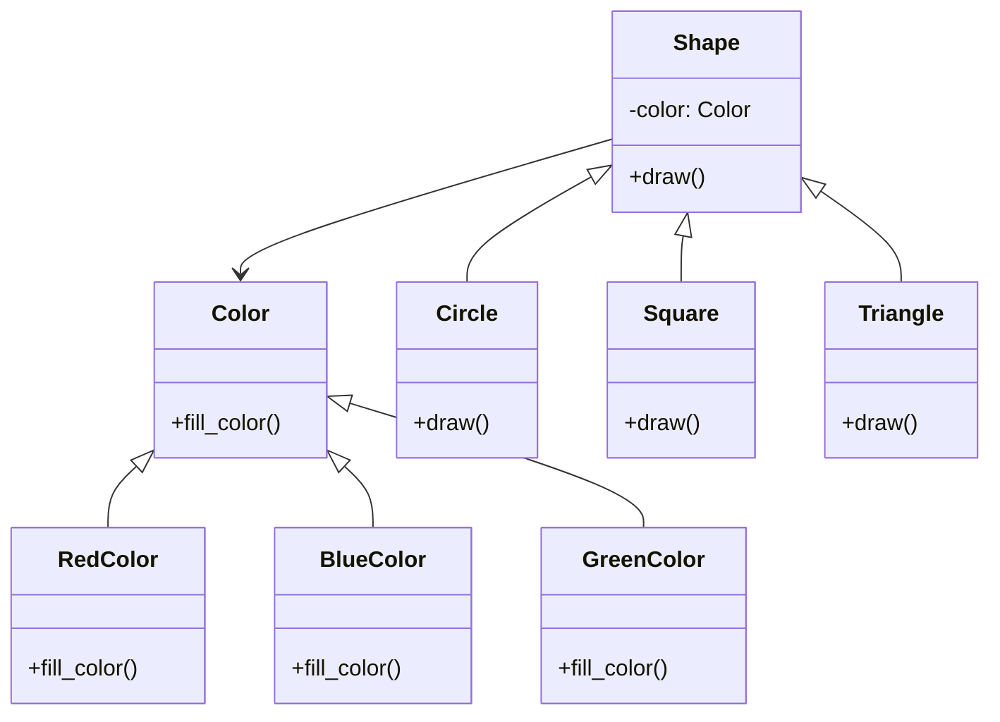

## Львівський Національний Університет Природокористування
## Кафедра Інформаційних систем та Технологій

### Звіт про виконання лабораторної роботи №12
# "Структурні шаблони проектування"

| Виконав: студент групи КН-31 Ковташ Іван |
|------------------------------------------|
| Перевірив: Татомир Андрій                |

**Мета:** Ознайомитися з групою структурних шаблонів проектування.

### Хід роботи

1. Надати теоретичний опис групи структурних шаблонів.
2. Описати вибраний шаблон.
3. Привести приклад коду, що реалізує даний шаблон.
4. Скласти UML-діаграму.

Структурні патерни проектування — це шаблони, які допомагають забезпечити спосіб складання класів та об'єктів у більші структури, зберігаючи при цьому гнучкість та ефективність.

**Основні типи структурних патернів:**

- **Адаптер** — патерн, що дозволяє об'єктам з несумісними інтерфейсами працювати разом.
- **Міст** — патерн, що відокремлює абстракцію від її реалізації, дозволяючи змінювати обидва незалежно.
- **Композит** — патерн, що дозволяє складати об'єкти в ієрархії дерева для роботи з групами об'єктів як з одним.
- **Декоратор** — патерн, що дозволяє динамічно додавати нові функції до об'єктів, обгортуючи їх.
- **Фасад** — патерн, що забезпечує спрощений інтерфейс до складної системи класів.

**Для чого використовують шаблони проектування:**

- Патерни допомагають розв’язувати повторювані проблеми в проектуванні, забезпечуючи стандартні рішення, які можуть бути адаптовані під специфічні вимоги проекту.

- Вони підвищують читабельність коду і полегшують його обслуговування.

**Код у файлі main.py:**
[реалізація](main.py)

У даному коді реалізовано патерн "Міст" (Bridge) для створення різних форм з різними кольорами.

**Структура коду:**
- Клас `Color` - абстракція для кольорів
- Класи `RedColor`, `BlueColor`, `GreenColor` - конкретні реалізації кольорів
- Клас `Shape` - абстракція для форм
- Класи `Circle`, `Square`, `Triangle` - конкретні реалізації форм

**Переваги цього підходу:**
- Дозволяє незалежно змінювати форми та кольори
- Легко додавати нові форми або кольори без зміни існуючого коду
- Покращує розширюваність системи
- Приховує деталі реалізації від клієнтського коду

**Недоліки цього підходу:**
- Збільшує складність коду через додаткові абстракції
- Може бути надмірним для простих систем
- Потребує попереднього планування архітектури

### Висновок 

На цій лабораторній роботі я ознайомився з принципами роботи структурних патернів проектування, зокрема з патерном Міст (Bridge). Я навчився відокремлювати абстракцію від реалізації, що дозволяє незалежно змінювати обидві частини. Цей патерн особливо корисний, коли потрібно уникнути постійного зростання кількості класів при додаванні нових варіацій функціональності.