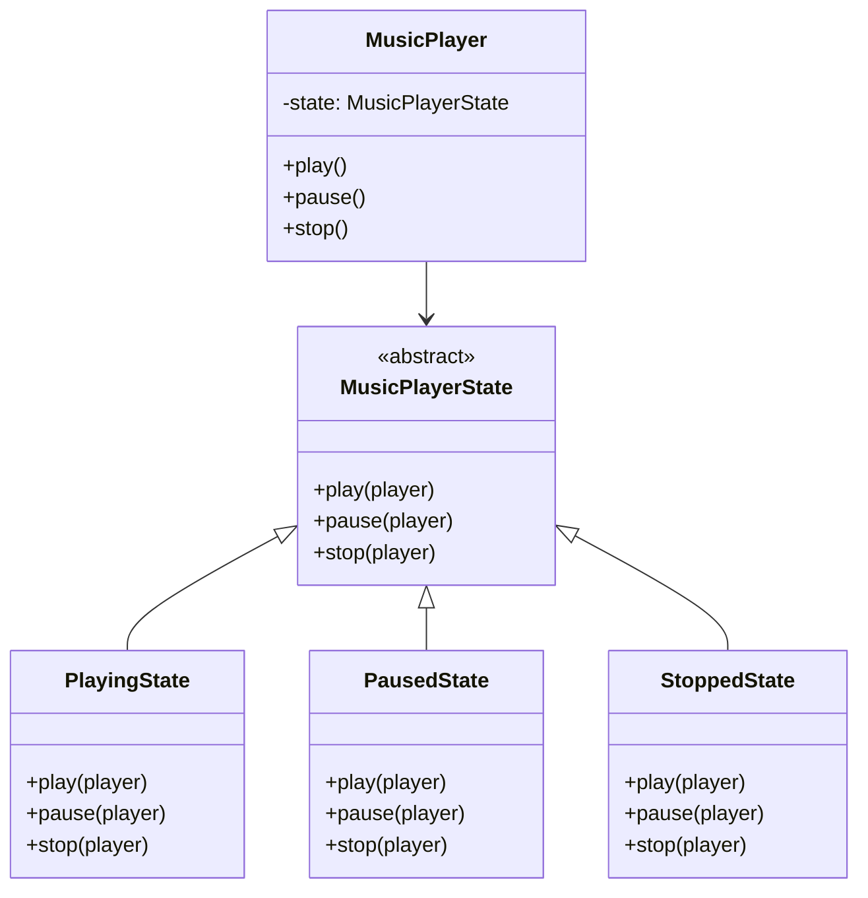

## Львівський Національний Університет Природокористування
## Кафедра Інформаційних систем та Технологій

### Звіт про виконання лабораторної роботи №13
# "Поведінкові шаблони проектування"

| Виконав: студент групи КН-31 Ковташ Іван |
|------------------------------------------|
| Перевірив: Татомир Андрій                |

**Мета:** Ознайомитися з групою поведінкових шаблонів проектування.

### Хід роботи

1. Надати теоретичний опис групи поведінкових шаблонів.
2. Описати вибраний шаблон.
3. Привести приклад коду, що реалізує даний шаблон.
4. Скласти UML-діаграму.

**Поведінкові патерни проектування** — це шаблони, які фокусуються на алгоритмах і розподілі відповідальності між об'єктами. Вони допомагають визначити, як об'єкти взаємодіють один з одним, і спрощують управління складними логічними зв'язками.

### Основні типи поведінкових патернів:

- **Команда** — патерн, який інкапсулює запити як об'єкти, що дозволяє їх передавати, зберігати, скасовувати або логувати.

- **Спостерігач** — патерн, що визначає відношення «один до багатьох» між об'єктами, так що при зміні стану одного об'єкта всі його спостерігачі отримують повідомлення про цю зміну.

- **Стратегія** — патерн, який дозволяє визначити сімейство алгоритмів, інкапсулювати їх і робити їх взаємозамінними.

- **Стан** — патерн, який дозволяє об'єкту змінювати свою поведінку в залежності від свого стану.

- **Ітератор** — патерн, який забезпечує спосіб послідовного доступу до елементів складу без розкриття його внутрішньої структури.

**Для чого використовують шаблони проєктування:**

На відміну від готових функцій чи бібліотек, патерн не можна просто взяти й скопіювати в програму. Патерн являє собою не якийсь конкретний код, а загальний принцип вирішення певної проблеми, який майже завжди треба підлаштовувати для потреб тієї чи іншої програми.

Патерни часто плутають з алгоритмами, адже обидва поняття описують типові рішення відомих проблем. Але якщо алгоритм — це чіткий набір дій, то патерн — це високорівневий опис рішення, реалізація якого може відрізнятися у двох різних програмах.

Якщо провести аналогії, то алгоритм — це кулінарний рецепт з чіткими кроками, а патерн — інженерне креслення, на якому намальовано рішення без конкретних кроків його отримання.

**Опис коду у файлі main.py:**
[Посилання на реалізацію](main.py)

У даному коді реалізовано патерн "Стан" (State) для музичного плеєра. Код демонструє, як об'єкт може змінювати свою поведінку при зміні внутрішнього стану.

**Структура коду:**
- Клас `MusicPlayerState` - базовий клас для всіх станів
- Класи `PlayingState`, `PausedState`, `StoppedState` - конкретні стани
- Клас `MusicPlayer` - контекст, який змінює свою поведінку залежно від стану

**Переваги цього підходу:**
- Усуває великі умовні оператори, пов'язані зі станом
- Концентрує код, пов'язаний з конкретним станом, в одному класі
- Спрощує додавання нових станів
- Робить переходи між станами явними

**Недоліки цього підходу:**
- Може бути надмірним для простих об'єктів з малою кількістю станів
- Збільшує кількість класів у програмі
- Потребує знання всіх можливих станів на етапі проектування

### Висновок 

На цій лабораторній роботі я ознайомився з принципами роботи поведінкових патернів проектування, зокрема з патерном Стан (State). Я навчився змінювати поведінку об'єкта в залежності від його внутрішнього стану, що дозволяє створювати більш гнучкі та підтримувані системи. Цей патерн особливо корисний при роботі з об'єктами, які мають різну поведінку в різних станах, і дозволяє уникнути складних умовних операторів у коді.

