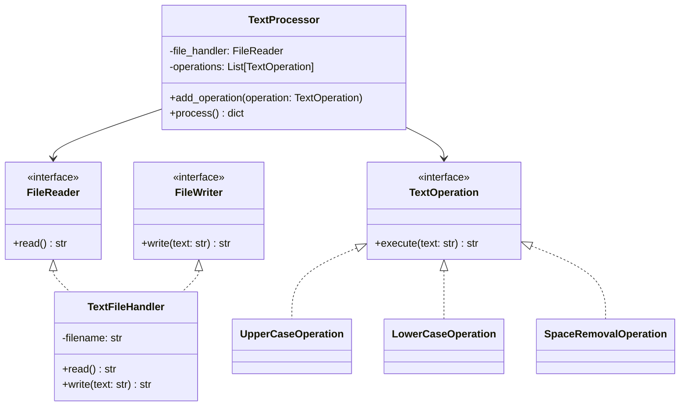

# Львівський Національний Університет Природокористування
## Кафедра Інформаційних систем та Технологій

### Звіт про виконання лабораторної роботи №14
### Тема: "Принципи проєктування програмного забезпечення"

| Виконав: студент групи КН-31 Ковташ Іван |  
| -----------------------------------------|  
| Перевірив: Татомир Андрій                |  

### Мета
Познайомитися з найбільш поширеними сучасними принципами проєктування програмного забезпечення.

### Хід роботи

1. Теоретичний опис принципів проєктування.
2. Теоретичний опис вибраного принципу проєктування.
3. Приклад коду, що реалізовує вибраний принцип.
4. UML-діаграма для пояснення архітектури.

# Принцип єдиної відповідальності (Single Responsibility Principle)

## Теоретичний опис

Принцип єдиної відповідальності (SRP) стверджує, що кожен клас повинен мати лише одну причину для змін. Іншими словами, клас повинен виконувати лише одну конкретну функцію або відповідати за один аспект функціональності програми.

### Основні аспекти SRP:

1. **Фокус на одній задачі**: Кожен клас повинен вирішувати тільки одну конкретну задачу.
2. **Інкапсуляція**: Зміни в одній частині системи не повинні впливати на інші частини.
3. **Чітка відповідальність**: Кожен клас повинен мати чітко визначену область відповідальності.

## Реалізація принципу

**Опис коду у файлі main.py:**
[Посилання на реалізацію](main.py)

У нашому коді принцип SRP реалізований через розділення відповідальності між різними класами:

- `FileReader` - відповідає тільки за читання файлів
- `FileWriter` - відповідає тільки за запис у файли
- `TextOperation` - базовий клас для операцій з текстом
- `TextProcessor` - координує роботу інших компонентів

### Переваги реалізації:
- Кожен клас має чітко визначену відповідальність
- Легко тестувати кожен компонент окремо
- Простіше вносити зміни та розширювати функціональність
- Покращена читабельність та підтримка коду

### Недоліки реалізації:
- Збільшення кількості класів
- Потреба в додатковій координації між компонентами
- Можлива надмірна деталізація для простих задач

### Висновок

На цій лабораторній роботі я ознайомився з принципом єдиної відповідальності (SRP) та реалізував його на практиці. Я навчився розділяти функціональність на окремі компоненти, кожен з яких відповідає за конкретну задачу. Це дозволило створити більш структурований та підтримуваний код, де кожен компонент має чітко визначену відповідальність. Такий підхід значно полегшує розробку, тестування та подальшу підтримку програмного забезпечення.