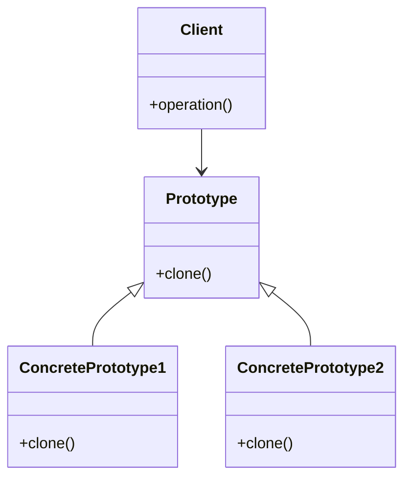

# Львівський Національний Університет Природокористування

## Кафедра Інформаційних систем та Технологій

### Звіт про виконання лабораторної роботи №1

### Тема: "Твірні шаблони проектування"

| Виконав: студент групи КН-31 Кухарчук Олександр |
| ----------------------------------------------- |
| Перевірив: Татомир Андрій                       |

---

## Мета

Познайомитися з групою твірних шаблонів проектування та дослідити їхнє застосування на практиці.

## Хід роботи

1. Теоретичний опис твірної групи шаблонів.
2. Теоретичний опис вибраного шаблону (Прототип).
3. Приклад коду, що реалізовує вибраний шаблон.
4. UML-діаграма для пояснення архітектури.

### Теоретичний опис твірних шаблонів проектування

Твірні шаблони проектування (або породжувальні патерни) — це повторювані рішення для типових проблем, які виникають під час розробки програмного забезпечення. Вони допомагають робити код більш гнучким, зрозумілим і легким для підтримки, забезпечуючи ефективне управління процесом створення об'єктів.

Основні твірні патерни:

- **Фабричний метод:** Визначає інтерфейс для створення об'єктів, але дозволяє підкласам вирішувати, який клас інстанціювати.
- **Абстрактна фабрика:** Надає інтерфейс для створення сімейств пов'язаних або залежних об'єктів без вказування їх конкретних класів.
- **Будівельник:** Розділяє процес створення складного об'єкта на кілька кроків, дозволяючи створювати різні представлення цього об'єкта.
- **Прототип:** Створює нові об'єкти шляхом копіювання існуючого об'єкта (прототипу).
- **Одинак:** Гарантує, що існує лише один екземпляр класу, забезпечуючи глобальний доступ до нього.

### Прототип

Прототип — це твірний шаблон проектування, який дозволяє копіювати існуючі об'єкти без залежності від їх конкретних класів. Цей патерн декларує загальний інтерфейс для всіх об'єктів, що підтримують клонування. Це дозволяє копіювати об'єкти, не прив'язуючись до їх конкретних класів.

#### Переваги Прототипу:

- Зменшення кількості підкласів: Замість створення підкласів для кожної конфігурації об'єкта, можна клонувати прототипи з різними налаштуваннями.
- Динамічне додавання і видалення об'єктів: Можна додавати або видаляти об'єкти під час виконання програми.
- Зниження складності ініціалізації об'єктів: Замість створення складних об'єктів з нуля, можна клонувати вже налаштовані прототипи.

#### Коли використовувати Прототип:

- Коли ваша система повинна створювати об'єкти різних класів, які мають лише кілька комбінацій станів.
- Коли потрібно зменшити кількість підкласів, які відрізняються тільки способом ініціалізації.
- Коли об'єкти в системі можуть мати одне з небагатьох різних комбінацій стану.

### Висновок

На цій лабораторній роботі я ознайомився з твірними шаблонами проектування, зокрема з Прототипом. Я навчився, як за допомогою цього патерну можна ефективно створювати копії об'єктів без прив'язки до їх конкретних класів, що сприяє гнучкості та ефективності програмних систем, особливо коли йдеться про створення об'єктів зі схожими станами.
