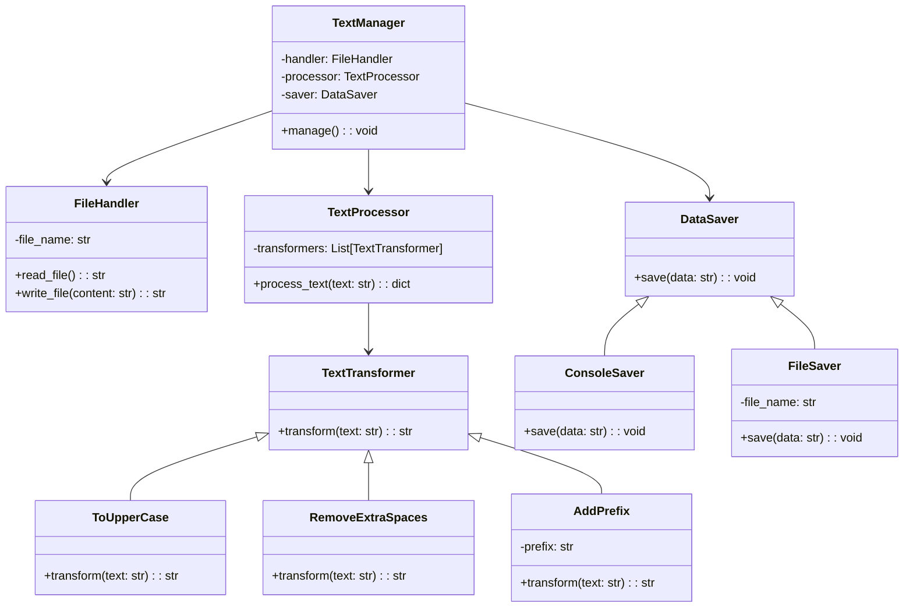

# Львівський Національний Університет Природокористування

## Кафедра Інформаційних систем та Технологій

### Звіт про виконання лабораторної роботи №13

### Тема: "Принципи проєктування програмного забезпечення"

| Виконав: студент групи КН-31 Кухарчук Олександр |
| ----------------------------------------------- |
| Перевірив: Татомир Андрій                       |

---

### Мета

Ознайомитися з сучасними принципами проєктування програмного забезпечення, зокрема SOLID, та застосувати їх на практиці.

---

### Хід роботи

1. Теоретичний опис принципів проєктування.
2. Теоретичний опис вибраного принципу.
3. Реалізація принципу на прикладі.
4. UML-діаграма для пояснення архітектури.

---

# Теоретичний опис SOLID

SOLID — це п’ять основних принципів об’єктно-орієнтованого програмування, які спрямовані на створення чистого, підтримуваного та масштабованого коду.

**S (Single Responsibility Principle):** Кожен клас повинен мати тільки одну відповідальність.

**O (Open/Closed Principle):** Класи мають бути відкритими для розширення, але закритими для зміни.

**L (Liskov Substitution Principle):** Підкласи повинні коректно заміняти суперкласи.

**I (Interface Segregation Principle):** Інтерфейси мають бути вузькими, щоб класи реалізовували тільки потрібну функціональність.

**D (Dependency Inversion Principle):** Залежності повинні будуватися на основі абстракцій, а не конкретних реалізацій.

---

# Принцип підстановки Лісков (Liskov Substitution Principle)

## Теоретичний опис

Принцип підстановки Лісков (LSP) стверджує, що об’єкти підкласів повинні заміняти об’єкти суперкласу без порушення логіки програми. Іншими словами, будь-який код, який працює з суперкласом, має працювати і з його підкласами без змін.

### Основні аспекти LSP:

1. **Коректна поведінка:** Усі методи підкласів повинні відповідати контракту суперкласу.
2. **Сумісність типів:** Підкласи повинні забезпечувати однаковий або розширений функціонал суперкласу.
3. **Збереження інваріантів:** Підкласи не повинні порушувати умови, що визначають правильний стан об’єкта.

---

## Реалізація принципу

**Опис коду у файлі `script.py`:** 
Код демонструє реалізацію принципу підстановки Лісков через ієрархію класів для оплати.

1. **Базовий клас `PaymentMethod`:** Абстракція для всіх типів оплати.
2. **Клас `CreditCardPayment`:** Реалізує оплату кредитною карткою.
3. **Клас `PayPalPayment`:** Реалізує оплату через PayPal.
4. **Клас `PaymentProcessor`:** Працює з абстракцією `PaymentMethod`, забезпечуючи підтримку принципу LSP.

### Переваги реалізації:

- **Зрозуміла структура:** кожен клас виконує чітко визначену роль, що спрощує розуміння коду.
- **Легкість у тестуванні:** кожен компонент можна тестувати незалежно від інших.
- **Гнучкість:** нові трансформації тексту можна додавати без зміни існуючого коду.
- **Розширюваність:** можна легко інтегрувати нові джерела даних (наприклад, мережеві чи бази даних) без зміни архітектури.

### Недоліки реалізації:

- **Збільшення кількості класів:** при роботі над невеликими задачами кількість файлів і класів може бути завеликою.
- **Підвищена складність для простих задач:** використання такого підходу для дуже простих систем може виявитися надмірним.
- **Більша потреба в координації:** у випадку складних систем між компонентами необхідно налаштовувати зв’язки та їхню взаємодію.

---

### UML-діаграма

---

### Висновок

Висновок
Під час виконання лабораторної роботи я ознайомився з принципами SOLID.
Код був розділений на класи з чітко визначеними ролями, що дозволило:

-Зробити код простим для тестування та розширення.
-Уникнути дублювання функціональності.
-Дотриматися чистої архітектури, легкої для підтримки.
