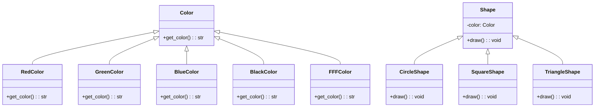

## Львівський Національний Університет Природокористування

## Кафедра Інформаційних систем та Технологій

### Звіт про виконання лабораторної роботи №2

# "Структурні патерни проектування"

| Виконав: студент групи КН-31 Кухарчук Олександр |
| ----------------------------------------------- |
| Перевірив: Татомир Андрій                       |

**Мета:** Познайомитися з групою структурних патернів.

### Хід роботи

1. Дати теоретичний опис структурних патернів.
2. Дати теоретичний опис вибраного патерну.
3. Навести приклад коду, який реалізовує даний патерн.
4. Скласти його UML-діаграму.

Структурні патерни проєктування допомагають організувати класи та об'єкти у великі структури, щоб забезпечити нову функціональність або спростити відносини між ними.

Короткий опис основних структурних патернів:

1. **Адаптер (Adapter)**

   - Цей патерн дозволяє об'єктам з несумісними інтерфейсами працювати разом. Він "обгортає" один клас в інший, щоб надати необхідний інтерфейс.
   - Приклад: адаптація класу для сумісності з іншим інтерфейсом.

2. **Декоратор (Decorator)**

   - Декоратор дозволяє динамічно додавати нові функціональні можливості до об'єктів. Він використовує композицію об'єктів замість наслідування, щоб розширити поведінку.
   - Приклад: додавання нових функцій до базового об'єкта, не змінюючи його структури.

3. **Фасад (Facade)**

   - Цей патерн надає спрощений інтерфейс до складної системи. Він приховує складні підсистеми, надаючи єдиний інтерфейс.
   - Приклад: забезпечення зручного інтерфейсу до великого й складного API.

4. **Міст (Bridge)**

   - Патерн міст розділяє абстракцію та реалізацію, дозволяючи їм розвиватися незалежно. Це дає змогу змінювати або розширювати обидві частини окремо.
   - Приклад: створення окремих класів для реалізації та абстракції.

5. **Композит (Composite)**

   - Патерн композит дозволяє групувати об'єкти в ієрархії "дерево", де індивідуальні об'єкти та їх групи обробляються однаково.
   - Приклад: структура каталогу, де файли й папки обробляються однаково.

6. **Проксі (Proxy)**
   - Патерн проксі дозволяє створити сурогатний об'єкт для контролю доступу до іншого об'єкта. Це зменшує навантаження або забезпечує контроль над доступом до об'єктів.
   - Приклад: відкладене створення об'єктів або контроль доступу до ресурсів.

### Патерн "Міст"

Патерн "Міст" розділяє абстракцію та реалізацію, дозволяючи їм розвиватися незалежно. Це особливо корисно, коли потрібно змінювати реалізацію без зміни абстракції та навпаки.

#### Основні частини патерну:

1. Абстракція: це інтерфейс, який визначає операції, що реалізуються.
2. Реалізація: це клас, який реалізує конкретні алгоритми.
3. Відносини між абстракцією та реалізацією: абстракція може мати посилання на реалізацію, що дозволяє змінювати реалізацію без зміни абстракції.

#### Як це працює:

1. Ми можемо мати різні кольори, такі як червоний, зелений, синій, чорний, білий.
2. Залежно від кольору, ми можемо малювати різні форми, такі як кола, квадрати та трикутники.

### Висновок

На даній лабораторній роботі я навчився основним принципам структурних патернів проектування, зокрема патерну Міст. Я засвоїв, як за допомогою цього патерну можна розділити абстракцію та реалізацію, що забезпечує гнучкість і можливість динамічного розширення програмних компонентів.
