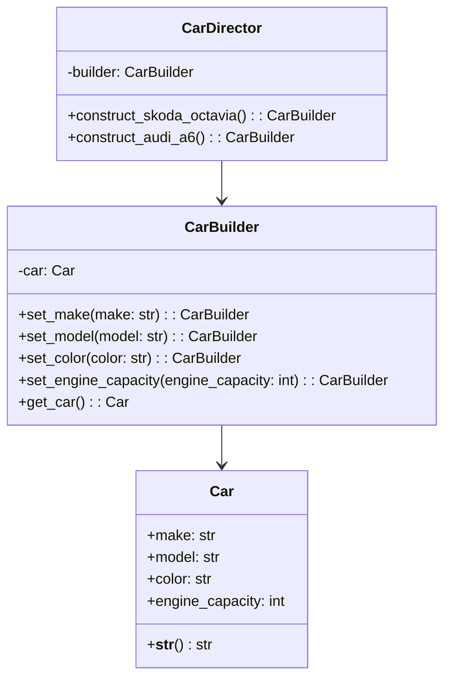

## Львівський Національний Університет Природокористування

## Кафедра Інформаційних систем та Технологій

### Звіт про виконання лабораторної роботи №11

# "Твірні шаблони проєктування"

| Виконав: студент групи КН-31 Фартушок Максим |
|----------------------------------------------|
| Перевірив: Татомир Андрій Володимирович      |

**Мета роботи: Познайомитися з групою твірних шаблонів проєктування.**

**Завдання:**

1. Дати теоретичний опис твірної групи шаблонів.
2. Відповідно до індивідуального завдання:
    - дати теоретичний опис даного шаблону;
    - навести приклад коду який
      реалізовує даний шаблон;
    - скласти його UML-діаграму.

**Твірні шаблони проектування** — це група шаблонів, які вирішують завдання створення об'єктів. Вони допомагають зробити
код
більш гнучким, дозволяючи змінювати спосіб створення об'єктів без внесення змін у клієнтський код. Основна ідея —
ізолювати процес створення об'єкта, аби спростити підтримку та розширення системи.

**Теоретичний опис патерна "Будівельник":**

Будівельник — це породжувальний патерн проектування, що дає змогу створювати складні об’єкти крок за кроком. Будівельник
дає можливість використовувати один і той самий код будівництва для отримання різних відображень об’єктів. Патерн
Будівельник пропонує винести конструювання об’єкта за межі його власного класу, доручивши цю справу окремим об’єктам,
які називаються будівельниками.

**Твірні патерни проектування:**

- Фабричний метод (Factory Method) - визначає загальний інтерфейс для створення об'єктів у суперкласі, дозволяючи
  підкласам змінювати тип створюваних об'єктів.

- Абстрактна фабрика (Abstract Factory) - Дає змогу створювати сімейства пов’язаних об’єктів, не прив’язуючись до
  конкретних класів створюваних об’єктів.

- Будівельник (Builder)

- Прототип (Prototype) - дає змогу копіювати об'єкти, не вдаючись у подробиці їхньої реалізації.

- Одинак (Singleton) - гарантує, що клас має лише один екземпляр, та надає глобальну точку доступу до нього.

**Приклад коду який реалізовує шаблон "Будівельник":**
[Реалізація шаблону](builder.py)

**Опис програми**

1. Клас Car є кінцевим продуктом, який ми будуємо за допомогою шаблону Builder. В ньому є кілька атрибутів, що
   визначають характеристику автомобіля:
    - make (марка автомобіля)
    - model (модель)
    - color (колір)
    - engine_capacity (об'єм двигуна в кубічних сантиметрах)

   Метод __str__ класу Car надає зручне представлення об'єкта у вигляді тексту, що дозволяє легко вивести його на екран.

2. CarBuilder є будівельником, який відповідає за створення об'єкта Car. Він:
    - Ініціалізує порожній об'єкт Car.
    - Має методи для налаштування кожної характеристики автомобіля:
        - set_make(make)
        - set_model(model)
        - set_color(color)
        - set_engine_capacity(engine_capacity)

   Коли всі характеристики автомобіля налаштовані, метод get_car() повертає готовий об'єкт Car.

3. CarDirector є керівником, який керує процесом створення автомобіля. Він не займається безпосереднім налаштуванням
   характеристик об'єкта, а лише визначає, як повинні бути побудовані конкретні варіанти автомобілів (наприклад, Skoda
   Octavia чи Audi A6).

   Методи класу CarDirector:
    - construct_skoda_octavia() — визначає кроки для створення автомобіля Skoda Octavia, налаштовуючи його марку,
      модель,
      колір та об'єм двигуна.
    - construct_audi_a6() — визначає кроки для створення Audi A6.
      Директор викликає відповідні методи в CarBuilder, щоб побудувати автомобіль відповідно до конкретних параметрів.

Отже, спочатку створюється об'єкт CarBuilder, який є будівельником для створення автомобіля.
Далі створюється об'єкт CarDirector, який використовує цей будівельник для створення конкретних моделей автомобілів.
Коли ми викликаємо методи construct_skoda_octavia() або construct_audi_a6() у CarDirector, директор викликає відповідні
методи CarBuilder, щоб налаштувати атрибути автомобіля (марка, модель, колір, об'єм двигуна).
Наприклад, при виклику director.construct_skoda_octavia() будуть налаштовані: марка "Skoda", модель "Octavia", колір "
White" і об'єм двигуна 1600 см3. Після налаштування всіх параметрів автомобіля метод get_car() в CarBuilder повертає
готовий об'єкт Car, який можна використовувати або вивести на екран.

---

### Висновок

Шаблон проектування Будівельник дозволяє поетапно створювати складні об'єкти, ізолюючи процес їхнього створення від
самого об'єкта. Це дає можливість легко змінювати конфігурації об'єктів, не змінюючи клієнтський код. У прикладі з
автомобілями клас CarBuilder забезпечує налаштування характеристик, а клас CarDirector керує процесом побудови
конкретних моделей. Завдяки цьому шаблону, створення складних об'єктів стає більш
гнучким і розширюваним.

---
