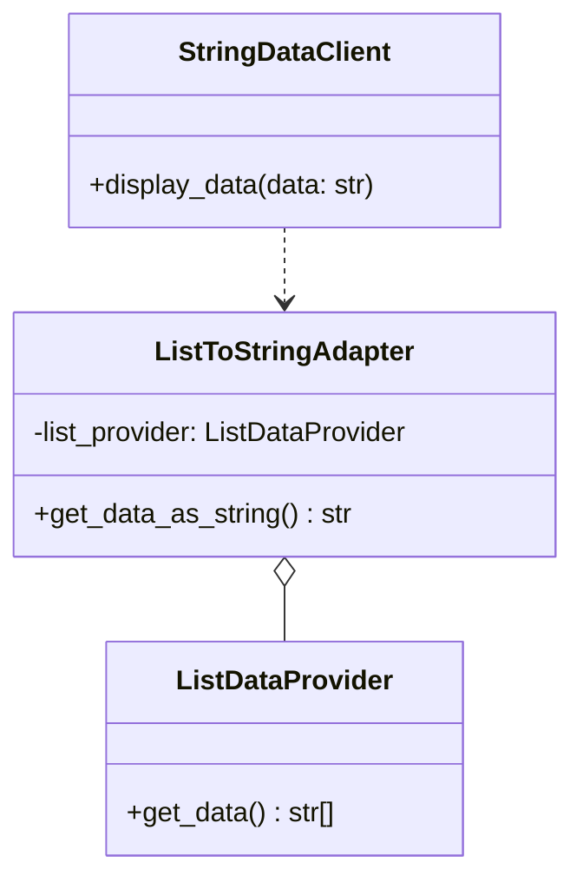

## Львівський Національний Університет Природокористування

## Кафедра Інформаційних систем та Технологій

### Звіт про виконання лабораторної роботи №12

# "Структурні шаблони проєктування"

| Виконав: студент групи КН-31 Фартушок Максим |
|----------------------------------------------|
| Перевірив: Татомир Андрій Володимирович      |

**Мета роботи: Познайомитися з групою структурних шаблонів
проєктування..**

**Завдання:**

1. Дати теоретичний опис структурної групи шаблонів.
2. Відповідно до індивідуального завдання:
    - дати теоретичний опис даного шаблону;
    - навести приклад коду який
      реалізовує даний шаблон;
    - скласти його UML-діаграму.

**Структурні шаблони проектування** - це група шаблонів, які допомагають організувати
взаємодію між класами та об'єктами, забезпечуючи їх зручну інтеграцію та спрощуючи архітектуру програми. Вони вирішують
проблеми сумісності та забезпечують гнучке з'єднання між різними компонентами системи, часто шляхом створення нових
структур або використання композиції, щоб уникнути жорсткої прив'язки до деталей реалізації.

**Теоретичний опис патерна Адаптер:**

Адаптер (Adapter) — це структурний шаблон проектування, який використовується для перетворення інтерфейсу одного класу в
інтерфейс, зрозумілий іншому класу. Він дозволяє об'єктам з несумісними інтерфейсами працювати разом без зміни їхнього
вихідного коду. Адаптер виступає посередником між двома класами або об'єктами. Він отримує виклики одного інтерфейсу,
обробляє їх (якщо потрібно), і передає ці виклики до іншого інтерфейсу, забезпечуючи сумісність.

**Структурні патерни проектування:**

- Adapter (Адаптер): Дає змогу об’єктам із несумісними інтерфейсами працювати разом.

- Bridge (Міст): Розділяє один або кілька класів на дві окремі ієрархії — абстракцію та реалізацію, дозволяючи змінювати
  код в одній гілці класів, незалежно від іншої.

- Composite (Компонувальник): Дає змогу згрупувати декілька об'єктів у деревоподібну структуру, а потім працювати з нею
  так, ніби це одиничний об'єкт.

- Decorator (Декоратор): Дає змогу динамічно додавати об'єктам нову функціональність, загортаючи їх у корисні
  «обгортки».

- Facade (Фасад): Надає простий інтерфейс до складної системи класів, бібліотеки або фреймворку.

- Flyweight (Легковаговик): Дає змогу вмістити більшу кількість об'єктів у відведеній оперативній пам'яті. Легковаговик
  заощаджує пам'ять, розподіляючи спільний стан об'єктів між собою, замість зберігання однакових даних у кожному
  об'єкті.

- Proxy (Замісник): Дає змогу підставляти замість реальних об'єктів спеціальні об'єкти-замінники. Ці об'єкти
  перехоплюють виклики до оригінального об'єкта, дозволяючи зробити щось до чи після передачі виклику оригіналові.

**Приклад коду який реалізовує шаблон Адаптер:**
[Реалізація шаблону](adapter.py)

**Опис програми**

Код демонструє реалізацію патерна адаптер (Adapter) для інтеграції двох класів із несумісними інтерфейсами:

**ListDataProvider**

Цей клас є постачальником даних. Його метод get_data() повертає список рядків (наприклад, ["one", "two", "three"]).
Він не може напряму взаємодіяти з клієнтом, який очікує дані у форматі рядка.

**StringDataClient**

Це клієнт, який працює з даними у форматі рядка. Його метод display_data(data) приймає один аргумент типу str і виводить
цей рядок на екран.

**ListToStringAdapter**

Адаптер дозволяє використовувати ListDataProvider разом із StringDataClient, перетворюючи дані з формату списку у формат
рядка.

У конструкторі (__init__) адаптер отримує екземпляр класу ListDataProvider і зберігає його.
Метод get_data_as_string() викликає get_data() у постачальника, отримує список, перетворює його в рядок, об'єднуючи
елементи через кому.

Спочатку створюється об'єкт ListDataProvider для отримання даних у вигляді списку.
Об'єкт ListToStringAdapter приймає ListDataProvider і надає метод для перетворення даних у рядок.
Об'єкт StringDataClient використовує адаптер, щоб отримати дані у вигляді рядка і вивести їх.

---

### Висновок

Реалізація патерна Адаптер дозволяє забезпечити сумісність між класами з різними інтерфейсами без необхідності змінювати
їхню реалізацію. Це забезпечує гнучкість у розробці системи та спрощує інтеграцію сторонніх компонентів. У
представленому прикладі адаптер ListToStringAdapter виступає посередником між ListDataProvider (який повертає дані у
форматі списку) та StringDataClient (який очікує дані у вигляді рядка). Такий підхід ілюструє, як адаптер вирішує
проблему несумісності форматів даних, забезпечуючи просте та інтуїтивне використання компонентів у системі.

---
