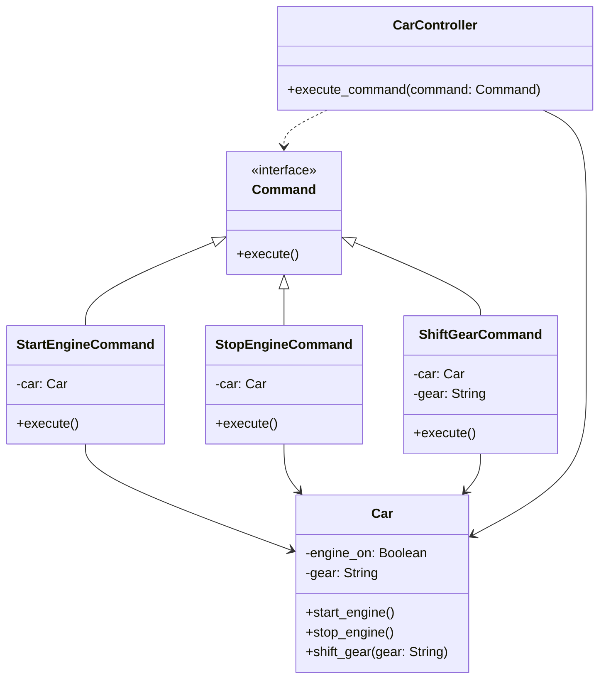

## Львівський Національний Університет Природокористування

## Кафедра Інформаційних систем та Технологій

### Звіт про виконання лабораторної роботи №13

# "Поведінкові шаблони проєктування"

| Виконав: студент групи КН-31 Фартушок Максим |
|----------------------------------------------|
| Перевірив: Татомир Андрій Володимирович      |

**Мета роботи: Познайомитися з групою поведінкових шаблонів проєктування.**

**Завдання:**

1. Дати теоретичний опис поведінкової групи шаблонів.
2. Відповідно до індивідуального завдання:
    - дати теоретичний опис даного шаблону;
    - навести приклад коду який
      реалізовує даний шаблон;
    - скласти його UML-діаграму.

**Поведінкові шаблони проектування** — це група шаблонів, які зосереджені на ефективному управлінні та взаємодії між
об'єктами в системі. Вони визначають, як об'єкти
комунікують один з одним, сприяючи гнучкості та розширюваності в їхніх взаємодіях. Ці шаблони допомагають розв'язувати
проблеми, що виникають при обміні інформацією та виконанні різних дій в рамках програми, зокрема управління станом,
поширенням подій або забезпеченням зворотного зв'язку.

**Теоретичний опис патерна Команда:**

Команда - перетворює запити на об'єкти, дозволяючи передавати їх як аргументи під час виклику методів, ставити
запити в чергу, логувати їх, а також підтримувати скасування операцій. Він дозволяє розділити виконавця запиту від того,
хто його ініціює. Це досягається шляхом створення окремих
об'єктів (команд), які містять інформацію про операцію, яку необхідно виконати, а також всі параметри для її виконання.
Клієнт (відправник запиту) створює об'єкт команди, а не викликає операції безпосередньо, таким чином реалізуючи низку
переваг, таких як спрощення взаємодії між компонентами, можливість скасування/повторного виконання запитів і зберігання
запитів у черзі.

**Поведінкові патерни проектування:**

- Ланцюжок обов'язків (Chain of Responsibility) - дає змогу передавати запити послідовно ланцюжком обробників. Кожен
  наступний обробник вирішує, чи може він обробити запит сам і чи варто передавати запит далі ланцюжком.
- Команда (Command) - перетворює запити на об'єкти, дозволяючи передавати їх як аргументи під час виклику методів,
  ставити запити в чергу,
  логувати їх, а також підтримувати скасування операцій.
- Ітератор (Iterator) - дає змогу послідовно обходити елементи складових об'єктів, не розкриваючи їхньої внутрішньої
  організації.
- Посередник (Mediator) - дає змогу зменшити зв'язаність великої кількості класів між собою, завдяки переміщенню цих
  зв'язків до одного
  класу-посередника.
- Знімок (Memento) - дає змогу зберігати та відновлювати минулий стан об'єктів, не розкриваючи подробиць їхньої
  реалізації.
- Спостерігач (Observer) - створює механізм підписки, що дає змогу одним об’єктам стежити й реагувати на події, які
  відбуваються в інших
  об’єктах.
- Стан (State) - дає змогу об'єктам змінювати поведінку в залежності від їхнього стану. Ззовні створюється враження,
  ніби змінився клас
  об'єкта.
- Стратегія (Strategy) - изначає сімейство схожих алгоритмів і розміщує кожен з них у власному класі. Після цього
  алгоритми можна заміняти
  один на інший прямо під час виконання програми.
- Шаблонний метод (Template Method) - визначає кістяк алгоритму, перекладаючи відповідальність за деякі його кроки на
  підкласи. Патерн дозволяє підкласам
  перевизначати кроки алгоритму, не змінюючи його загальної структури.
- Відвідувач (Visitor) - дає змогу додавати до програми нові операції, не змінюючи класи об'єктів, над якими ці операції
  можуть виконуватися.

**Приклад коду який реалізовує шаблон Команда:**
[Реалізація шаблону](command.py)

**Опис програми**

Ця програма демонструє використання поведінкового шаблону проектування "Команда" для керування діями автомобіля, такими
як запуск двигуна, зупинка двигуна та перемикання передач.

**Command:**

Інтерфейс, який визначає метод execute(). Усі конкретні команди повинні реалізувати цей метод,
який визначає, яку операцію виконуватиме команда.
У нашому випадку метод execute() відповідає за виконання операцій, таких як запуск чи зупинка двигуна або перемикання
передач.

**Конкретні команди:**

**StartEngineCommand:** Ця команда виконує операцію запуску двигуна автомобіля. Вона містить посилання на об'єкт Car і
викликає його метод start_engine().

**StopEngineCommand:** Ця команда відповідає за зупинку двигуна автомобіля. Вона також має посилання на об'єкт Car і
викликає його метод stop_engine().

**ShiftGearCommand:** Ця команда відповідає за перемикання передач автомобіля. Вона отримує нову передачу як параметр і
викликає метод shift_gear() об'єкта Car для зміни передачі.

**Клас Car:**

Цей клас представляє автомобіль, який має два основних стани: чи включений двигун (engine_on), і яка передача
вставлена (gear).

**Клас Car має методи:**

- start_engine(): запускає двигун.
- stop_engine(): зупиняє двигун.
- shift_gear(): змінює передачу на вказану.

**Клас CarController:**

Управляє виконанням команд, не знаючи точно, яка саме команда буде виконана. Клас має метод
execute_command(command), який приймає об'єкт команди і викликає її метод execute().
Це дозволяє абстрагувати виконання конкретних команд від деталей автомобіля, тобто клієнт може подавати будь-які команди
без необхідності знати про реалізацію конкретних дій.

---

### Висновок

У результаті виконання роботи було розглянуто поведінковий шаблон проектування "Команда", який дозволяє інкапсулювати
запити в окремі об'єкти та розділяє ініціатора запиту від його виконавця. Це забезпечує зручність у керуванні операціями
та дозволяє застосовувати різноманітні стратегії для виконання запитів, зокрема черги, логування чи скасування.
Практичне застосування шаблону було продемонстровано через управління діями автомобіля, такими як запуск двигуна,
зупинка та перемикання передач. Завдяки такій абстракції програмний код стає гнучким, розширюваним і легким для
модифікацій, що є однією з головних переваг шаблону "Команда".

---
