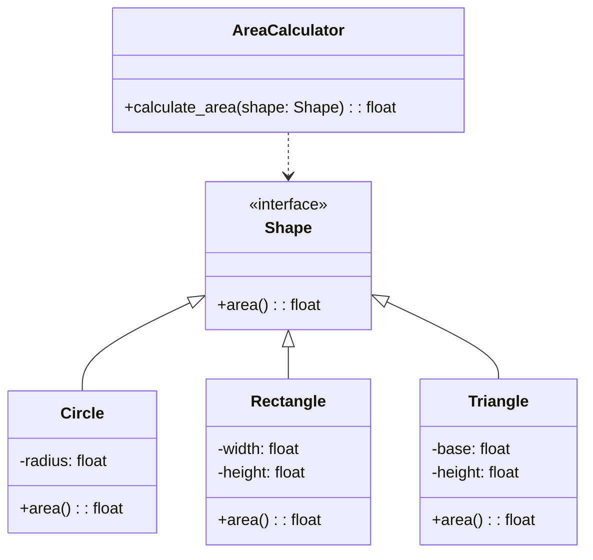

## Львівський Національний Університет Природокористування

## Кафедра Інформаційних систем та Технологій

### Звіт про виконання лабораторної роботи №14

# "Принципи проєктування програмного забезпечення"

| Виконав: студент групи КН-31 Фартушок Максим |
|----------------------------------------------|
| Перевірив: Татомир Андрій Володимирович      |

**Мета роботи: познайомитися з найбільш поширеними сучасними
принципами проєктування програмного забезпечення.**

**Завдання:**

1. Дати загальний опис принципів проєктування.
2. Дати детальний опис одного із принципів SOLID з наведення прикладу
   коду.

**Принципи проєктування** — це набір загальних керівних принципів, які сприяють створенню ефективних, масштабованих і
підтримуваних програмних систем. Вони дозволяють розробникам забезпечити високу якість коду, знижуючи ризики та
складність, покращуючи взаємодію між компонентами і забезпечуючи можливість майбутніх змін.

**Принципи SOLID**

- **Single Responsibility Principle** (Принцип єдиної відповідальності) - ніколи не повинно бути більше однієї причини
  змінити клас.

- **Open Closed Principle** (Принцип відкритості/закритості) - програмні сутності (класи, модулі, функції тощо) мають
  бути відкриті розширення, але закриті зміни.

- **Liskov's Substitution Principle** (Принцип підстановки Барбари Лисков) - об'єкти у програмі можна замінити їх
  спадкоємцями без зміни властивостей програми.

- **Interface Segregation Principle** (Принцип розподілу інтерфейсу) - клієнти повинні бути змушені реалізовувати
  методи, які вони використовуватимуть.

- **Dependency Inversion Principle** (Принцип інверсії залежностей) - залежності всередині системи будуються на основі
  абстракцій.

**Приклад коду який реалізовує Принцип відкритості/закритості:**
[Реалізація принципу OCP](solid.py)

**Опис програми**

Ця програма розраховує площу різних геометричних фігур, таких як коло, прямокутник і трикутник, використовуючи принципи
об'єктно-орієнтованого програмування. Кожна фігура представлена окремим класом, який реалізує метод для обчислення
площі. Усі ці класи успадковують інтерфейс Shape, який визначає загальний інтерфейс для методу area().

Програма використовує клас AreaCalculator, який приймає будь-яку фігуру, що реалізує інтерфейс Shape, і обчислює її
площу, викликаючи метод area().

**Чому програма реалізує принцип відкритості/закритості (Open/Closed Principle):**

Принцип відкритості/закритості стверджує, що програмні одиниці (класи, модулі, функції) повинні бути відкритими для
розширення, але закритими для модифікації. Це означає, що ми повинні мати можливість додавати нові функціональності (
наприклад, нові типи фігур), не змінюючи існуючий код.

- Закритість для модифікації:клас AreaCalculator не потребує змін, коли ми додаємо нові фігури. Він просто викликає
  метод area() для будь-якої
  фігури, що реалізує інтерфейс Shape.
  Клас AreaCalculator не потребує змін, навіть якщо ми додаємо нові конкретні фігури, оскільки вони будуть наслідувати
  від Shape і реалізовувати метод area().

- Відкритість для розширення: якщо ми хочемо додати нову фігуру (наприклад, квадрат, еліпс тощо), ми можемо створити
  новий клас, який успадковує Shape
  і реалізує метод area().
  Для цього не потрібно змінювати існуючі класи або код у класі AreaCalculator. Це дозволяє легко додавати нові фігури,
  що розширюють функціональність програми без необхідності модифікувати існуючі класи або код.
  Таким чином, програма дозволяє безпечно додавати нові типи фігур, не змінюючи існуючий код, що повністю відповідає
  принципу відкритості/закритості.

---

### Висновок

У ході виконання роботи було розглянуто один з принципів SOLID — принцип відкритості/закритості (OCP), який вимагає, щоб
програмні компоненти були відкритими для розширення, але закритими для модифікації. В прикладі коду цей принцип
реалізовано шляхом використання абстрактного інтерфейсу Shape, який визначає метод area(), і конкретних класів, що
успадковують цей інтерфейс і реалізують свій власний метод для обчислення площі. Клас AreaCalculator викликає метод
area() для будь-якої фігури, що реалізує інтерфейс Shape, не змінюючи свій код при додаванні нових фігур. Це дозволяє
безпечно і без змін у вже існуючому коді додавати нові типи фігур, що демонструє правильне застосування принципу OCP.
Такий підхід забезпечує гнучкість та масштабованість програмного забезпечення, зменшуючи ризики при подальших змінах або
розширеннях.

---
