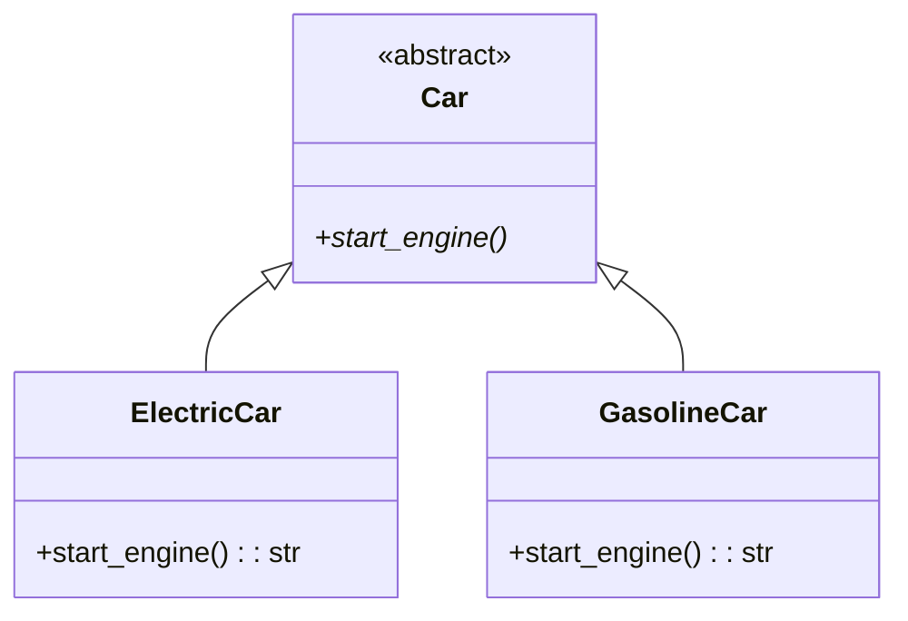

## Львівський Національний Університет Природокористування

## Кафедра Інформаційних систем та Технологій

### Звіт про виконання лабораторної роботи №15

# "Рефакторинг програмного забезпечення"

| Виконав: студент групи КН-31 Фартушок Максим |
|----------------------------------------------|
| Перевірив: Татомир Андрій Володимирович      |

**Мета роботи: познайомитися з основними принципами та найбільш
поширеними техніками рефакторингу програмного забезпечення.**

**Завдання:**

1. Дати загальний опис принципів рефакторингу.
2. Ознайомитися із основними техніками рефакторингу.
3. Познайомитися із поняттям “запахів коду”.

**Рефакторинг** - це процес зміни програмного коду з метою поліпшення його структури,
читабельності, підтримуваності та продуктивності, при цьому без зміни його зовнішньої поведінки. Рефакторинг дає змогу
розробникам вносити зміни в програму, не порушуючи функціональність і покращуючи якість.

**Основні принципи рефакторингу**

Основні принципи рефакторингу допомагають забезпечити ефективне та безпечне проведення змін у коді.

- **Поступовість**. Рефакторинг слід проводити покроково, вносячи невеликі зміни щоразу. Це дає змогу контролювати
  процес і
  своєчасно виявляти можливі проблеми.
- **Збереження функціональності**. Головне правило рефакторингу полягає в тому, щоб не змінювати зовнішню поведінку коду
  в
  процесі його зміни. Після кожного рефакторингу код має продовжувати працювати так само, як і до змін.
- **Використання автоматизованих тестів**. Попереднє написання автотестів, які перевіряють функціональність коду, –
  невід’ємна
  частина рефакторингу. Тести допомагають виявляти можливі проблеми та гарантувати, що зміни не зашкодять працездатності
  системи.

**Практики рефакторингу**

- виділення методів, які можна повторно використовувати і легко змінювати;
- об’єднання коду, що дублюється;
- поліпшення іменування змінних;
- усунення складних умов і впровадження простих алгоритмів;
- поліпшення структури даних, реструктуризація і заміна;
- поділ відповідальності окремих класів і функцій.

**Основні техніки рефакторингу**

- Перейменування (Rename): зміна назв змінних, класів чи методів для підвищення зрозумілості.
- Розбиття великих методів (Extract Method): виділення частин методу в окремі менші методи.
- Видалення дублювання (DRY — Don’t Repeat Yourself): перенесення однакових блоків коду в спільні методи чи класи.
- Інкапсуляція (Encapsulation): обмеження прямого доступу до даних, використання гетера/сетера.
- Заміна умов на поліморфізм: заміна умовних конструкцій (if-else) на виклик методів з класів-нащадків.
- Заміна магічних чисел (Magic Numbers): винесення числових значень у константи чи конфігураційні файли.

**Запахи коду** — це ознаки проблем у програмному коді, які вказують на потенційні недоліки, що можуть ускладнювати
розуміння, підтримку або розвиток програмного забезпечення. Це не є помилками або дефектами, але такі проблеми можуть
спричинити серйозні ускладнення в майбутньому.

**Типові приклади запахів коду**

1. Дубльований код (Duplicated Code)

2. Довгі методи (Long Method)

3. Довгі класи (Large Class)

4. Занадто багато параметрів (Long Parameter List)

5. Нераціональні залежності (Unnecessary Coupling)

6. Застарілі коментарі (Comment Smell)

7. Прихована залежність (Hidden Dependency)

8. Складні умовні оператори (Complex Conditional)

**Приклад коду, який показує процес рефакторингу**
[Рефакторинг](main.py)

---

### Висновок

У ході цієї роботи я ознайомився з основними принципами та техніками рефакторингу програмного забезпечення, а також із
поняттям "запахів коду". Рефакторинг є важливим процесом для покращення структури, читабельності та
підтримуваності коду, при цьому без зміни його зовнішньої поведінки. Особливо корисними є принципи поступовості,
збереження функціональності та використання автоматизованих тестів, які дозволяють знизити ризик внесення помилок під
час змін.

Також я ознайомився з типовими "запахами коду", такими як дубльований код, довгі методи, нераціональні залежності, і
зрозумів, як вони можуть ускладнювати роботу з програмою. Використовуючи техніки рефакторингу, наприклад, видалення
дублювання, розбиття великих методів та заміну умов на поліморфізм, я зробив код більш гнучким і
підтримуваним.

---
