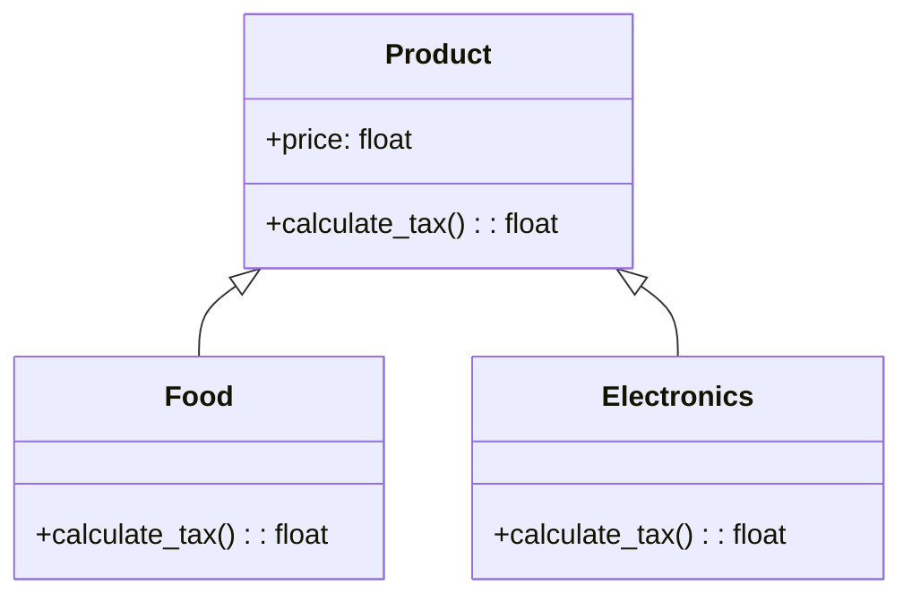

# Львівський Національний Університет Природокористування
## Кафедра Інформаційних систем та Технологій

### Звіт про виконання лабораторної роботи №4
### Тема: "Принципи проєктування програмного забезпечення"

| Виконав: студент групи КН-31 Фіковський Михайло |  
| ------------------------------------------ |  
| Перевірив: Татомир Андрій Володимирович              |  

---

### Мета
Мета роботи - познайомитися з найбільш поширеними сучасними принципами проєктування програмного забезпечення.

---

### Хід роботи

1. Загальний опис принципів проєктування.
2. Детальний опис одного із принципів SOLID з наведення прикладу коду.
3. UML-діаграма для пояснення архітектури.

---

###  Загальний опис принципів проєктування.

Принципи проєктування програмного забезпечення — це загальні правила та рекомендації, що сприяють створенню ефективної, легко підтримуваної, модульної та масштабованої системи.

## Принцип SOLID у Python 

Концепція SOLID була сформована Робертом Мартіном, вона допомагає забезпечити гнучкість, розширюваність та підтримку коду. Кожна літера у слові SOLID представляє один з цих принципів

### Single Responsibility Principle (Принцип єдиної відповідальності)

Цей принцип стверджує, що кожен клас, модуль чи функція повинні виконувати лише одну задачу або відповідати лише за одну частину функціональності. Ідея полягає в тому, що клас або модуль має мати одну чітку причину для змін.

#### Open/Closed Principle (Принцип відкритості-закритості)
Цей принцип вимагає, щоб класи та модулі були «відкритими для розширення», але «закритими для модифікації». Іншими словами, поведінку класу можна розширювати, не змінюючи його код.

Переваги:
- Зменшує ризик внесення помилок при розширенні функціональності.
- Дозволяє легко додавати нові можливості, не змінюючи існуючі класи.

#### Liskov Substitution Principle (Принцип підстановки Лісков)
Принцип підстановки Лісков стверджує, що об'єкти підкласу повинні мати можливість заміняти об'єкти суперкласу без порушення логіки програми. Тобто підкласи повинні підтримувати поведінку, визначену в суперкласах.

Переваги:
- Забезпечує стабільність та передбачуваність системи при використанні підкласів.
- Підвищує надійність коду, оскільки можна уникнути несподіваних результатів.

#### Interface Segregation Principle (Принцип поділу інтерфейсу)
Принцип поділу інтерфейсу закликає створювати спеціалізовані інтерфейси, які потрібні конкретним клієнтам, замість одного великого інтерфейсу. Інтерфейси мають бути вузькими та точковими, а не включати функції, які не використовуються всіма реалізаціями.

Переваги:
- Уникає прив'язки класів до непотрібних методів, що робить їх простішими.
- Дозволяє уникати змін в одному класі через зміни в методах, які йому не потрібні.

#### Dependency Inversion Principle (Принцип інверсії залежностей)
Принцип інверсії залежностей стверджує, що високорівневі модулі не повинні залежати від низькорівневих модулів; обидва повинні залежати від абстракцій. Абстракції не повинні залежати від деталей, а деталі мають залежати від абстракцій.

Переваги:
- Знижує жорстку залежність між модулями та спрощує тестування.
- Забезпечує гнучкість, оскільки низькорівневі модулі можна замінити, не змінюючи високорівневі.

---

### Open/Closed Principle (Принцип відкритості-закритості)
Принцип відкритості-закритості (Open/Closed Principle, OCP) є одним із п'яти основних принципів SOLID, що використовуються для написання чистого, зрозумілого та розширюваного коду. Принцип свідчить, що класи, модулі або функції мають бути відкритими для розширення, але закритими для модифікації. Це означає, що ми повинні розробляти програмні компоненти так, щоб їх поведінку можна було змінити або розширити без зміни їх вихідного коду.

### Суть принципу відкритості-закритості
1) Відкритість для розширення: програмний компонент можна доповнювати новою поведінкою чи функціональністю.
2) Закритість для модифікації: існуючий код не повинен змінюватися, оскільки це може порушити вже налагоджену та протестовану роботу системи.

Це досягається через побудову абстракцій та використання спадковості або поліморфізму. Замість того щоб модифікувати клас для нової поведінки, ми створюємо нові класи або об’єкти, які наслідують або розширюють існуючу функціональність.

___

### Приклад прицнипу
 [`open_closed.py`](./open_closed.py)

### Пояснення коду
Закритість для модифікації:

- Базовий клас Product є універсальним, і його метод calculate_tax не потребує змін для кожного нового типу продукту.
- Замість того, щоб змінювати існуючий клас Product, нові види продуктів (наприклад, Food і Electronics) додаються як дочірні класи, що розширюють його функціональність.

Відкритість для розширення:
- Ми створюємо нові класи Food та Electronics, які перевизначають метод calculate_tax для обчислення специфічного податку на їжу (5%) та електроніку (15%).
- Додавання нового типу продукту (наприклад, Clothing) можливе без зміни базового класу Product. Просто створюється новий клас, що наслідує Product, і в ньому визначається власна логіка податку.
___

## UML діаграма

---

### Висновок

У результаті виконання лабораторної роботи з вивчення принципів SOLID та детальнішого ознайомлення з принципом відкритості/закритості було продемонстровано, як ці принципи сприяють створенню гнучких, масштабованих і підтримуваних програмних систем, де зміни в одній частині програми не впливають на інші, забезпечуючи стабільність, а також можливість легко додавати нові функціональні можливості без модифікації існуючого коду, що сприяє високому рівню якості програмного продукту.

---

