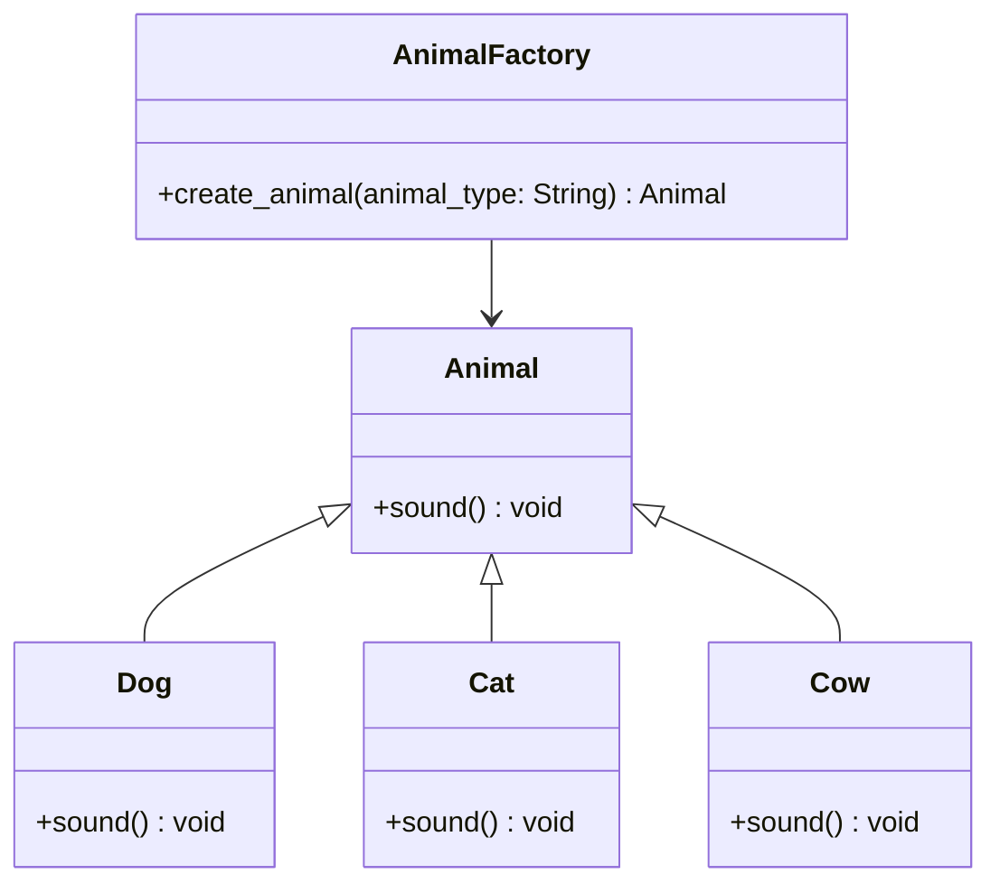

# Львівський Національний Університет Природокористування
## Кафедра Інформаційних систем та Технологій

### Звіт про виконання лабораторної роботи №11
### Тема: "Твірні шаблони проєктування"

| Виконав: студент групи КН-31 Паламар Валентин |  
| ----------------------------------------------|  
| Перевірив: Татомир Андрій                     |  

---

### Мета роботи: Познайомитися з групою твірних шаблонів проєктування.

---

**Хід роботи**

1. Дати теоретичний опис твірної групи шаблонів.

2. Відповідно до індивідуального завдання: - дати теоретичний опис даного шаблону; - навести приклад коду який реалізовує даний шаблон; - скласти його UML-діаграму.

---

**Теоретичний опис твірних шаблонів проєктування**

Твірні шаблони проєктування — це категорія шаблонів проєктування, які вирішують завдання створення об'єктів у програмуванні. Вони допомагають відокремити процес створення об'єкта від його використання, надаючи більшу гнучкість і полегшуючи підтримку коду. Основна мета твірних шаблонів - контролювати, коли і як створюються об'єкти, уникаючи прямого виклику конструкторів у коді.

Основні твірні патерни:

Фабричний метод: Цей шаблон визначає інтерфейс для створення об'єктів, але залишає підкласи відповідальними за те, який конкретний клас буде створено. Це дозволяє класам відкладати інстанціювання до своїх підкласів.

Абстрактна фабрика: Шаблон, який надає інтерфейс для створення родин пов'язаних або залежних об'єктів без вказівки їх конкретних класів. Він дозволяє створювати набори взаємопов'язаних об'єктів, зберігаючи інтерфейси узгодженими.

Одинак: Цей шаблон гарантує, що у класу є тільки один екземпляр, і надає глобальну точку доступу до нього. Він зазвичай використовується для об'єктів, які повинні бути єдиними в системі, наприклад, для об'єкта керування конфігурацією або з'єднання з базою даних.

Будівельник: Будівельник відокремлює процес побудови складного об'єкта від його представлення, дозволяючи створювати різні варіації об'єкта, зберігаючи при цьому загальний процес створення.

Прототип: Шаблон, який дозволяє копіювати існуючі об'єкти без необхідності залежати від їх класу. Це особливо корисно, коли створення об'єктів є дорогим або складним процесом.

---

**Фабричний метод**

Фабричний метод - це шаблон проектування, який надає інтерфейс для створення об'єктів у суперкласі, але дозволяє підкласам змінювати тип об'єктів, які будуть створені. Основна ідея полягає в тому, щоб делегувати створення об'єктів підкласам, що дозволяє гнучко додавати нові типи об'єктів без зміни базового коду.

**Недоліки фабричного методу:**

Складність впровадження: Для малих проектів або простих випадків використання патерн може бути надмірним, що ускладнює реалізацію без явних переваг.

Зниження продуктивності: Додаткові виклики фабричних методів можуть призводити до незначних витрат часу виконання, особливо якщо процес створення об'єктів є дуже простим.

Ускладненість коду: Збільшує кількість класів і, отже, загальну складність коду. Це може ускладнити систему, якщо в ній багато типів об'єктів.

**Переваги фабричного методу:**

Гнучкість: Дозволяє легко додавати нові класи без необхідності змінювати існуючий код. Якщо з’являється новий підклас, вам потрібно лише реалізувати його фабричний метод.

Відокремлення створення об'єктів: Процес створення об'єктів відокремлюється від їх використання, що робить код чистішим і легшим для підтримки.

Полегшене тестування: Завдяки використанню інтерфейсів або абстрактних класів, легше створювати мок-об'єкти для юніт-тестування.

---

---

## Висновок

У даній роботі було розглянуто твірні шаблони проєктування, зокрема патерн "Фабричний метод". Згідно з теоретичним описом, твірні шаблони сприяють ефективному створенню об'єктів, відокремлюючи процес їх генерації від використання. Це забезпечує більшу гнучкість у розробці програмного забезпечення та спрощує підтримку коду.

Фабричний метод дозволяє делегувати створення об'єктів підкласам, що робить систему більш гнучкою і розширюваною. Було наведено приклад коду, який реалізує цей шаблон, а також UML-діаграму, що ілюструє структуру класів і їхні взаємозв'язки.

Аналіз переваг і недоліків фабричного методу показав, що, попри певну складність впровадження та можливі витрати на продуктивність, цей патерн забезпечує легкість в управлінні змінами та спрощує тестування. У результаті, фабричний метод є потужним інструментом для створення масштабованих і підтримуваних програмних систем.

Таким чином, використання твірних шаблонів, зокрема фабричного методу, є важливим аспектом сучасного програмування, що сприяє покращенню якості коду та підвищенню продуктивності розробки.

---

