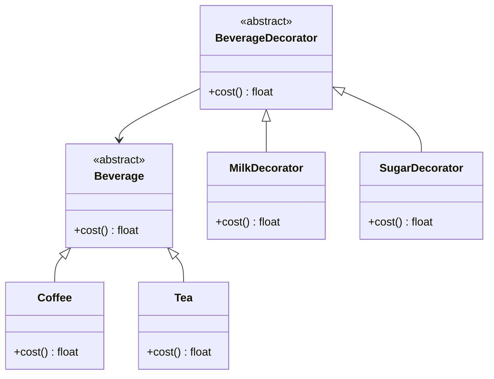

# Львівський Національний Університет Природокористування
## Кафедра Інформаційних систем та Технологій

### Звіт про виконання лабораторної роботи №12
### Тема: "Структурні шаблони проєктування"

| Виконав: студент групи КН-31 Паламар Валентин |  
| ----------------------------------------------|  
| Перевірив: Татомир Андрій                     |  

---

### Мета роботи: познайомитися з групою структурних шаблонів проєктування.

---

**Хід роботи**

1. Дати теоретичний опис структурної групи шаблонів.

2. Відповідно до индивідуального завдання: - дати теоретичний опис даного шаблону; - навести приклад коду який реалізовує даний шаблон; - скласти його UML-діяграму.

---

**Теоретичний опис структурних шаблонів проєктування**

Структурні шаблони проєктування — це категорія шаблонів, які допомагають організувати класи та об'єкти у програмах. Вони визначають, як об'єкти і класи можуть взаємодіяти, формуючи складніші структури з простіших. Основна мета структурних шаблонів — спростити архітектуру програмного забезпечення, підвищити його гнучкість і полегшити підтримку.

Основні структурні патерни:

Декоратор: Цей шаблон дозволяє динамічно додавати нову функціональність до об'єктів, не змінюючи їх структуру. Він використовує обгортки (декоратори) для розширення поведінки базового класу. Декоратор дозволяє створювати різні комбінації функціональності, що робить код більш гнучким і зручним для використання.

Адаптер: Шаблон, який дозволяє об'єктам з несумісними інтерфейсами працювати разом. Адаптер перетворює інтерфейс одного класу на інтерфейс, який очікує клієнт.

Міст: Цей шаблон розділяє абстракцію і реалізацію, що дозволяє змінювати їх незалежно. Це досягається за рахунок введення двох ієрархій класів, які можуть розвиватися незалежно одна від одної.

Композит: Шаблон, що дозволяє об'єктам формувати ієрархічні структури, де окремі об'єкти і групи об'єктів обробляються однаково. Це корисно для роботи з деревоподібними структурами.

Фасад: Цей шаблон надає спрощений інтерфейс для складної системи класів, роблячи її використання більш зручним і зрозумілим.

---

**Декоратор**

Декоратор - це шаблон проектування, що дозволяє динамічно додавати нові поведінки до об'єктів, не змінюючи їх структуру. Основна ідея полягає в обгортанні об'єкта у декоратор, який надає додаткові функції, зберігаючи при цьому основну логіку.

**Недоліки фабричного методу:**

Складність коду: Використання декораторів може ускладнити код, оскільки кількість класів та об'єктів збільшується.

Потенційні проблеми з продуктивністю: Додаткові виклики функцій через декоратори можуть знижувати швидкість виконання.

**Переваги фабричного методу:**

Гнучкість: Декоратори дозволяють легко додавати нові функції до об'єктів без зміни їх основної реалізації.

Відокремлення обов'язків: Декоратори сприяють дотриманню принципу єдиного обов'язку, оскільки кожен декоратор відповідає за свою конкретну функціональність.

Легкість тестування: Завдяки структурі декораторів, стає легше тестувати окремі компоненти системи, ізольовані від інших.

---

---

## Висновок

У даній роботі розглянуто структурний шаблон декоратора, який дозволяє динамічно додавати нову функціональність до об'єктів без зміни їх структури. Декоратори сприяють гнучкості і розширюваності програмного забезпечення, полегшуючи реалізацію нових можливостей.

Аналіз переваг і недоліків показав, що, незважаючи на потенційну складність коду, декоратори є ефективним інструментом для створення масштабованих і легко підтримуваних систем. Використання декораторів у програмуванні сприяє кращій організації коду, що, в свою чергу, підвищує якість і продуктивність розробки.

---

