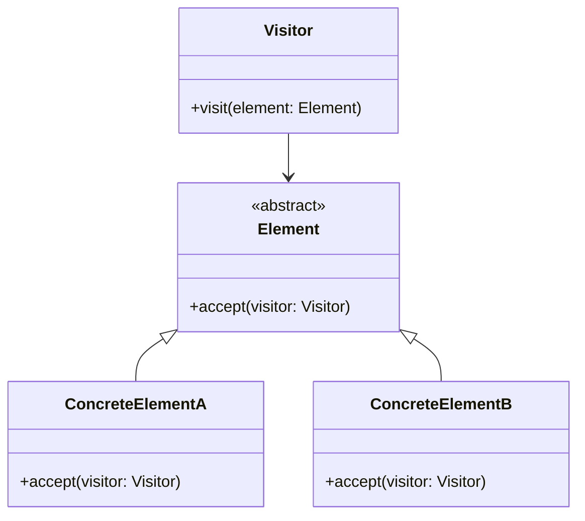

# Львівський Національний Університет Природокористування
## Кафедра Інформаційних систем та Технологій

### Звіт про виконання лабораторної роботи №13
### Тема: "Поведінкові шаблони проєктування"

| Виконав: студент групи КН-31 Паламар Валентин |  
| ----------------------------------------------|  
| Перевірив: Татомир Андрій                     |  

---

### Мета роботи: познайомитися з групою поведінкових шаблонів проєктування.

---

**Хід роботи**

1. Дати теоретичний опис поведінковій групі шаблонів.

2. Відповідно до индивідуального завдання: - дати теоретичний опис даного шаблону; - навести приклад коду який реалізовує даний шаблон; - скласти його UML-діяграму.

---

**Теоретичний опис поведінкових шаблонів проєктування**

Поведінкові шаблони проєктування — це категорія шаблонів, які вирішують завдання взаємодії між об'єктами і організації поведінки в програмуванні. Вони допомагають визначити, як об'єкти взаємодіють один з одним, а також як реалізувати складні алгоритми, що вимагають співпраці кількох об'єктів. Основна мета поведінкових шаблонів — спростити управління поведінкою об'єктів, зменшуючи залежності та підвищуючи гнучкість системи.

Основні поведінкові патерни:

Команда: Шаблон, що перетворює запит на дію в об'єкт, що дозволяє параметризувати клієнтів, які виконують ці дії, зберігати їх і відправляти в чергу для виконання.

Спостерігач: Дозволяє об'єктам спостерігати за змінами в інших об'єктах, автоматично отримуючи повідомлення про зміни, що відбуваються.

Стан: Дозволяє об'єкту змінювати свою поведінку залежно від його внутрішнього стану, фактично перетворюючи об'єкт на інший.

Відвідувач: Дозволяє додавати нові операції до об'єктів без зміни їх класів. Це досягається через введення візитора, який реалізує специфічну поведінку.

Стратегія: Дозволяє визначити сімейство алгоритмів, інкапсулювати їх та зробити їх взаємозамінними. Це дає змогу змінювати алгоритми незалежно від клієнтів, які їх використовують.

Ітератор: Дозволяє послідовно обходити елементи колекції без відкриття її внутрішньої структури. Це корисно для створення абстракцій над різними типами колекцій.

Посередник: Визначає об'єкт, який інкапсулює спосіб взаємодії множини об'єктів. Це зменшує зв'язність між об'єктами, сприяючи зменшенню складності системи.

Знімок: це поведінковий патерн проектування, що дає змогу зберігати та відновлювати минулий стан об’єктів, не розкриваючи подробиць їхньої реалізації.

Ланцюжок обов’язків: це поведінковий патерн проектування, що дає змогу передавати запити послідовно ланцюжком обробників. Кожен наступний обробник вирішує, чи може він обробити запит сам і чи варто передавати запит далі ланцюжком.

Шаблонний метод: Визначає скелет алгоритму в суперкласі, дозволяючи підкласам реалізувати деякі з його кроків. Це дозволяє реалізувати однакові алгоритми, змінюючи лише їхні частини.

---

**Відвідувач**

Шаблон "Відвідувач" дозволяє відокремити алгоритми від об'єктів, з якими вони працюють, що дає змогу додавати нові операції до структури об'єктів без зміни їх класів. Основна ідея полягає в тому, що замість того, щоб безпосередньо реалізовувати функціональність у класах об'єктів, ми створюємо окремий клас (візитора), який може відвідувати різні об'єкти і виконувати над ними операції.

**Недоліки фабричного методу:**

Складність розширення: Додавання нового класу об'єкта потребує модифікації візитора, що може призвести до проблем у разі частих змін.

Проблеми з типами: Якщо у вас велика кількість об'єктів, потрібно визначити методи для кожного з них у класі візитора, що може призвести до збільшення кількості коду.

Порушення інкапсуляції: Візитори отримують доступ до внутрішнього стану об'єктів, що може ускладнити підтримку коду.

**Переваги фабричного методу:**

Гнучкість: Дозволяє легко додавати нові операції до об'єктів без зміни їхніх класів.

Сприяє чистоті коду: Відокремлює алгоритми від об'єктів, що зменшує залежності і підвищує читабельність.

Спрощене тестування: Операції можна тестувати окремо, не змінюючи структуру класів.

**Пояснення того як реалізований шаблон:**

[Посилання на файл](main.py)

Є базовий інтерфейс Visitor, який визначає набір методів для кожного типу елементів, які можуть бути "відвідані". У цьому прикладі є методи visit_concrete_element_A() і visit_concrete_element_B().

Існують класи елементів ConcreteElementA і ConcreteElementB, кожен з яких реалізує інтерфейс Element. У цих класах є метод accept(visitor: Visitor), який отримує відвідувача як параметр. Цей метод викликає відповідний метод у відвідувачі, дозволяючи відвідувачу виконати якусь дію над конкретним елементом.

Класи відвідувачів, такі як ConcreteVisitor1 і ConcreteVisitor2, реалізують інтерфейс Visitor і містять свої версії методів для кожного елементу. Таким чином, кожен відвідувач може виконати свою унікальну операцію над елементами без необхідності змінювати самі класи елементів.

Клієнтський код створює елементи та відвідувачів, після чого передає відвідувачів до елементів через метод accept(). Це дозволяє додавати нові операції для об'єктів без зміни їхніх класів, що робить систему гнучкішою і розширюваною.

---

---

## Висновок

У даній роботі було розглянуто поведінкові шаблони проєктування, зокрема патерн "Відвідувач". Згідно з теоретичним описом, поведінкові шаблони сприяють ефективному управлінню поведінкою об'єктів, що робить код більш гнучким і легким для підтримки.

Патерн "Відвідувач" дозволяє відокремити алгоритми від об'єктів, з якими вони працюють, що забезпечує можливість легкого додавання нових операцій без зміни класів об'єктів. Було наведено приклад коду, що реалізує цей шаблон, а також UML-діаграму, що ілюструє структуру класів і їхні взаємозв'язки.

Аналіз переваг і недоліків патерну "Відвідувач" показав, що, незважаючи на певні складності, цей шаблон є потужним інструментом для розробки масштабованих і підтримуваних програмних систем.

Таким чином, використання поведінкових шаблонів, зокрема патерну "Відвідувач", є важливим аспектом сучасного програмування, що сприяє покращенню якості коду та підвищенню продуктивності розробки.

---
