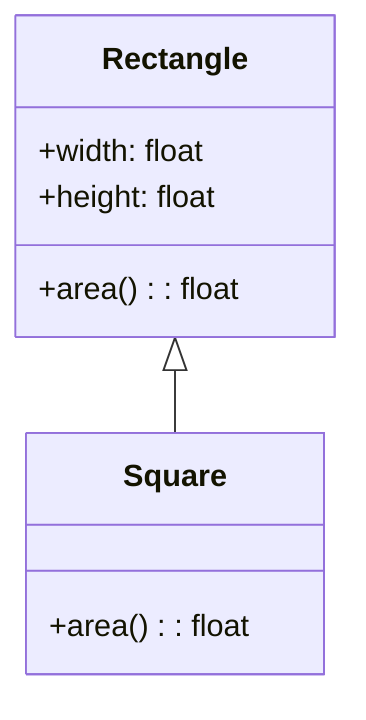

# Львівський Національний Університет Природокористування
## Кафедра Інформаційних систем та Технологій

### Звіт про виконання лабораторної роботи №4
### Тема: "Принципи проєктування програмного забезпечення"

| Виконав: студент групи КН-31 Плитич Василь |  
| ------------------------------------------ |  
| Перевірив: Татомир Андрій Володимирович              |  

---

### Мета
Мета роботи - познайомитися з найбільш поширеними сучасними принципами проєктування програмного забезпечення.

---

### Хід роботи

1. Загальний опис принципів проєктування.
2. Детальний опис одного із принципів SOLID з наведення прикладу коду.
3. UML-діаграма для пояснення архітектури.

---

###  Загальний опис принципів проєктування.
Принципи проєктування — це набори рекомендацій або правил, які допомагають створювати програмне забезпечення, яке буде легким для розуміння, підтримки та розвитку. Вони дозволяють зробити код більш ефективним і зручним для інших розробників. 

## Принцип SOLID у Python 

Принципи SOLID — це набір п'яти основних принципів об'єктно-орієнтованого програмування, які допомагають розробникам створювати більш ефективний, масштабований та підтримуваний код. 

### Основні принципи проєктування

- Принцип єдиної відповідальності (Single Responsibility Principle, SRP)
Клас або метод повинні мати лише одну відповідальність, тобто виконувати одну задачу. Якщо клас або метод робить більше одного завдання, його потрібно розділити на кілька.
- Принцип відкритості/закритості (Open/Closed Principle, OCP)
Клас повинен бути відкритим для розширення, але закритим для змін. Це означає, що ви можете додавати нову функціональність, не змінюючи вже існуючий код.
- Принцип підстановки Лісков (Liskov Substitution Principle, LSP)
Об'єкти підкласів повинні бути взаємозамінними з об'єктами батьківських класів. Це означає, що підкласи не повинні змінювати поведінку батьківських класів, яка порушує їх очікування.
- Принцип розділення інтерфейсу (Interface Segregation Principle, ISP)
Клас не повинен залежати від методів, які він не використовує. Тобто, замість одного великого інтерфейсу, потрібно створювати кілька маленьких інтерфейсів для конкретних завдань.
- Принцип інверсії залежностей (Dependency Inversion Principle, DIP)
Вищі рівні модуля не повинні залежати від нижчих рівнів. Обидва повинні залежати від абстракцій. Це дозволяє зменшити залежність між компонентами програми і підвищити її гнучкість.
---

### Принцип підміни Лісков (Liskov Substitution Principle, LSP)
Принцип підміни Лісков стверджує, що об'єкти підкласів повинні бути взаємозамінними з об'єктами батьківських класів без порушення коректності програми. Тобто, підкласи мають доповнювати або розширювати функціональність батьківського класу, а не змінювати або зламувати його поведінку.

Принцип дозволяє забезпечити, щоб підкласи могли заміняти батьківські класи без негативних наслідків, зберігаючи при цьому очікувану поведінку.
### Особливості LSP::
-- Підкласи не повинні порушувати функціональність, яку забезпечує батьківський клас.
-- Підкласи повинні додавати можливості, але не змінювати основні методи батьківського класу так, щоб це призводило до порушень.
-- Важливо, щоб підкласи не змінювали логіку, яка вже реалізована в базовому класі, і не викликали побічних ефектів.

### Переваги застосування принципу OCP:
1) Зниження ризику помилок:
Оскільки існуючий код не змінюється, ймовірність внесення нових помилок зменшується.
2) Зручність для розширення:
Легко додавати нові функціональності або змінювати поведінку програми, не змінюючи вже перевірений код.
3) Підвищена масштабованість:
Програма стає більш гнучкою і може масштабуватися з мінімальними змінами в коді.

___

### Приклад прицнипу
Для даної задачі можна створити клас для геометричних фігур, наприклад, Rectangle, і його похідний клас — Square, оскільки квадрат є спеціальним випадком прямокутника. Однак, важливо, щоб клас Square не порушував поведінку класу Rectangle.
[`Liskov.py`](./Liskov.py)

### Пояснення коду
* Базовий клас Rectangle: має два атрибути — ширину і висоту, а також метод area(), який обчислює площу прямокутника.
* Похідний клас Square: успадковує від класу Rectangle і має лише один атрибут — довжину сторони, яку передає в конструктор батьківського класу для ініціалізації обох сторін прямокутника.
* Функція print_area: приймає об'єкти класу Rectangle (та похідних від нього) і виводить площу.
### Як це відповідає принципу Лісков
Принцип Лісков вимагає, щоб похідні класи могли замінити базові класи без порушення коректності програми. У цьому прикладі клас Square замінює Rectangle, але не змінює очікувану поведінку (метод area() працює так само). Таким чином, ми можемо використовувати будь-який об'єкт типу Rectangle або його похідні (як, наприклад, Square), і програма працюватиме коректно.
___

## UML діаграма

---

### Висновок
У ході виконання лабораторної роботи було продемонстровано принцип підміни Лісков (Liskov Substitution Principle, LSP), який є важливим елементом об'єктно-орієнтованого програмування. Ми розглянули приклад з використанням класів для геометричних фігур, зокрема прямокутників та квадратів.

Принцип Лісков полягає в тому, що похідні класи повинні бути взаємозамінними з базовими без порушення функціональності програми. У нашому випадку клас Square успадковує від класу Rectangle, і, незважаючи на те, що квадрат є спеціальним випадком прямокутника, обидва класи зберігають правильну поведінку завдяки успадкуванню.

---

