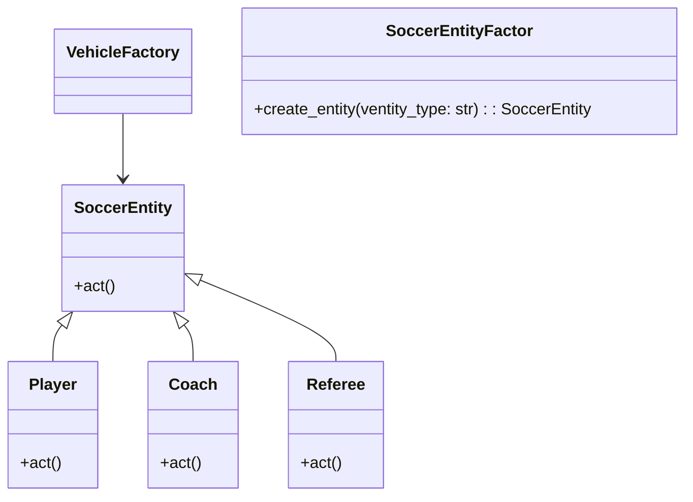

# Львівський Національний Університет Природокористування
## Кафедра Інформаційних систем та Технологій

### Звіт про виконання лабораторної роботи №1
### Тема: "Твірні шаблони проектування"

| Виконав: студент групи КН-31 Плитич Василь |  
| ------------------------------------------ |  
| Перевірив: Татомир Андрій                  |  

---

### Мета
Познайомитися з групою твірних шаблонів проектування та дослідити їхнє застосування на практиці.

---

### Хід роботи

1. Теоретичний опис твірної групи шаблонів.
2. Теоретичний опис вибраного шаблону.
3. Приклад коду, що реалізовує вибраний шаблон.
4. UML-діаграма для пояснення архітектури.

---

### Теоретичний опис твірних шаблонів проектування

Твірні (або породжувальні) шаблони проектування належать до однієї з трьох основних груп шаблонів (поряд із структурними та поведінковими) і використовуються для створення об'єктів. Їх головна мета — відокремити логіку створення об'єктів від їх використання. Вони надають гнучкість у виборі типу об'єктів, які необхідно створити, і керують створенням складних об'єктів або цілих ієрархій об'єктів.

Основні шаблони, що входять до твірної групи:

Factory Method (Фабричний метод) — надає інтерфейс для створення об'єктів, дозволяючи підкласам змінювати тип створюваних об'єктів.
Abstract Factory (Абстрактна фабрика) — дозволяє створювати сімейства взаємопов'язаних об'єктів без зазначення їх конкретних класів.
Singleton (Одинак) — гарантує, що у класу є тільки один екземпляр і надає до нього глобальну точку доступу.
Builder (Будівельник) — відокремлює створення складного об'єкта від його подання, дозволяючи створювати різні представлення об'єкта.
Prototype (Прототип) — дозволяє створювати нові об'єкти шляхом клонування вже існуючих.

---

### Фабричний метод

Фабричний метод — це патерн проектування з категорії "Створюючі", який дозволяє створювати об'єкти без вказівки конкретних класів, з яких ці об'єкти будуть створені. Це досягається через визначення інтерфейсу для створення об'єктів, але з делегуванням конкретної реалізації підкласам.

Основними складовими фабричного методу є продукт, який представляє інтерфейс або абстрактний клас, що визначає, які методи повинні реалізувати конкретні продукти. Конкретний продукт — це реалізація інтерфейсу, що представляє певний тип об'єкта. Фабричний метод містить інтерфейс, який включає метод для створення об'єктів. Конкретна фабрика реалізує фабричний метод і відповідає за створення конкретних продуктів.

Цей патерн має кілька переваг. По-перше, він забезпечує гнучкість, оскільки дозволяє легко додавати нові типи продуктів без зміни коду клієнта. По-друге, він інкапсулює процес створення об'єктів, що дозволяє змінювати реалізацію без впливу на клієнтський код.

---

### Висновок

У процесі виконання лабораторної роботи я навчився, як застосовувати патерн "Фабричний метод" для створення об'єктів без прямого вказування їх класів. Я зрозумів, що цей підхід дозволяє інкапсулювати логіку створення об'єктів, спрощуючи модифікацію та розширення коду.
---

   

   