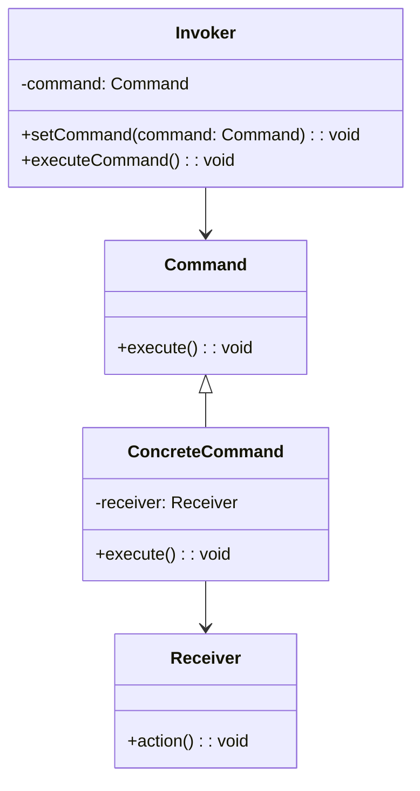

# Львівський Національний Університет Природокористування
## Кафедра Інформаційних систем та Технологій

### Звіт про виконання лабораторної роботи №3
### Тема: "Поведінкові патерни проектування"

| Виконав: студент групи КН-31 Фіковський Михайло |  
| ------------------------------------------ |  
| Перевірив: Татомир Андрій                  |  

---

### Мета
Познайомитися з групою поведінкових патернів та дослідити їхнє застосування на практиці.

---

### Хід роботи

1. Теоретичний опис поведінкових патернів.
2. Теоретичний опис вибраного патерну.
3. Приклад коду, що реалізовує вибраний патерн.
4. UML-діаграма для пояснення архітектури.

---

### Теоретичний опис поведінкової групи шаблонів
Шаблони поведінки (англ. behavioral patterns) — шаблони проєктування, що пов'язані з алгоритмами та розподілом обов'язків поміж об'єктів. Мова в них йде не тільки про самі об'єкти та класи, але й про типові способи їхньої взаємодії. Шаблони поведінки характеризують складний потік керування, котрий досить важко прослідкувати під час виконання програми. Увага акцентована не на потоці керування, а на зв'язках між об'єктами.

У шаблонах поведінки рівня класу використовується успадкування — щоб розподілити поведінку поміж різних класів.

У шаблонах поведінки рівня об'єкта використовується композиція. Деякі з них описують, як за допомогою кооперації багато рівноправних об'єктів пораються із завданням, котре жодному з них поодинці не під силу. Тут важливо, як об'єкти отримують інформацію про існування один одного. Об'єкти-колеги можуть зберігати посилання один на одного, але це посилює ступінь зв'язаності системи. За максимального рівня зв'язаності кожному об'єкту довелось би мати інформацію про всі інші. Деякі з наведених шаблонів вирішують цю проблему.

Основні поведінкові патерни включають:

Спостерігач (Observer)
Стратегія (Strategy)
Команда (Command)
Ітератор (Iterator)

---

### Патерн "Команда": 

Патерн Команда — це поведінковий патерн, який інкапсулює запит як об'єкт, дозволяючи параметризувати клієнтів різними запитами, черги або журнали запитів, і підтримувати відміну операцій. Патерн дозволяє відокремити об'єкт, який ініціює запит, від об'єкта, який виконує цей запит.

#### Застосування:

Коли необхідно параметризувати об'єкти операціями.
Коли потрібно виконувати операції у вигляді відкладених викликів.
Коли необхідно мати можливість скасувати операції.

#### Основні компоненти:

Команда (Command): Оголошує загальний інтерфейс для всіх команд.
Конкретна команда (ConcreteCommand): Реалізує команду та викликає певну операцію в отримувача.
Отримувач (Receiver): Клас, що виконує операцію.
Інвокер (Invoker): Об'єкт, який ініціює запит на виконання команди.
Клієнт (Client): Створює конкретну команду і встановлює отримувача.

####  UML-діаграма

---

### Висновок
В ході виконання лабораторної роботи №3 на тему "Поведінкові патерни проектування" я вивчив патерн "Команда", який дозволяє інкапсулювати запити як окремі об'єкти та відокремлювати логіку запитів від їх виконавців. Завдяки цьому патерну можна легко змінювати, додавати або відміняти запити без необхідності змінювати клієнтський код. Реалізація патерну та створення UML-діаграми допомогли краще зрозуміти його застосування на практиці.
---

