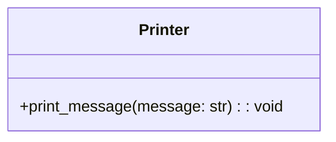

# Львівський Національний Університет Природокористування
## Кафедра Інформаційних систем та Технологій

### Звіт про виконання лабораторної роботи №4
### Тема: "Принципи проєктування програмного забезпечення"

| Виконав: студент групи КН-31 Пирч Олександр |  
| ------------------------------------------ |  
| Перевірив: Татомир Андрій Володимирович              |  

---

### Мета
Мета роботи - познайомитися з найбільш поширеними сучасними принципами проєктування програмного забезпечення.

---

### Хід роботи

1. Загальний опис принципів проєктування.
2. Детальний опис одного із принципів SOLID з наведення прикладу коду.
3. UML-діаграма для пояснення архітектури.

---

###  Загальний опис принципів проєктування.
Принципи проєктування — це набори рекомендацій або правил, які допомагають створювати програмне забезпечення, яке буде легким для розуміння, підтримки та розвитку. Вони дозволяють зробити код більш ефективним і зручним для інших розробників. 

## Принцип SOLID у Python 

Принципи SOLID — це набір п'яти основних принципів об'єктно-орієнтованого програмування, які допомагають розробникам створювати більш ефективний, масштабований та підтримуваний код. 

### Основні принципи проєктування

- Принцип єдиної відповідальності (Single Responsibility Principle, SRP) - Клас має виконувати лише одну задачу.
- Принцип відкритості/закритості (Open/Closed Principle, OCP) -  Відкритий для розширення, закритий для змін.
- Принцип підстановки Лісков (Liskov Substitution Principle, LSP) - Похідні класи повинні заміняти базові без порушення логіки.
- Принцип розділення інтерфейсу (Interface Segregation Principle, ISP) - Інтерфейси мають бути вузькими й конкретними..
- Принцип інверсії залежностей (Dependency Inversion Principle, DIP) - Залежність від абстракцій, а не від конкретних реалізацій.
---

### Принцип єдиної відповідальності
Принцип єдиної відповідальності стверджує, що клас повинен мати тільки одну причину для зміни, тобто виконувати одну конкретну задачу або відповідати за одну частину функціональності системи. Це робить код простішим для підтримки, зрозумілим і менш схильним до помилок.

Принцип дозволяє забезпечити, щоб підкласи могли заміняти батьківські класи без негативних наслідків, зберігаючи при цьому очікувану поведінку.
### Особливості принципу єдиної відповідальності:
- Одна причина для змін: Клас повинен мати лише одну причину для змін. Якщо змінюється вимога або поведінка, що стосується лише певної частини логіки, змінюється лише відповідний клас.
- Зменшення складності: Клас, що має лише одну відповідальність, зазвичай є меншим, зрозумілішим і менш схильним до помилок. Це полегшує його тестування та супровід.
- Легше розширення: Якщо клас відповідає лише за одну задачу, його можна легко розширити або замінити без великого впливу на інші частини програми.
Покращення читабельності коду:

Коли кожен клас відповідає за конкретну задачу, код стає більш логічним і зрозумілим для інших розробників.

___

### Приклад прицнипу
[`Vidpovidalnosti.py`](./Vidpovidalnosti.py)

### Пояснення коду
1) Проста відповідальність:
Клас Printer має єдину відповідальність — друкувати повідомлення.

2) Дотримання принципу:
Якщо треба змінити спосіб друку (наприклад, записувати в файл замість консолі), ми змінюємо лише клас Printer, не зачіпаючи інші частини коду.
___

## UML діаграма

---

### Висновок
У результаті виконання лабораторної роботи з принципу єдиної відповідальності (Single Responsibility Principle) було продемонстровано важливість цього принципу в об'єктно-орієнтованому програмуванні. Принцип єдиної відповідальності стверджує, що кожен клас повинен мати тільки одну причину для зміни, що дозволяє зменшити складність коду, підвищити його читабельність і спростити тестування.

---

