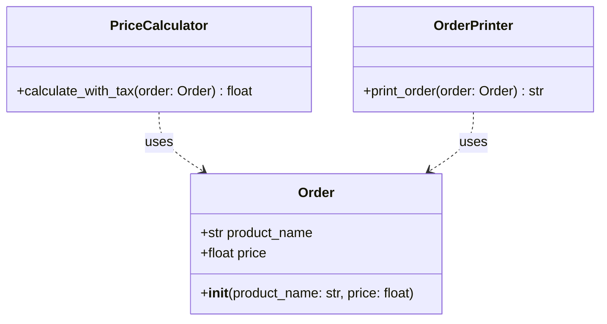

## Львівський Національний Університе Природокористування
## Кафедра інформаційних систем та технологій

### Звіт про виконання лабораторної роботи №4
# "Принципи SOLID: Принцип єдиної відповідальності"

| Виконав: Студент групи : Кн-31 Чепеняк Василь |
|-----------------------------------------------|
| Перевірив: Татомир Андрій                     |

**Мета: познайомитися з найбільш поширеними сучасними принципами проєктування програмного забезпечення.**

**Завдання:**
1. Дати загальний опис принципів проєктування. 
2. Дати детальний опис одного із принципів SOLID з наведення прикладу коду.

## Принципи SOLID

SOLID - це набір з п'яти принципів проєктування, сформульованих Робертом Мартіном ("Дядько Боб"). Ці принципи орієнтовані на поліпшення структури програмного забезпечення, підвищення його гнучкості та мінімізацію помилок.

1. **Single Responsibility Principle (SRP) – Принцип єдиної відповідальності**
   - Клас повинен мати лише одну причину для змін, тобто відповідати лише за одну функцію.
   - Приклад: Клас, який обробляє дані користувача, не повинен займатися логікою їх відображення.

2. **Open/Closed Principle (OCP) – Принцип відкритості/закритості**
   - Програмні сутності (класи, модулі, функції) повинні бути відкритими для розширення, але закритими для змін.
   - Приклад: Замість зміни існуючого класу додаються нові класи, що реалізують інтерфейси.

3. **Liskov Substitution Principle (LSP) – Принцип підстановки Барбари Лісков**
   - Об'єкти базового класу можуть бути замінені об'єктами його підкласів без порушення коректності роботи програми.
   - Приклад: Якщо у базовому класі є метод calculateArea(), підкласи повинні правильно його реалізувати, без змін інтерфейсу.

4. **Interface Segregation Principle (ISP) – Принцип розділення інтерфейсів**
   - Краще мати багато вузьких інтерфейсів, ніж один великий. Клас не повинен залежати від методів, які він не використовує.
   - Приклад: Замість одного інтерфейсу Device з методами print(), scan() і fax() можна створити три окремі інтерфейси для принтера, сканера і факса.

5. **Dependency Inversion Principle (DIP) – Принцип інверсії залежностей**
   - Модулі високого рівня не повинні залежати від модулів низького рівня; обидва повинні залежати від абстракцій.
   - Абстракції не повинні залежати від деталей, деталі повинні залежати від абстракцій.
   - Приклад: Замість створення об'єктів у класі напряму, використовується ін'єкція залежностей.

**Переваги SOLID:**
- Код стає більш зрозумілим і легшим у підтримці.
- Зменшується ризик виникнення помилок при зміні функціоналу.
- Полегшується тестування.

## Принцип єдиної відповідальності (SPR)

Принцип єдиної відповідальності означає, що кожен клас повинен мати лише одну причину для змін, тобто виконувати лише одну конкретну функцію. Це дозволяє зменшити складність коду, підвищити його гнучкість та зменшити ризик внесення помилок.

### Як визначити, чи клас порушує SRP:

1. Якщо можна описати відповідальність класу використовуючи "і" ("клас робить це І це") - ймовірно, принцип порушено
2. Якщо зміни в одній частині класу можуть вплинути на іншу функціональність
3. Якщо клас має забагато методів, які відносяться до різних аспектів системи
4. Якщо клас має забагато методів, які відносяться до різних аспектів системи

## Опис програми

Програма демонструє реалізацію  принципу єдиної відповідальності (SRP). Кожен клас відповідає за одну конкретну функцію, що робить код більш організованим та легшим для підтримки. Це класичний приклад правильного застосування принципу єдиної відповідальності.

### Структура програми:

1. **Базовий клас Order**
   - Зберігає базову інформацію про замовлення
   - Містить поля для назви товару та ціни

2. **Клас для розрахунків PriceCalculator**
   - Відповідає за обчислення фінальної ціни
   - Містить метод для розрахунку ціни з податком

3. **Клас для виведення OrderPrinter**
   - Відповідає за форматування та виведення інформації
   - Містить метод для форматування даних замовлення

4. **Головна функція main()**
   - Створює екземпляр замовлення
   - Виконує розрахунок ціни з податком
   - Виводить інформацію про замовлення

### Відповідність принципу SRP:

1. **Чітке розділення відповідальності**
   - Кожен клас відповідає за одну конкретну функцію
   - Зміни в одному класі не впливають на інші

2. **Логічне розділення функціоналу**
   - Order відповідає лише за дані
   - PriceCalculator лише за розрахунки
   - OrderPrinter лише за виведення

3. **Простота модифікації**
   - Можна змінити спосіб розрахунку, не чіпаючи виведення
   - Можна змінити формат виведення, не чіпаючи розрахунків

### Переваги такої реалізації:

- Чітка та логічна структура класів
- Покращена читабельність коду 
- Покращена підтримка коду
- Гнучкість системи

### UML діаграма класів

[Реалізація SRP](main.py)

## Висновок
Принципи проєктування, зокрема SOLID, допомагають створювати чистий, зрозумілий і масштабований код. Вони забезпечують гнучкість архітектури та спрощують підтримку і розвиток програмного забезпечення. Детальний аналіз принципу SRP (принцип єдиної відповідальності) демонструє, як розділення обов’язків між класами покращує модульність і дозволяє ізолювати зміни в логіці, що значно знижує ризик помилок.