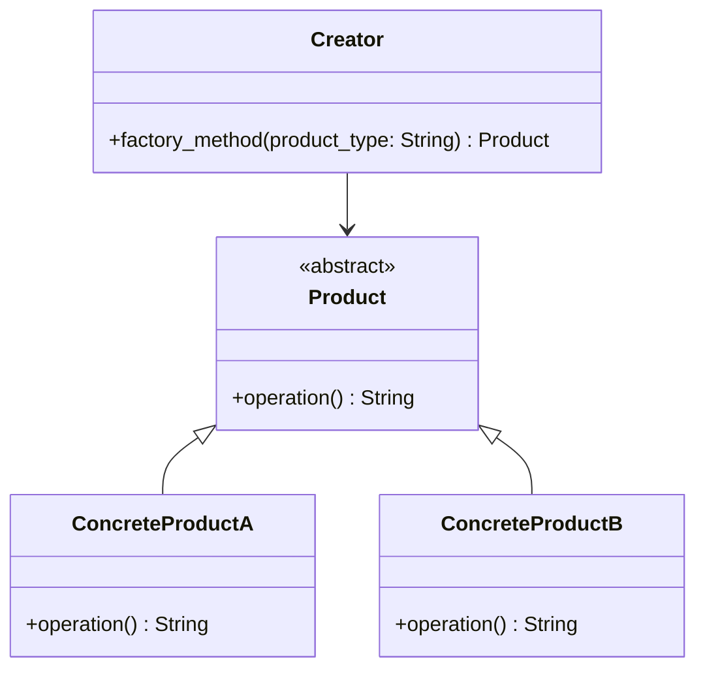

## Львівський Національний Університет Природокористування
## Кафедра Інформаційних систем та Технологій

### Звіт про виконання лабораторної роботи №11
# "Твірні шаблони проєктування"

| Виконав: студент групи КН-31 Чепеняк Василь|
|--------------------------------------------|
| Перевірив: Татомир Андрій                  |

**Мета роботи: Познайомитися з групою твірних шаблонів проєктування.**

**Завдання**

1. Дати теоретичний опис твірної групи шаблонів.
2. Відповідно до індивідуального завдання: - дати теоретичний опис даного шаблону; - навести приклад коду який реалізовує даний шаблон; - скласти його UML-діаграму.

Твірна група шаблонів - це абстрактне поняття з теорії груп, яке використовується для опису структурних взаємозв'язків об'єктів у математиці, інформатиці та інших дисциплінах. Вона є сукупністю елементів та правил їх комбінування, які дозволяють отримати всі елементи групи шляхом застосування певної операції.
У контексті шаблонів (patterns), твірна група може бути інтерпретована як група трансформацій, які дозволяють утворити всі можливі конфігурації шаблону, починаючи з базових елементів.
Фабричний метод (Factory Method) — визначає інтерфейс для створення об'єктів, але дозволяє підкласам вирішувати, який клас створювати.

**Теоретичний опис шаблону "Фабричний метод":**

Фабричний метод (Factory Method) — це шаблон проєктування, що визначає інтерфейс для створення об'єктів, але дозволяє підкласам самостійно вирішувати, який саме клас створювати. Завдяки цьому підхід забезпечує динамічне створення об'єктів та інкапсуляцію логіки створення в окремих класах. Використання шаблону дозволяє зменшити жорстку залежність між класами та полегшити модифікацію й розширення системи.

**Теоретичний опис твірної групи шаблонів:**

Твірні шаблони проєктування (або шаблони генерації) спрямовані на вирішення задач створення об'єктів у програмному забезпеченні. Вони допомагають відокремити логіку створення об'єктів від їхнього подальшого використання, що дозволяє досягти більшої гнучкості, розширюваності та легшого обслуговування коду. Основними шаблонами цієї групи є:

- Фабричний метод (Factory Method)

- Абстрактна фабрика (Abstract Factory)

- Будівельник (Builder)

- Прототип (Prototype)

- Одинак (Singleton)

**Переваги цього підходу:**

Гнучкість і розширюваність: Завдяки фабричному методу можна додавати нові типи продуктів без зміни існуючого коду, що робить систему більш гнучкою та масштабованою.

Поліпшення керованості кодом: Фабричний метод інкапсулює процес створення об'єктів, роблячи код більш зрозумілим і полегшуючи модифікацію цього процесу в майбутньому.

Підтримка принципу відкритості/закритості (OCP): Додавати нові класи можна без зміни існуючого коду, що відповідає принципам SOLID.

**Недоілки цього підходу:**

Ускладнення коду: Впровадження фабричного методу збільшує кількість класів і кодової бази, що може зробити проєкт складнішим для розуміння та підтримки.

Можливе перевантаження абстракціями: Якщо кількість продуктів і фабрик зростає, це може призвести до надмірної абстракції, що ускладнює підтримку та розвиток проєкту.

Зайві залежності в простих проєктах: У невеликих проєктах або коли кількість варіантів створення об'єктів невелика, використання фабричного методу може бути надмірним.

**Реалізація фабричного методу:**
[Посилання на реалізацію](main.py)

---

### Висновок

У результаті виконання завдання було успішно реалізовано шаблон "Фабричний метод", продемонстровано приклад коду, де клас Creator повертає різні продукти залежно від параметра, а також створено UML-діаграму, яка візуалізує структуру класів та їхні зв'язки, що забезпечує глибше розуміння архітектури рішення.

---

