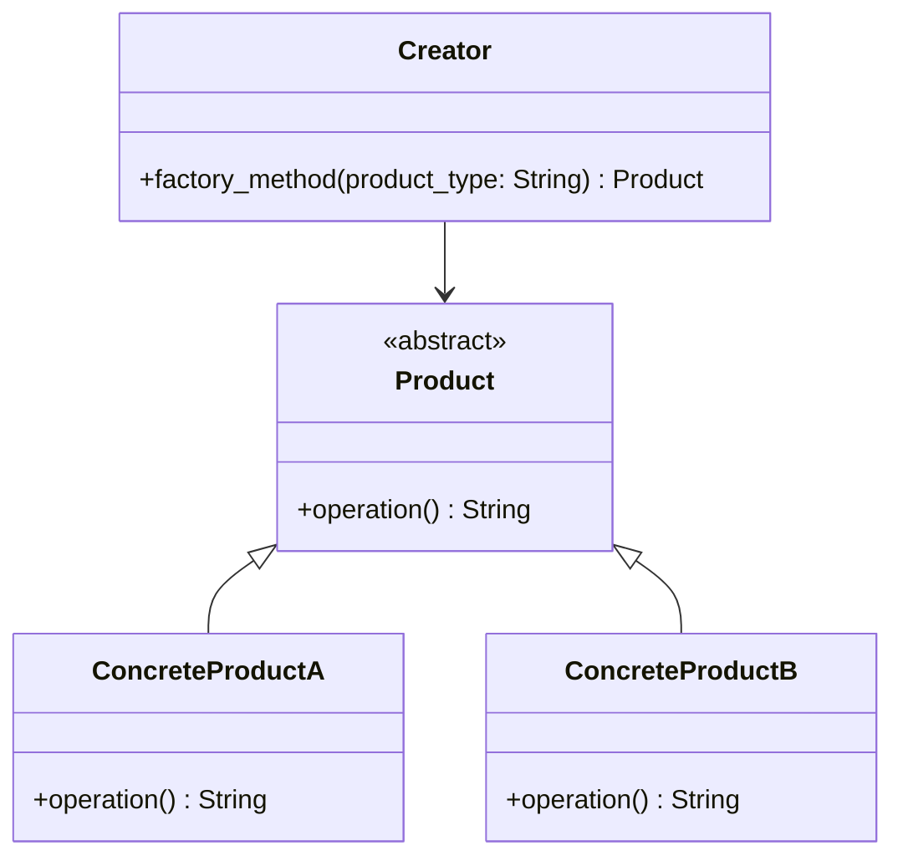

## Львівський Національний Університет Природокористування
## Кафедра Інформаційних систем та Технологій

### Звіт про виконання лабораторної роботи №11
# "Твірні шаблони проєктування"

| Виконав: студент групи КН-31 Чепеняк Василь|
|--------------------------------------------|
| Перевірив: Татомир Андрій                  |

**Мета роботи: Познайомитися з групою твірних шаблонів проєктування.**

**Завдання**

1. Дати теоретичний опис твірної групи шаблонів.
2. Відповідно до індивідуального завдання: - дати теоретичний опис даного шаблону; - навести приклад коду який реалізовує даний шаблон; - скласти його UML-діаграму.

Твірна група шаблонів - це абстрактне поняття з теорії груп, яке використовується для опису структурних взаємозв'язків об'єктів у математиці, інформатиці та інших дисциплінах. Вона є сукупністю елементів та правил їх комбінування, які дозволяють отримати всі елементи групи шляхом застосування певної операції.
У контексті шаблонів (patterns), твірна група може бути інтерпретована як група трансформацій, які дозволяють утворити всі можливі конфігурації шаблону, починаючи з базових елементів.
Фабричний метод (Factory Method) — визначає інтерфейс для створення об'єктів, але дозволяє підкласам вирішувати, який клас створювати.

**Переваги цього підходу:**

Гнучкість і розширюваність: Завдяки фабричному методу можна додавати нові типи продуктів без зміни існуючого коду, що робить систему більш гнучкою та масштабованою.

Поліпшення керованості кодом: Фабричний метод інкапсулює процес створення об'єктів, роблячи код більш зрозумілим і полегшуючи модифікацію цього процесу в майбутньому.

Підтримка принципу відкритості/закритості (OCP): Додавати нові класи можна без зміни існуючого коду, що відповідає принципам SOLID.

**Недоілки цього підходу:**

Ускладнення коду: Впровадження фабричного методу збільшує кількість класів і кодової бази, що може зробити проєкт складнішим для розуміння та підтримки.

Можливе перевантаження абстракціями: Якщо кількість продуктів і фабрик зростає, це може призвести до надмірної абстракції, що ускладнює підтримку та розвиток проєкту.

Зайві залежності в простих проєктах: У невеликих проєктах або коли кількість варіантів створення об'єктів невелика, використання фабричного методу може бути надмірним.

---

### Висновок

У результаті виконання завдання було досягнуто кілька важливих результатів:

**Теоретичний опис твірної групи шаблонів:**

Твірні шаблони проєктування (або шаблони генерації) спрямовані на вирішення задач створення об'єктів у програмному забезпеченні. Вони допомагають відокремити логіку створення об'єктів від їхнього подальшого використання, що дозволяє досягти більшої гнучкості, розширюваності та легшого обслуговування коду. Основними шаблонами цієї групи є:

- Фабричний метод (Factory Method)

- Абстрактна фабрика (Abstract Factory)

- Будівельник (Builder)

- Прототип (Prototype)

- Одинак (Singleton)

**Теоретичний опис шаблону "Фабричний метод":**

Фабричний метод (Factory Method) — це шаблон проєктування, що визначає інтерфейс для створення об'єктів, але дозволяє підкласам самостійно вирішувати, який саме клас створювати. Завдяки цьому підхід забезпечує динамічне створення об'єктів та інкапсуляцію логіки створення в окремих класах. Використання шаблону дозволяє зменшити жорстку залежність між класами та полегшити модифікацію й розширення системи.

**Приклад коду реалізації шаблону:**

У ході завдання було наведено приклад коду, що реалізує шаблон "Фабричний метод". У ньому клас Creator містить фабричний метод, який повертає відповідні продукти: ConcreteProductA або ConcreteProductB, залежно від переданого параметра. Це дозволяє клієнтському коду працювати з різними продуктами через загальний інтерфейс.

**UML-діаграма:**

Для кращого розуміння структури коду було створено UML-діаграму, яка демонструє зв'язки між класами. Було показано, що клас Creator викликає метод, що повертає екземпляри класів-нащадків абстрактного класу Product. Це дозволяє чітко бачити спадковість і залежність між класами.

Таким чином, завдання було успішно виконане. Була надана теоретична база для розуміння твірної групи шаблонів, детально розглянуто шаблон "Фабричний метод", продемонстровано його приклад реалізації, а також складено UML-діаграму для візуалізації архітектури рішення.

# Питання для самоконтролю

**Що таке твірні шаблони?**

Твірні шаблони проєктування — це група шаблонів, що фокусуються на процесі створення об'єктів у програмуванні. Вони вирішують питання того, як створювати об'єкти без безпосереднього використання оператора new, аби зменшити залежність програми від конкретних класів. Твірні шаблони допомагають інкапсулювати логіку створення об'єктів, роблячи систему більш гнучкою та розширюваною. Завдяки цьому створення об'єктів стає контрольованим, що дозволяє змінювати типи або структуру об'єктів без зміни клієнтського коду.

**Які твірні шаблони Вам відомі?**

Найвідоміші твірні шаблони:

Фабричний метод (Factory Method) — визначає інтерфейс для створення об'єктів, але дозволяє підкласам вирішувати, який клас створювати.

Абстрактна фабрика (Abstract Factory) — дозволяє створювати сімейства взаємопов'язаних або залежних об'єктів без прив'язки до їх конкретних класів.

Будівельник (Builder) — забезпечує пошагову побудову складних об'єктів, абстрагуючи процес їх створення.

Прототип (Prototype) — створює нові об'єкти шляхом копіювання існуючих об'єктів (прототипів).

Одинак (Singleton) — гарантує, що клас має лише один екземпляр і надає глобальну точку доступу до нього.

**Поясніть як реалізовано шаблон у Вашому прикладі.**

У моєму прикладі було реалізовано шаблон "Фабричний метод". Цей шаблон полягає в наступному:

- Є базовий клас Product, який визначає загальний інтерфейс для всіх продуктів. У ньому є метод `operation()`, що реалізується в підкласах.

- ConcreteProductA і ConcreteProductB — це конкретні класи, що наслідують Product і реалізують свої версії методу `operation()`.

- Клас Creator містить метод factory_method(product_type), який отримує тип продукту (наприклад, 'A' або 'B') та створює відповідний об'єкт продукту, повертаючи екземпляр класу ConcreteProductA або ConcreteProductB.

Таким чином, клієнтський код (той, який використовує продукти) не залежить від конкретних класів продуктів, а працює з абстракцією. Це дозволяє легко додавати нові продукти або змінювати логіку їх створення, не змінюючи основного коду.

---

