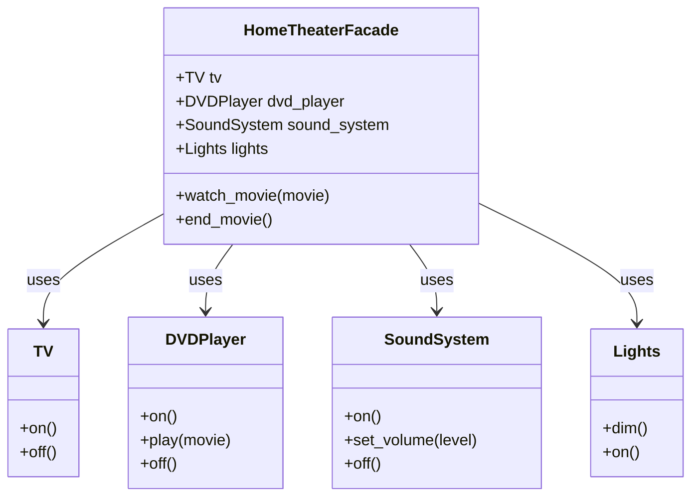

## Львівський Національний Університет Природокористування
## Кафедра Інформаційних систем та Технологій

### Звіт про виконання лабораторної роботи №12
# "Структурні шаблони проєктування"

| Виконав: студент групи КН-31 Чепеняк Василь|
|--------------------------------------------|
| Перевірив: Татомир Андрій                  |

**Мета роботи: познайомитися з групою структурних шаблонів проєктування.**

**Завдання**

1. Дати теоретичний опис структурної групи шаблонів.
2. Відповідно до индивідуального завдання: - дати теоретичний опис даного шаблону; - навести приклад коду який реалізовує даний шаблон; - скласти його UML-діяграму.

Структурна група шаблонів — це патерн проєктування у сфері програмного забезпечення, який акцентує увагу на способах організації класів і об'єктів для вирішення завдань на рівні їхньої структури.
Основна ідея структурних шаблонів полягає в полегшенні взаємодії між об'єктами або класами, спрощенні їхньої композиції та зміні їхньої поведінки без зміни основного коду.

Фасад (Facade) — це структурний шаблон, що забезпечує спрощений інтерфейс для взаємодії зі складною системою. Він приховує складність за єдиним інтерфейсом, полегшуючи роботу з підсистемою, і використовується для того, щоб зменшити залежність клієнтів від деталей реалізації.

**Приклади твірних шаблонів:**

Адаптер (Adapter)

Декоратор (Decorator)

Фасад (Facade)

Міст (Bridge)

Компоновник (Composite)

Замісник (Proxy)

**Поясніть як реалізовано шаблон у Вашому прикладі.**

У моєму прикладі було реалізовано шаблон "Фабричний метод". Цей шаблон полягає в наступному:

- У прикладі реалізовано шаблон Фасад. Він об'єднує чотири класи (TV, DVDPlayer, SoundSystem, Lights) у єдиний клас HomeTheaterFacade, який надає спрощений інтерфейс для взаємодії з усіма компонентами домашнього кінотеатру.

- Користувач викликає методи watch_movie() і end_movie() фасада, який, у свою чергу, викликає потрібні методи об'єктів для включення та вимкнення різних пристроїв, що робить керування системою простішим.

**Реалізація фасаду:**
[Посилання на реалізацію](main.py)

**Ключові аспекти структурних шаблонів:**

- Адаптація інтерфейсів: Структурні шаблони часто використовуються для забезпечення взаємодії між класами з різними інтерфейсами, роблячи систему гнучкою та розширюваною.

- Композиція об'єктів: Важливий аспект у тому, що структурні шаблони дозволяють використовувати композицію замість наслідування, що робить код більш гнучким і легким для модифікації.

**Переваги цього підходу:**

Спрощення інтерфейсу: Фасад надає клієнту спрощений інтерфейс для роботи зі складною системою, зменшуючи кількість викликів і роблячи код зрозумілішим.

Поліпшення підтримки та читабельності коду: Впровадження фасаду робить код більш структурованим, що полегшує його розуміння та підтримку.

Гнучкість: Якщо підсистема змінюється, клієнту достатньо оновити лише фасад, не змінюючи власної логіки взаємодії з системою.

**Недоілки цього підходу:**

Можливе ускладнення архітектури: Якщо фасад стає надто універсальним або громіздким, це може зробити його складнішим для підтримки та розуміння.

Підвищена залежність від фасаду: Якщо клієнтська логіка повністю залежить від фасаду, будь-які зміни у фасаді можуть потребувати значних змін у клієнтському коді.

Одноточковий доступ: Якщо фасад стає єдиною точкою доступу до підсистеми, його може бути важко масштабувати, або він може стати "вузьким місцем" у продуктивності системи.

---

### Висновок

У рамках завадання дослідив шаблон Фасад, який спрощує взаємодію з підсистемами, надаючи єдиний інтерфейс. Було наведено приклад коду для його реалізації та складено UML-діаграму для візуалізації взаємозв'язків між класами, що підкреслює переваги цього шаблону в спрощенні проєктування та підвищенні гнучкості систем.

---

