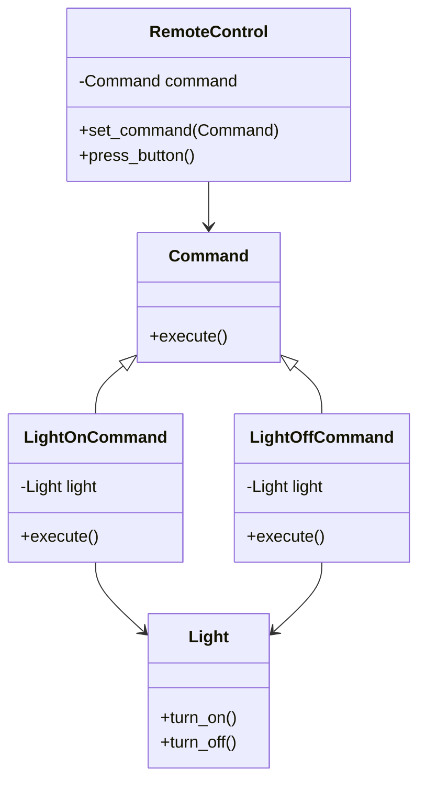

## Львівський Національний Університет Природокористування
## Кафедра Інформаційних систем та Технологій

### Звіт про виконання лабораторної роботи №13
# "Поведінкові шаблони проєктування"

| Виконав: студент групи КН-31 Чепеняк Василь|
|--------------------------------------------|
| Перевірив: Татомир Андрій                  |

**Мета роботи: познайомитися з групою поведінкових шаблонів проєктування.**

**Завдання:**

1. Дати теоретичний опис поведінкової групи шаблонів. 
2. Відповідно до индивідуального завдання: - дати теоретичний опис даного шаблону; - навести приклад коду який реалізовує даний шаблон; - скласти його UML-діяграму. 

Поведінкові шаблони проєктування фокусуються на взаємодії між об'єктами та способах передачі інформації між ними. Основна мета поведінкових шаблонів — забезпечити гнучкі способи взаємодії між об'єктами в системі, сприяючи їхній співпраці та обміну інформацією. Такі шаблони дозволяють описати, як об'єкти передають повідомлення, керують взаємодіями, змінюють свій стан та реагують на події.

Шаблон **Команда (Command)** — це поведінковий шаблон, який інкапсулює запит як об'єкт, дозволяючи таким чином:

- Відкласти виконання запиту.

- Зберігати історію команд для можливості їх скасування або повторного виконання.

- Створити гнучку систему для керування діями, що часто використовуються у програмах для створення системи відкату (undo) або чергування команд.

**Цей шаблон має три основні учасники:**

Клієнт — створює команду та задає її об'єкту-виконавцю.

Рецептор (Receiver) — об'єкт, над яким виконується команда.

Виконавець (Invoker) — об'єкт, що зберігає команду та викликає її виконання.

**Переваги цього підходу:**

Інкапсуляція запиту: Командний патерн інкапсулює запити як окремі об'єкти. Це дозволяє легко додавати нові команди без зміни існуючого коду або бізнес-логіки.

Розширюваність: Нові команди можна додавати без змін до існуючих класів. Це відповідає принципу відкритості/закритості (OCP) з SOLID.

Підтримка чергування та логування: Команди можна додавати в чергу або логувати для подальшого аналізу чи виконання в асинхронному режимі.

**Недоілки цього підходу:**

Ускладнення коду: Для кожної операції необхідно створювати окремі класи команд. Це може призвести до збільшення кількості класів і ускладнення підтримки проєкту, особливо у випадку великої кількості команд.

Перевантаження при дрібних операціях: Для дуже простих дій (наприклад, однокрокових операцій) використання командного патерну може бути зайвим і ускладнювати архітектуру.

Невиправдане використання в простих проєктах: У випадках, коли немає необхідності в складних запитах, чергах або операціях скасування, використання командного патерну може бути надмірним і збільшити час розробки.

---

### Висновок

У рамках завдання було розглянуто поведінкову групу шаблонів, зокрема шаблон Команда (Command), який дозволяє інкапсулювати запити (дії) у вигляді об'єктів. Це робить систему більш гнучкою та масштабованою, дозволяючи легко додавати нові команди, зберігати їх, передавати й виконувати незалежно від клієнта.
Шаблон Команда був реалізований у прикладі з пультом дистанційного керування для лампи, де команди на вмикання та вимикання лампи інкапсулюються в об'єкти та виконуються через виконавця (пульт). Це дозволяє чітко відокремити логіку керування від самих команд.
Було складено UML-діаграму, яка наочно демонструє структуру класів і зв'язки між ними, показуючи, як клієнт взаємодіє з виконавцем, командами та рецептором. Шаблон Команда дозволяє легко розширювати систему новими командами, не змінюючи існуючий код, що є ключовою перевагою цього підходу.

# Питання для самоконтролю

**Що таке поведінкові шаблони?**

Поведінкові шаблони — це тип шаблонів проєктування (design patterns), які визначають способи взаємодії між об'єктами і спрощують їхню взаємодію, полегшуючи досягнення складних цілей, знижуючи залежність між компонентами системи. Ці шаблони фокусуються на алгоритмах і завданнях, пов'язаних з поведінкою об'єктів, а також на способах передачі дій від одного об'єкта до іншого.

**Відомі поведінкові шаблони:**

Найвідоміші твірні шаблони:

Command (Команда) — інкапсулює дію в об'єкт, що дозволяє відкладати виконання команд або вести журнал команд.

Observer (Спостерігач) — описує залежність "один до багатьох" між об'єктами, коли при зміні стану одного об'єкта всі залежні об'єкти повідомляються про це.

Strategy (Стратегія) — дозволяє вибирати алгоритм під час виконання програми.

State (Стан) — дозволяє об'єкту змінювати свою поведінку в залежності від свого стану.

Iterator (Ітератор) — забезпечує послідовний доступ до елементів об'єкта-агрегату без розкриття його внутрішнього представлення.

Template Method (Шаблонний метод) — визначає скелет алгоритму, дозволяючи підкласам перевизначати деякі кроки алгоритму.

**Поясніть як реалізовано шаблон у Вашому прикладі.**

У наведеному прикладі реалізовано шаблон "Command". Він полягає в тому, що дії (вмикання/вимикання світла) інкапсулюються в окремі об'єкти-команди, які потім можуть передаватися іншим об'єктам для виконання (наприклад, пульту дистанційного керування).

Основні елементи реалізації:

- Клас `Command` — абстрактний клас, що визначає інтерфейс для команд. Кожна команда має метод `execute()`, який виконує дію.

- Класи `LightOnCommand` і `LightOffCommand` — конкретні реалізації команд для вмикання та вимикання світла. Вони зберігають посилання на об'єкт світла і виконують відповідну дію (`turn_on` або `turn_off`).

- Клас `RemoteControl` — це клієнт, який використовує команди. Він має метод для встановлення команди (`set_command`) і виконання команди при натисканні кнопки (`press_button`).

Таким чином, шаблон "Команда" дозволяє відокремити об'єкт, який виконує дію (пульт), від самої дії (вмикання/вимикання світла), що забезпечує більшу гнучкість в керуванні діями.

---

