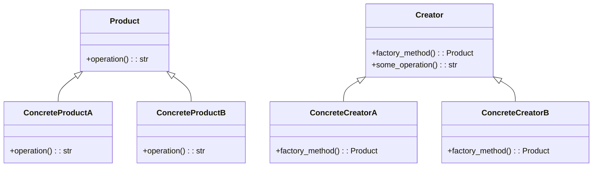

# Львівський Національний Університет Природокористування
## Кафедра Інформаційних систем та Технологій

### Звіт про виконання лабораторної роботи №1
### Тема: "Твірні шаблони проектування"

| Виконав: студент групи КН-31 Вітка Тарас |  
| ------------------------------------------ |  
| Перевірив: Татомир Андрій                  |  

---

### Мета
Познайомитися з групою твірних шаблонів проектування та дослідити їхнє застосування на практиці.

---

### Хід роботи

1. Теоретичний опис твірної групи шаблонів.
2. Теоретичний опис вибраного шаблону.
3. Приклад коду, що реалізовує вибраний шаблон.
4. UML-діаграма для пояснення архітектури.

---

### Теоретичний опис твірних шаблонів проектування

Твірні шаблони зосереджені на процесі створення об'єктів, надаючи розробникам можливість гнучко управляти створенням об'єктів. Використання цих шаблонів полегшує управління залежностями, зменшує зв'язність компонентів системи і робить код більш чистим та зрозумілим.

Основні твірні шаблони включають:

- Синглтон (Singleton): Гарантує, що клас має лише один екземпляр, надаючи до нього глобальний доступ.
- Фабричний метод (Factory Method): Визначає інтерфейс для створення об'єктів, але дозволяє підкласам змінювати тип об'єктів.
- Абстрактна фабрика (Abstract Factory): Дозволяє створювати сімейства пов'язаних об'єктів без вказівки їх конкретних класів.
- Будівельник (Builder): Відокремлює конструювання складного об'єкта від його представлення, забезпечуючи можливість створення різних представлень через один процес.

### Фабричний метод

Фабричний метод — це породжувальний патерн проектування, який визначає загальний інтерфейс для створення об’єктів у суперкласі, дозволяючи підкласам змінювати тип створюваних об’єктів.

####  Застосування:
1)Коли типи і залежності об’єктів, з якими повинен працювати ваш код, невідомі заздалегідь.
2)Коли ви хочете надати користувачам можливість розширювати частини вашого фреймворку чи бібліотеки.
3)Коли ви хочете зекономити системні ресурси, повторно використовуючи вже створені об’єкти, замість породження нових.

#### Кроки реалізації:
1) Приведіть усі створювані продукти до загального інтерфейсу.

2) Створіть порожній фабричний метод у класі, який виробляє продукти. В якості типу, що повертається, вкажіть загальний інтерфейс продукту.

3) Пройдіться по коду класу й знайдіть усі ділянки, що створюють продукти. По черзі замініть ці ділянки викликами фабричного методу, переносячи в нього код створення різних продуктів. Можливо, доведеться додати до фабричного методу декілька параметрів, що контролюють, який з продуктів потрібно створити. Імовірніше за все, фабричний метод виглядатиме гнітюче на цьому етапі. В ньому житиме великий умовний оператор, який вибирає клас створюваного продукту. Але не хвилюйтеся, ми ось-ось все це виправимо.

4) Для кожного типу продуктів заведіть підклас і перевизначте в ньому фабричний метод. З суперкласу перемістіть туди код створення відповідного продукту.

5) Якщо створюваних продуктів занадто багато для існуючих підкласів творця, ви можете подумати про введення параметрів до фабричного методу, аби повертати різні продукти в межах одного підкласу.

Наприклад, у вас є клас Пошта з підкласами АвіаПошта і НаземнаПошта, а також класи продуктів Літак, Вантажівка й Потяг. Авіа відповідає Літакам, але для НаземноїПошти є відразу два продукти. Ви могли б створити новий підклас пошти й для потягів, але проблему можна вирішити по-іншому. Клієнтський код може передавати до фабричного методу НаземноїПошти аргумент, що контролює, який з продуктів буде створено.

6) Якщо після цих всіх переміщень фабричний метод став порожнім, можете зробити його абстрактним. Якщо ж у ньому щось залишилося — не страшно, це буде його типовою реалізацією (за замовчуванням).

#### Переваги:
- Позбавляє клас від прив’язки до конкретних класів продуктів.
- Виділяє код виробництва продуктів в одне місце, спрощуючи підтримку коду.
- Спрощує додавання нових продуктів до програми.
- Реалізує принцип відкритості/закритості.

---

### Висновок

У ході виконання лабораторної роботи №1 на тему "Твірні шаблони проектування" я детально ознайомився з основами твірних шаблонів, їх структурою та принципами роботи. Основною метою лабораторної роботи було дослідити застосування цих шаблонів на практиці.

У першій частині роботи я розглянув теоретичний опис твірних шаблонів, таких як Синглтон, Фабричний метод, Абстрактна фабрика та Будівельник. Я зрозумів, як ці шаблони дозволяють підвищити гнучкість коду, зменшити зв'язність між компонентами та спростити управління залежностями.

Особливу увагу було приділено шаблону "Фабричний метод". Я вивчив його структуру, компоненти та переваги, такі як можливість уникнення прив'язки до конкретних класів продуктів і спрощення підтримки коду.

Важливим етапом була реалізація прикладу коду, що демонструє принципи роботи шаблону "Фабричний метод", а також створення UML-діаграми, яка ілюструє архітектуру взаємодії між компонентами. Ці практичні аспекти допомогли мені глибше усвідомити, як теоретичні концепції перетворюються на реальні рішення в програмуванні.

Отже, лабораторна робота дозволила мені отримати цінний досвід у використанні твірних шаблонів проектування, що, безумовно, стане корисним у подальшій практиці програмування та розробки програмного забезпечення.

