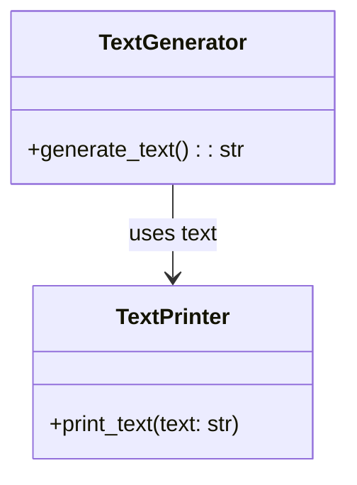

# Львівський Національний Університет Природокористування
## Кафедра Інформаційних систем та Технологій

### Звіт про виконання лабораторної роботи №4
### Тема: "Принципи проєктування програмного забезпечення"

| Виконав: студент групи КН-31 Вітка Тарас |  
| ------------------------------------------ |  
| Перевірив: Татомир Андрій Володимирович              |  

---

### Мета
Мета роботи - познайомитися з найбільш поширеними сучасними принципами проєктування програмного забезпечення.

---

### Хід роботи

1. Загальний опис принципів проєктування.
2. Детальний опис одного із принципів SOLID з наведення прикладу коду.
3. UML-діаграма для пояснення архітектури.

---

###  Загальний опис принципів проєктування.

Принципи проєктування є основоположними концепціями, які допомагають розробникам створювати програмне забезпечення, що є стійким, масштабованим, підтримуваним і зрозумілим. Вони слугують основою для розробки якісного коду, сприяють спрощенню складних систем і полегшують співпрацю в команді.

## Принцип SOLID у Python 

SOLID - це набір із п'яти принципів об'єктно-орієнтованого проєктування, які можуть допомогти вам написати зручніший, гнучкіший і масштабованіший код на основі добре спроєктованих, чітко структурованих класів. Ці принципи є фундаментальною частиною найкращих практик об'єктно-орієнтованого проектування.

### Основні принципи проєктування

- S (Single Responsibility Principle) – Принцип єдиної відповідальності. Клас повинен мати лише одну причину для зміни, тобто виконувати лише одну функцію або відповідати за одну частину функціональності.
- O (Open/Closed Principle) – Принцип відкритості/закритості. Код повинен бути відкритим для розширення, але закритим для змін.
- L (Liskov Substitution Principle) – Принцип підстановки Барбари Лісков. Об'єкти підкласів повинні замінюватися об'єктами батьківських класів без порушення функціональності програми.
- I (Interface Segregation Principle) – Принцип розділення інтерфейсу. Інтерфейси мають бути вузькоспеціалізованими, а не включати велику кількість методів, які не використовуються.
- D (Dependency Inversion Principle) – Принцип інверсії залежностей. Залежності повинні будуватися від абстракцій, а не від конкретних реалізацій.

---

### S (Single Responsibility Principle) – Принцип єдиної відповідальності
Принцип єдиної відповідальності стверджує, що клас повинен виконувати лише одну задачу і мати одну причину для змін. Це означає, що кожен клас має бути відповідальним за одну частину функціональності програми.

Якщо клас відповідає за кілька задач одночасно, це ускладнює його підтримку, тестування і розширення. Зміна однієї задачі може ненавмисно вплинути на інші задачі, що веде до появи помилок.0

### Переваги
1) Легкість підтримки
Кожен клас відповідає лише за одну задачу, тому зміни в одній частині функціональності не впливають на інші. Це зменшує ризик появи помилок.
2) Зрозумілість коду
Код легше читати й розуміти, оскільки кожен клас має чітко визначену відповідальність.
3) Простота тестування
Тестувати класи стає легше, адже кожен з них має вузький і чітко окреслений обсяг роботи.
4) Гнучкість і масштабованість
Легше додавати нову функціональність без ризику порушити існуючу, оскільки класи незалежні.
5) Повторне використання
Класи з вузькою відповідальністю можна використовувати в різних частинах програми або навіть в інших проєктах.

### Для чого використовується
1) Зниження залежностей
SRP допомагає мінімізувати залежності між компонентами програми, що робить код більш стійким до змін.
2) Розділення логіки
Використовується для розділення бізнес-логіки і технічних деталей (наприклад, генерація даних і їх відображення).
3) Покращення тестування
Код стає зручнішим для модульного тестування, оскільки кожен клас вирішує лише одну задачу.
4) Масштабування програм
У великих проєктах SRP забезпечує структуру, яку легко розширювати, додаючи нові функціональні можливості.

### Ключові моменти для реалізації
1) Один клас – одна відповідальність.
Якщо клас відповідає за кілька різних завдань (наприклад, обробка даних і їх відображення), це є порушенням SRP.
2) Одна причина для змін.
Якщо зміни в одній частині програми впливають на кілька задач класу, це ознака, що клас не відповідає SRP.
3) Розбиття завдань.
Завдання краще розділяти на окремі класи або модулі, навіть якщо це здається зайвим на перший погляд. У довгостроковій перспективі це спростить підтримку.
___

### Приклад прицнипу
Дана задача демонструє, як розділити відповідальності між класами відповідно до принципу SRP. Це забезпечує гнучкість та простоту підтримки коду.[`Single Responsibility Principle.py`](./Single Responsibility Principle.py)

### Пояснення коду
## 1. Клас TextGenerator
Цей клас відповідає лише за генерацію тексту. Він має один метод generate_text, який повертає текст "Hello, world!".

## 2. Клас TextPrinter
Цей клас відповідає лише за друк тексту. Він має метод print_text, який приймає текст як вхідний параметр і виводить його в консоль за допомогою функції print.

## 3. Використання класів
Створюються об'єкти обох класів (TextGenerator і TextPrinter).

___

## UML діаграма

---

### Висновок

У даній лабораторній роботі було продемонстровано принцип єдиної відповідальності (SRP) на прикладі розробки двох класів: TextGenerator для генерації тексту та TextPrinter для його друку, що забезпечує полегшення підтримки коду, гнучкість, зрозумілість і незалежність модифікацій, а також було створено UML-діаграму, яка ілюструє взаємозв’язок між цими класами.

---

