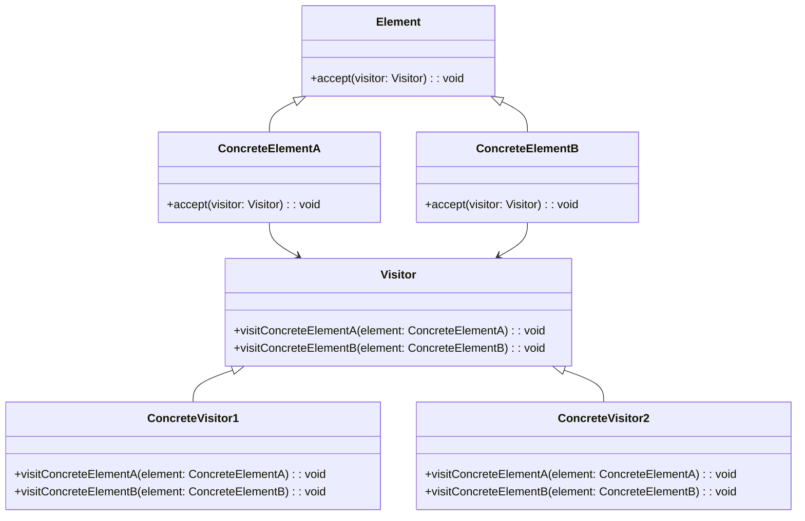

# Львівський Національний Університет Природокористування
## Кафедра Інформаційних систем та Технологій

### Звіт про виконання лабораторної роботи №3
### Тема: "Поведінкові шаблони проектування"

| Виконав: студент групи КН-31 Сітка Владислав |  
| ------------------------------------------ |  
| Перевірив: Татомир Андрій                  |  

---

### Мета
Мета роботи - познайомитися з групою поведінкових шаблонів
проєктування.

---

### Завдання

1. Дати теоретичний опис структурної групи шаблонів.
2. Відповідно до индивідуального завдання:
    - дати теоретичний опис даного шаблону;
    - навести приклад коду який реалізовує даний шаблон;
    - скласти його UML-діяграму.
---

### Поведінкові шаблони

Це категорія шаблонів, які зосереджуються на ефективній взаємодії між об'єктами і визначенні способів передачі відповідальностей між ними. Вони допомагають спростити складність системи, чітко розподіляючи поведінку між об'єктами та визначаючи, як ці об'єкти повинні взаємодіяти.

### Шаблон 'Відвідувач'

Шаблон "Відвідувач"  — це поведінковий шаблон проектування, який дозволяє додавати нові операції до об'єктів без зміни їх класів. Це досягається шляхом визначення нового класу, відвідувача, який реалізує ці нові операції. Шаблон корисний у ситуаціях, коли потрібно виконати різні операції над об'єктами, що належать до різних класів.

### Посилання на код

[Код](Visitor.py)

---

### Висновок

У ході виконання лабораторної роботи №3 на тему "Поведінкові шаблони проектування" я ознайомився з основами поведінкових шаблонів, їх призначенням та застосуванням у програмуванні. Особливу увагу було приділено шаблону Відвідувач, який дозволяє додавати нові операції до об'єктів без зміни їх класів, забезпечуючи гнучкість у реалізації нових функцій.

Я вивчив основні компоненти шаблону "Відвідувач", такі як інтерфейс елемента, конкретні елементи та інтерфейс відвідувача. Це допомогло зрозуміти, як можна використовувати цей шаблон для розширення функціональності системи без зміни її структури.

Крім того, я реалізував приклад коду, що демонструє роботу шаблону, та створив UML-діаграму, яка ілюструє зв'язки між компонентами. Це дозволило мені краще усвідомити, як поведінкові шаблони проектування сприяють створенню гнучких і масштабованих програмних рішень.

---

