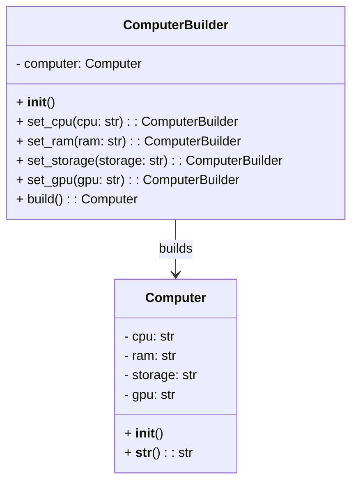

## Львівський Національний Університет Природокористування

## Кафедра Інформаційних систем та Технологій

### Звіт про виконання лабораторної роботи №11

# "Твірні шаблони проєктування"

| Виконав: студент групи КН-31 Фартушок Юрій |
|--------------------------------------------|
| Перевірив: Татомир Андрій Володимирович    |

**Мета роботи: Познайомитися з групою твірних шаблонів проєктування.**

**Завдання:**

1. Дати теоретичний опис твірної групи шаблонів.
2. Відповідно до індивідуального завдання:
    - дати теоретичний опис даного шаблону;
    - навести приклад коду який
      реалізовує даний шаблон;
    - скласти його UML-діаграму.

**Твірні шаблони проектування** — це шаблони, які допомагають створювати об'єкти в
програмуванні. Вони визначають найкращі способи створення об'єктів, щоб зробити цей процес більш гнучким, ефективним і
зручним для змін. Твірні шаблони дозволяють вирішити, як і коли створювати об'єкти, в залежності від ситуації в
програмі.

**Теоретичний опис патерна "Будівельник":**

Патерн "Будівельник" дозволяє створювати складні об'єкти поетапно. Він розділяє процес створення об'єкта на окремі
кроки, що дає змогу створювати різні варіанти об'єкта з однаковим процесом побудови.

**Твірні патерни проектування:**

- Фабричний метод (Factory Method) - визначає загальний інтерфейс для створення об'єктів у суперкласі, дозволяючи
  підкласам змінювати тип створюваних об'єктів.

- Абстрактна фабрика (Abstract Factory) - Дає змогу створювати сімейства пов’язаних об’єктів, не прив’язуючись до
  конкретних класів створюваних об’єктів.

- Будівельник (Builder)

- Прототип (Prototype) - дає змогу копіювати об'єкти, не вдаючись у подробиці їхньої реалізації.

- Одинак (Singleton) - гарантує, що клас має лише один екземпляр, та надає глобальну точку доступу до нього.

**Приклад коду який реалізовує шаблон "Будівельник":**
[Реалізація шаблону](builder.py)

**Опис програми**

1. Клас Computer:
   Представляє комп'ютер з чотирма основними компонентами: процесор (cpu), оперативна пам'ять (ram), сховище (storage) і
   відеокарта (gpu).
   Має метод __str__(), який повертає опис комп'ютера у вигляді рядка, що містить інформацію про всі його компоненти.

2. Клас ComputerBuilder:
   Це будівельник для об'єкта Computer. Його завдання — створювати об'єкти комп'ютерів поетапно.
   Він надає методи для налаштування кожного з компонентів комп'ютера (set_cpu(), set_ram(), set_storage(), set_gpu()),
   що
   дозволяє клієнту задавати значення для кожного параметра.
   Метод build() повертає готовий об'єкт комп'ютера.

3. Клієнтський код:
   Створюється об'єкт будівельника (ComputerBuilder).
   Крок за кроком налаштовуються компоненти комп'ютера за допомогою методів будівельника.
   Викликається метод build(), щоб отримати готовий об'єкт комп'ютера, який потім виводиться на екран.

Цей підхід дозволяє легко створювати складні об'єкти з різними варіантами налаштувань, зберігаючи при цьому код чистим і
зрозумілим.

---

### Висновок

Отже, твірні патерни проектування зосереджуються на гнучкому та ефективному створенні об'єктів, розділяючи процес їх створення
від використання. Патерн "Будівельник" дозволяє поетапно створювати складні об'єкти, що дає змогу налаштовувати різні їх компоненти без
зміни процесу створення. Це корисно, коли об'єкти мають багато варіативних властивостей.

---
