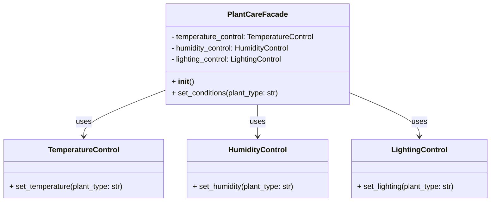

## Львівський Національний Університет Природокористування

## Кафедра Інформаційних систем та Технологій

### Звіт про виконання лабораторної роботи №12

# "Структурні шаблони проєктування"

| Виконав: студент групи КН-31 Фартушок Юрій |
|--------------------------------------------|
| Перевірив: Татомир Андрій Володимирович    |

**Мета роботи: Познайомитися з групою структурних шаблонів
проєктування..**

**Завдання:**

1. Дати теоретичний опис структурної групи шаблонів.
2. Відповідно до індивідуального завдання:
    - дати теоретичний опис даного шаблону;
    - навести приклад коду який
      реалізовує даний шаблон;
    - скласти його UML-діаграму.

**Структурні шаблони проектування** — визначають, як компонувати класи та об'єкти для
створення більш складних структур. Вони допомагають організувати ієрархії та взаємодії між об'єктами, забезпечуючи
гнучкість, повторне використання та зниження складності.

**Теоретичний опис патерна Фасад:**

Патерн "Фасад" - надає спрощений інтерфейс для складної системи, приховуючи її внутрішню реалізацію. Це дозволяє
зменшити
складність використання системи, надаючи лише необхідні функції для користувача.

**Структурні патерни проектування:**

- Adapter (Адаптер): Дає змогу об’єктам із несумісними інтерфейсами працювати разом.

- Bridge (Міст): Розділяє один або кілька класів на дві окремі ієрархії — абстракцію та реалізацію, дозволяючи змінювати
  код в одній гілці класів, незалежно від іншої.

- Composite (Компонувальник): Дає змогу згрупувати декілька об'єктів у деревоподібну структуру, а потім працювати з нею
  так, ніби це одиничний об'єкт.

- Decorator (Декоратор): Дає змогу динамічно додавати об'єктам нову функціональність, загортаючи їх у корисні
  «обгортки».

- Facade (Фасад): Надає простий інтерфейс до складної системи класів, бібліотеки або фреймворку.

- Flyweight (Легковаговик): Дає змогу вмістити більшу кількість об'єктів у відведеній оперативній пам'яті. Легковаговик
  заощаджує пам'ять, розподіляючи спільний стан об'єктів між собою, замість зберігання однакових даних у кожному
  об'єкті.

- Proxy (Замісник): Дає змогу підставляти замість реальних об'єктів спеціальні об'єкти-замінники. Ці об'єкти
  перехоплюють виклики до оригінального об'єкта, дозволяючи зробити щось до чи після передачі виклику оригіналові.

**Приклад коду який реалізовує шаблон Фасад:**
[Реалізація шаблону](main.py)

**Опис програми**

1. Класи для окремих підсистем:
   TemperatureControl: відповідає за налаштування температури для конкретного типу рослин.
   HumidityControl: регулює рівень вологості для рослин.
   LightingControl: налаштовує освітлення для рослин. У кожному класі є метод, який визначає налаштування параметра
   залежно
   від типу рослини (apple, cactus або інші).

2. Клас PlantCareFacade:
   Реалізує фасад, що об'єднує роботу всіх підсистем (температури, вологості, освітлення) в одному місці.
   Має метод set_conditions(plant_type), який викликає відповідні методи підсистем для комплексного налаштування умов.

3. Клієнтський код:
   Використовує лише фасад (PlantCareFacade) для налаштування умов догляду за рослинами.
   Для кожного типу рослин (apple, cactus, other) викликається метод set_conditions, який автоматично налаштовує всі
   параметри.

Переваги:

- Спрощення використання складної системи через єдиний інтерфейс.
- Зменшення залежності клієнта від деталей реалізації підсистем.

---

### Висновок

Отже, структурні шаблони проектування спрощують організацію взаємодії між об'єктами, роблячи системи більш зрозумілими,
масштабованими та повторно використовуваними. Шаблон "Фасад" забезпечує єдиний інтерфейс для взаємодії зі складною
системою, приховуючи її внутрішню реалізацію та
зменшуючи складність використання.

---
