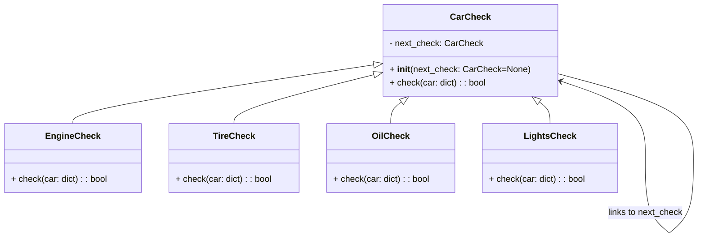

## Львівський Національний Університет Природокористування

## Кафедра Інформаційних систем та Технологій

### Звіт про виконання лабораторної роботи №13

# "Поведінкові шаблони проєктування"

| Виконав: студент групи КН-31 Фартушок Юрій |
|--------------------------------------------|
| Перевірив: Татомир Андрій Володимирович    |

**Мета роботи: Познайомитися з групою поведінкових шаблонів проєктування.**

**Завдання:**

1. Дати теоретичний опис поведінкової групи шаблонів.
2. Відповідно до індивідуального завдання:
    - дати теоретичний опис даного шаблону;
    - навести приклад коду який
      реалізовує даний шаблон;
    - скласти його UML-діаграму.

**Поведінкові шаблони проектування** — це шаблони, які визначають алгоритми та способи взаємодії між об'єктами,
розподіляючи відповідальність і спрощуючи комунікацію. Вони дозволяють змінювати поведінку системи без зміни її
структури, полегшують управління складною логікою та роблять код більш зрозумілим і гнучким.

**Теоретичний опис патерна Ланцюжок обов'язків:**

Ланцюжок обов’язків — це поведінковий патерн проектування, що дає змогу передавати запити послідовно ланцюжком
обробників. Кожен наступний обробник вирішує, чи може він обробити запит сам і чи варто передавати запит далі ланцюжком.

**Поведінкові патерни проектування:**

- Ланцюжок обов'язків (Chain of Responsibility) - дає змогу передавати запити послідовно ланцюжком обробників. Кожен
  наступний обробник вирішує, чи може він обробити запит сам і чи варто передавати запит далі ланцюжком.
- Команда (Command) - перетворює запити на об'єкти, дозволяючи передавати їх як аргументи під час виклику методів,
  ставити запити в чергу,
  логувати їх, а також підтримувати скасування операцій.
- Ітератор (Iterator) - дає змогу послідовно обходити елементи складових об'єктів, не розкриваючи їхньої внутрішньої
  організації.
- Посередник (Mediator) - дає змогу зменшити зв'язаність великої кількості класів між собою, завдяки переміщенню цих
  зв'язків до одного
  класу-посередника.
- Знімок (Memento) - дає змогу зберігати та відновлювати минулий стан об'єктів, не розкриваючи подробиць їхньої
  реалізації.
- Спостерігач (Observer) - створює механізм підписки, що дає змогу одним об’єктам стежити й реагувати на події, які
  відбуваються в інших
  об’єктах.
- Стан (State) - дає змогу об'єктам змінювати поведінку в залежності від їхнього стану. Ззовні створюється враження,
  ніби змінився клас
  об'єкта.
- Стратегія (Strategy) - изначає сімейство схожих алгоритмів і розміщує кожен з них у власному класі. Після цього
  алгоритми можна заміняти
  один на інший прямо під час виконання програми.
- Шаблонний метод (Template Method) - визначає кістяк алгоритму, перекладаючи відповідальність за деякі його кроки на
  підкласи. Патерн дозволяє підкласам
  перевизначати кроки алгоритму, не змінюючи його загальної структури.
- Відвідувач (Visitor) - дає змогу додавати до програми нові операції, не змінюючи класи об'єктів, над якими ці операції
  можуть виконуватися.

**Приклад коду який реалізовує шаблон Команда:**
[Реалізація шаблону](main.py)

**Опис програми**

Цей код реалізує патерн "Ланцюг відповідальностей" для перевірки стану автомобіля перед поїздкою.

1. Базовий клас CarCheck:
   Містить посилання на наступну перевірку в ланцюгу (next_check).
   Метод check передає обробку до наступного елемента ланцюга, якщо він існує.

2. Конкретні перевірки:
   EngineCheck перевіряє стан двигуна.
   TireCheck перевіряє стан шин.
   OilCheck перевіряє рівень масла.
   LightsCheck перевіряє справність ліхтарів. Кожна перевірка виконує свою логіку і передає управління далі в ланцюгу,
   якщо
   перевірка пройдена.

3. Ланцюг перевірок:
   Ланцюг будується шляхом передавання посилань на наступні перевірки під час ініціалізації (наприклад, EngineCheck ->
   TireCheck -> OilCheck -> LightsCheck).

4. Дані про автомобіль:
   У вигляді словника передаються параметри стану автомобіля (engine, tires, oil, lights).

5. Результат:
   Якщо всі перевірки пройдені, автомобіль готовий до поїздки.
   Якщо будь-яка з перевірок провалена, автомобіль не готовий.

---

### Висновок

Отже, поведінкові патерни проектування забезпечують ефективну взаємодію між об'єктами та визначають алгоритми їхньої
співпраці, роблячи систему більш гнучкою та легкою для підтримки.
Патерн "Ланцюжок обов'язків" дозволяє передавати запити послідовно через ланцюг обробників до тих пір, поки один із них
не виконає потрібну дію. Це зменшує зв'язність між об'єктами та спрощує додавання нових обробників.

---
