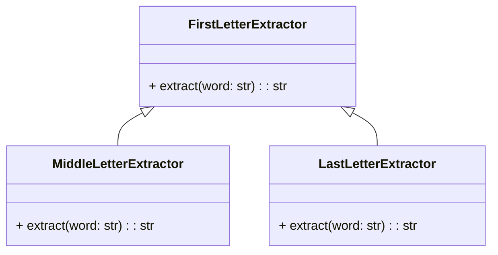

## Львівський Національний Університет Природокористування

## Кафедра Інформаційних систем та Технологій

### Звіт про виконання лабораторної роботи №14

# "Принципи проєктування програмного забезпечення"

| Виконав: студент групи КН-31 Фартушок Юрій |
|--------------------------------------------|
| Перевірив: Татомир Андрій Володимирович    |

**Мета роботи: познайомитися з найбільш поширеними сучасними
принципами проєктування програмного забезпечення.**

**Завдання:**

1. Дати загальний опис принципів проєктування.
2. Дати детальний опис одного із принципів SOLID з наведення прикладу
   коду.

**Принципи проєктування** — це набір рекомендацій і найкращих практик, які допомагають створювати ефективні, зрозумілі,
масштабовані та підтримувані програмні системи. Вони включають принципи, такі як SOLID, DRY, KISS та інші, що сприяють
досягненню якості коду та зручності його розвитку.

**Принципи SOLID**

- **Single Responsibility Principle** (Принцип єдиної відповідальності) - ніколи не повинно бути більше однієї причини
  змінити клас.

- **Open Closed Principle** (Принцип відкритості/закритості) - програмні сутності (класи, модулі, функції тощо) мають
  бути відкриті розширення, але закриті зміни.

- **Liskov's Substitution Principle** (Принцип підстановки Барбари Лисков) - об'єкти у програмі можна замінити їх
  спадкоємцями без зміни властивостей програми.

- **Interface Segregation Principle** (Принцип розподілу інтерфейсу) - клієнти повинні бути змушені реалізовувати
  методи, які вони використовуватимуть.

- **Dependency Inversion Principle** (Принцип інверсії залежностей) - залежності всередині системи будуються на основі
  абстракцій.

**Приклад коду який реалізовує Принцип єдиного обов'язку(Single Responsibility Principle):**
[Реалізація принципу Single Responsibility Principle](main.py)

**Опис програми**
Ця програма містить три класи для вилучення різних літер із слова:

1. FirstLetterExtractor: цей клас містить метод extract, який повертає першу літеру слова. Якщо слово порожнє, метод
   повертає None.

2. MiddleLetterExtractor: цей клас також має метод extract, який обчислює середину слова:
   Якщо кількість літер у слові непарна, метод повертає одну середню літеру.
   Якщо кількість літер парна, метод повертає дві середні літери.

3. LastLetterExtractor: цей клас містить метод extract, який повертає останню літеру слова. Якщо слово порожнє, метод
   повертає None.

Програма на прикладі слова "cat" використовує ці класи для вилучення першої, середньої та останньої літери. Результат
виводиться на екран у вигляді повідомлень:

Перша буква: c
Середня буква: a
Остання буква: t

---

### Висновок

Отже, SOLID — це набір з п'яти принципів для об'єктно-орієнтованого програмування, що допомагають створювати гнучкий,
масштабований і легко підтримуваний код. Single Responsibility Principle (SRP) стверджує, що кожен клас повинен мати
тільки одну причину для змін. Це робить код більш зрозумілим, легким для тестування та підтримки.

---
