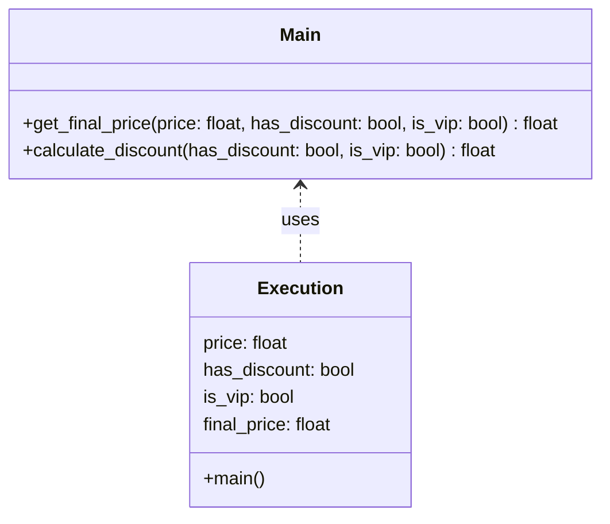

## Львівський Національний Університет Природокористування

## Кафедра Інформаційних систем та Технологій

### Звіт про виконання лабораторної роботи №15

# "Рефакторинг програмного забезпечення"

| Виконав: студент групи КН-31 Фартушок Юрій |
|--------------------------------------------|
| Перевірив: Татомир Андрій Володимирович    |

**Мета роботи: познайомитися з основними принципами та найбільш
поширеними техніками рефакторингу програмного забезпечення.**

**Завдання:**

1. Дати загальний опис принципів рефакторингу.
2. Ознайомитися із основними техніками рефакторингу.
3. Познайомитися із поняттям “запахів коду”.

**Рефакторинг** - це процес покращення структури коду без зміни його функціональності. Він включає
спрощення логіки, видалення дублювання, розбиття великих функцій на менші та підвищення читабельності. Основна мета —
зробити код більш зрозумілим, гнучким і простим для підтримки.

**Основні принципи рефакторингу**

Основні принципи рефакторингу:

- DRY (Don't Repeat Yourself): Уникайте дублювання коду, виділяючи повторювану логіку в окремі методи чи функції.
- KISS (Keep It Simple, Stupid): Спрощуйте код, уникаючи надмірно складних рішень.
- Single Responsibility: Кожна функція, клас чи метод має виконувати лише одну чітку задачу.
- Consolidation: Об'єднуйте подібні умови або логіку для зменшення розгалужень.
- Readable Code: Робіть код зрозумілим для людей — використовуйте зрозумілі назви змінних, функцій та структур.
- Тестування після змін: Після кожної зміни перевіряйте, чи програма працює так само, як і раніше.

Ці принципи допомагають зробити код чистішим, простішим і легшим для підтримки.

**Практики рефакторингу**

- виділення методів, які можна повторно використовувати і легко змінювати;
- об’єднання коду, що дублюється;
- поліпшення іменування змінних;
- усунення складних умов і впровадження простих алгоритмів;
- поліпшення структури даних, реструктуризація і заміна;
- поділ відповідальності окремих класів і функцій.

**Основні техніки рефакторингу**

- Перейменування (Rename): зміна назв змінних, класів чи методів для підвищення зрозумілості.
- Розбиття великих методів (Extract Method): виділення частин методу в окремі менші методи.
- Видалення дублювання (DRY — Don’t Repeat Yourself): перенесення однакових блоків коду в спільні методи чи класи.
- Інкапсуляція (Encapsulation): обмеження прямого доступу до даних, використання гетера/сетера.
- Заміна умов на поліморфізм: заміна умовних конструкцій (if-else) на виклик методів з класів-нащадків.
- Заміна магічних чисел (Magic Numbers): винесення числових значень у константи чи конфігураційні файли.

**Запахи коду** — (Code Smells) це ознаки потенційних проблем у коді, які не є помилками, але можуть
ускладнювати його читання, підтримку чи розширення.

**Типові приклади запахів коду**

1. Дубльований код

2. Довгі методи

3. Довгі класи

4. Занадто багато параметрів

5. Зайві залежності

6. Складні умовні оператори

**Приклад коду, який показує процес рефакторингу**
[Рефакторинг](main.py)

---

### Висновок

Отже, я вивчив та використав на практиці такі поняття, як рефакторинг коду та запахи коду. Рефакторинг — це процес
покращення структури коду без зміни його поведінки. Він підвищує читабельність, полегшує підтримку та зменшує ризик
появи помилок у майбутньому. Запахи коду — це ознаки, які вказують на потенційні проблеми в коді, навіть якщо він працює
правильно. Ось приклади запахів коду: дублювання коду, довгі методи, складні умови, зайві залежності. Отже, Рефакторинг
усуває ці "запахи", роблячи код більш чистим та ефективним.

---
