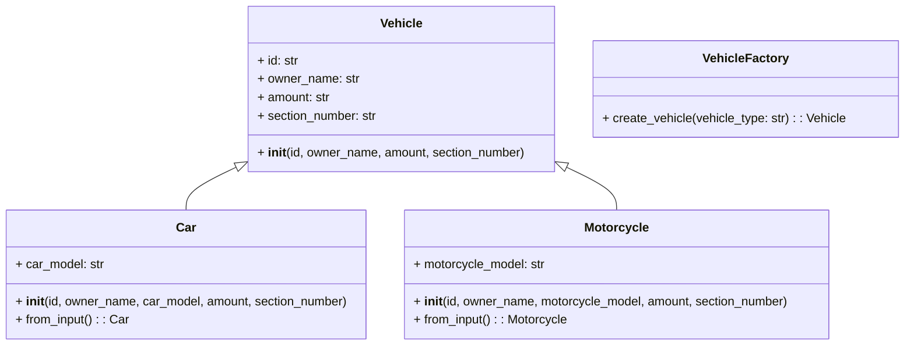

## Львівський Національний Університе Природокористування
## Кафедра інформаційних систем та технологій

### Звіт про виконання лабораторної роботи №1
# "Твірні шаблони проєктування"

| Виконав: Студент групи : Кн-31 Ладанай Андрій |
|-----------------------------------------------|
| Перевірив: Татомир Андрій Володимирович       |

Студента групи : Кн-31 Ладаная Андрія

**Мета: ознайомитись з породжувальними патернами ,а саме з фабричним методом.**

## Що таке патерн проектування

Патерн проектування — це загальновживане рішення для часто зустрічаючих проблем у розробці програмного забезпечення. Це не готовий код, а швидше шаблон, який можна використовувати для розв’язання певних задач в архітектурі програми. Патерни проектування допомагають підвищити якість коду, зменшити складність та полегшити його супроводження, сприяючи кращій структурі та організації коду.

## Що таке фабричний патерн

Фабричний патерн (Factory Pattern) є одним із найвідоміших патернів проектування, що належить до категорії патернів створення. Він використовується для створення об’єктів без необхідності вказувати точний клас, який буде створений. Замість цього, фабричний патерн делегує відповідальність за створення об'єктів спеціалізованій фабричній класи, що забезпечує більшу гнучкість у додатку та дозволяє легко додавати нові класи без модифікації існуючого коду.

## Опис програми

У представленій програмі реалізовано два класи транспортних засобів: `Car` і `Motorcycle`, які успадковуються від базового класу `Vehicle`. Клас `VehicleFactory` відповідає за створення об’єктів `Car` або `Motorcycle` на основі введення користувача. 

**Проблема, з якою я стикнувся:** 
При створенні програми для реєстрації транспортних засобів виникла потреба в гнучкій структурі, яка дозволяла б легко додавати нові типи транспортних засобів без змін у вже існуючому коді. 

**Рішення:** 
Використання фабричного патерну дозволило зосередитися на створенні об'єктів транспортних засобів, не турбуючись про деталі їхньої ініціалізації. Користувач вводить тип транспортного засобу, а програма автоматично створює відповідний об'єкт.
[Виконання задачі](fabric.py)

## Висновок

При вивченні патернів проектування, зокрема фабричного патерну, я дізнався про важливість абстракції та інкапсуляції у створенні об'єктів. Це дозволяє значно спростити процес розробки та зменшити ризик помилок при внесенні змін у код. Фабричний патерн став не лише корисним інструментом для реалізації моєї програми, але й відкрив нові горизонти для подальшого навчання та вдосконалення в проектуванні програмного забезпечення. Зрозумів, наскільки важливо обирати правильні патерни для ефективного вирішення специфічних задач у програмуванні.
