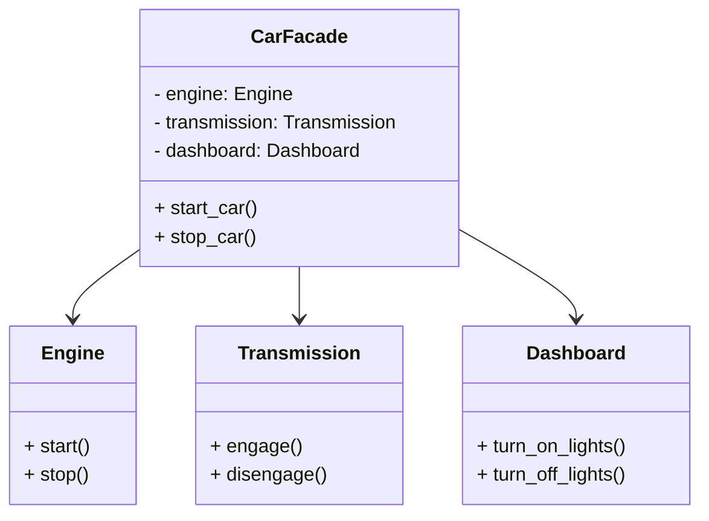

## Львівський Національний Університе Природокористування
## Кафедра інформаційних систем та технологій

### Звіт про виконання лабораторної роботи №2
# "Структурні шаблони проєктування"

| Виконав: Студент групи : Кн-31 Ладанай Андрій |
|-----------------------------------------------|
| Перевірив: Татомир Андрій Володимирович       |

**Мета: ознайомитись з структурними патернами ,а саме з фасадним методом.**

## Що таке патерн проектування

Патерн проектування — це узагальнене рішення для часто зустрічаючих проблем у розробці програмного забезпечення. Він представляє собою шаблон, який допомагає структурувати код, робити його зрозумілішим і легшим у супроводженні. Використання патернів дозволяє знижувати складність програмних систем та полегшує співпрацю між розробниками.

## Що таке фасадний патерн

Фасадний патерн (Facade Pattern) — це структурний патерн проектування, який надає спрощений інтерфейс до складних систем або наборів підсистем. Фасад приховує складність системи, дозволяючи користувачеві взаємодіяти з нею через простий і зрозумілий інтерфейс. Це знижує кількість взаємодій з підсистемами, роблячи систему більш доступною та легкою для використання.

## Опис програми

У представленій програмі реалізовано систему, що моделює процес управління автомобілем. Використано фасадний патерн для спрощення взаємодії з трьома підсистемами: `Engine`, `Transmission` і `Dashboard`.

**Проблема, з якою я стикнувся:**
Користувачам було складно взаємодіяти з різними компонентами автомобіля, оскільки кожен з них вимагав окремих викликів методів, що ускладнювало управління.

**Рішення:**
Завдяки впровадженню фасадного патерну було створено клас `CarFacade`, який надає прості методи `start_car` і `stop_car`. Ці методи автоматично обробляють взаємодію з усіма підсистемами, дозволяючи користувачеві запускати або зупиняти автомобіль за допомогою одного виклику.
[Виконання задачі](lab2.py)

## Висновок

При вивченні фасадного патерну я зрозумів, як важливо спрощувати взаємодію з комплексними системами. Використання фасадного патерну не лише полегшило управління автомобілем у моїй програмі, але й продемонструвало, як можна приховати складність, зберігаючи при цьому всю функціональність. Я дізнався, що хороша архітектура може значно підвищити зручність використання програмного забезпечення, і це знання стане в пригоді в майбутній розробці.
