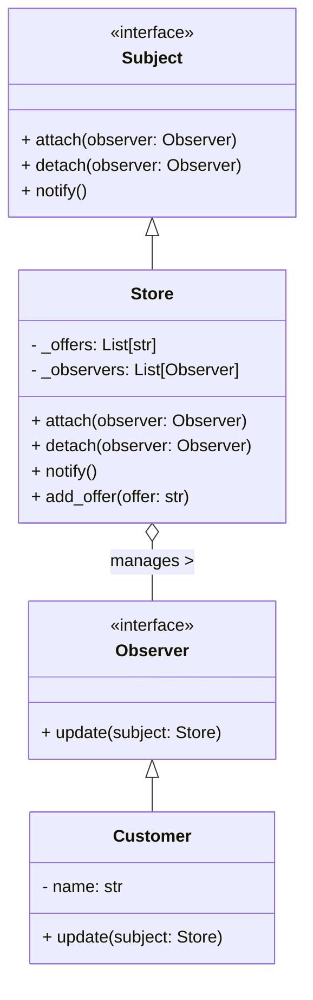

## Львівський Національний Університе Природокористування
## Кафедра інформаційних систем та технологій

### Звіт про виконання лабораторної роботи №3
# "Поведінкові шаблони проєктування"

| Виконав: Студент групи : Кн-31 Ладанай Андрій |
|-----------------------------------------------|
| Перевірив: Татомир Андрій Володимирович       |

Студента групи : Кн-31 Ладаная Андрія

**Мета: ознайомитись з поведінковими патернами ,а саме з методом Спостерігач.**

## Що таке патерн проектування

Патерн проектування — це загальновживане рішення для часто зустрічаючих проблем у розробці програмного забезпечення. Це шаблон, який допомагає структурувати код, робити його більш зрозумілим і легшим для супроводження. Використання патернів проектування підвищує якість коду, знижує його складність і сприяє кращій співпраці між розробниками.

## Що таке патерн "Спостерігач"

Патерн "Спостерігач" (Observer Pattern) є одним із патернів поведінки, що дозволяє створити зв'язок один-до-багатьох між об'єктами. Це означає, що коли один об'єкт (суб'єкт) змінює свій стан, всі його підписники (спостерігачі) автоматично отримують повідомлення про цю зміну. Патерн корисний у ситуаціях, коли важливо зберігати актуальність даних у різних компонентах програми без прямої залежності між ними.

## Опис програми

У представленій програмі реалізовано патерн "Спостерігач" для моделювання системи магазинів, які сповіщають клієнтів про нові акції. Клас `Store` реалізує інтерфейс `Subject`, а клієнти (`Customer`) реалізують інтерфейс `Observer`. Коли магазин додає нову акцію, він сповіщає всіх підписаних клієнтів про цю зміну.

**Проблема, з якою я стикнувся:**
Основною проблемою було управління інформацією про акції в магазині та своєчасне сповіщення клієнтів про нові пропозиції. Якщо акції змінювалися, клієнти повинні були бути в курсі без необхідності перевіряти магазин вручну.

**Рішення:**
Використання патерну "Спостерігач" дозволило автоматизувати процес сповіщення клієнтів. Коли в магазині додається нова акція, усі підписані клієнти отримують повідомлення без додаткових запитів.
[Виконання задачі](lab2.py)

## Висновок

При вивченні патерну "Спостерігач" я дізнався про важливість створення гнучких архітектур, що дозволяють зменшити зв'язність між компонентами програми. Патерн "Спостерігач" демонструє, як можна автоматично оновлювати дані в різних частинах системи, що спрощує підтримку та розвиток програмного забезпечення. Це знання стане в пригоді для подальшого вдосконалення в проектуванні програмного забезпечення, особливо в контексті створення більш динамічних і адаптивних систем.
