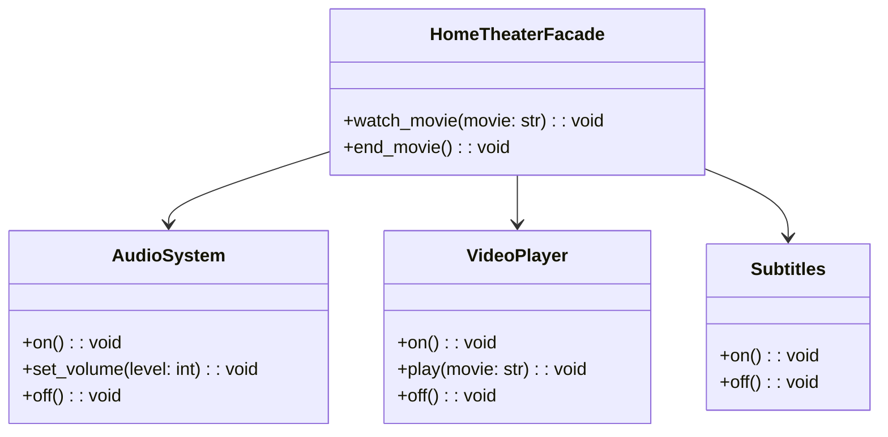

## Львівський Національний Університет Природокористування
## Кафедра Інформаційних систем та Технологій

### Звіт про виконання лабораторної роботи №2
# "Структурні шаблони проєктування"

| Виконав: студент групи КН-31 Халюк Денис |
|------------------------------------------|
| Перевірив: Татомир Андрій                |

**Мета: Познайомитися з групою структурних шаблонів**

Хід роботи

1. Дати теоретичний опис структурні групи шаблонів.
2. Дати теоретичний опис вибраного шаблону.
3. Навести приклад коду який реалізовує даний шаблон.
4. Скласти його UML-діаграму.

Структурні патерни проектування - це шаблони які відповідають за побудову зручних в підтримці ієрархій класів.

**Існують такі структурні патерни проєктування:**

- Адаптер — це структурний патерн проєктування, що дає змогу об’єктам із несумісними інтерфейсами працювати разом.

- Міст — це структурний патерн проєктування, який розділяє один або кілька класів на дві окремі ієрархії — абстракцію та реалізацію, дозволяючи змінювати код в одній гілці класів, незалежно від іншої.

- Компонувальник — це структурний патерн проєктування, що дає змогу згрупувати декілька об’єктів у деревоподібну структуру, а потім працювати з нею так, ніби це одиничний об’єкт.

- Легковаговик — це структурний патерн проєктування, що дає змогу вмістити більшу кількість об’єктів у відведеній оперативній пам’яті. Легковаговик заощаджує пам’ять, розподіляючи спільний стан об’єктів між собою, замість зберігання однакових даних у кожному об’єкті.

- Замісник — це структурний патерн проєктування, що дає змогу підставляти замість реальних об’єктів спеціальні об’єкти-замінники. Ці об’єкти перехоплюють виклики до оригінального об’єкта, дозволяючи зробити щось до чи після передачі виклику оригіналові.

- Декоратор — це структурний патерн проектування, що дає змогу динамічно додавати об’єктам нову функціональність, загортаючи їх у корисні «обгортки».

- Фасад — це структурний патерн проектування, який надає простий інтерфейс до складної системи класів, бібліотеки або фреймворку.

**Для чого використовують шаблони проєктування:**

- На відміну від готових функцій чи бібліотек, патерн не можна просто взяти й скопіювати в програму. Патерн являє собою не якийсь конкретний код, а загальний принцип вирішення певної проблеми, який майже завжди треба підлаштовувати для потреб тієї чи іншої програми.

- Патерни часто плутають з алгоритмами, адже обидва поняття описують типові рішення відомих проблем. Але якщо алгоритм — це чіткий набір дій, то патерн — це високорівневий опис рішення, реалізація якого може відрізнятися у двох різних програмах.

- Якщо провести аналогії, то алгоритм — це кулінарний рецепт з чіткими кроками, а патерн — інженерне креслення, на якому намальовано рішення без конкретних кроків його отримання.

**Опис коду у файлі Lab_12:**

Є кілька окремих компонентів: клас AudioSystem відповідає за аудіосистему, VideoPlayer — за відеоплеєр, а Subtitles — за субтитри. Кожен із цих класів має свої методи для увімкнення, налаштування та вимкнення відповідних пристроїв.

Клас HomeTheaterFacade об'єднує ці компоненти та надає спрощений інтерфейс для роботи з ними. У ньому є методи watch_movie(movie), який виконує всі необхідні кроки для початку перегляду фільму (увімкнення аудіосистеми, встановлення гучності, увімкнення відеоплеєра і субтитрів), та end_movie(), який завершує перегляд, вимикаючи всі пристрої.

Таким чином, клієнтський код, який використовує домашній кінотеатр, не працює безпосередньо з кожним окремим компонентом (аудіо, відео, субтитри), а звертається до фасаду, що значно спрощує взаємодію з системою. Це дозволяє легко додавати нові функції або змінювати внутрішню логіку без впливу на клієнтський код.

**Переваги цього підходу:**

Спрощений інтерфейс: Фасад надає спрощений доступ до складної підсистеми, що дозволяє клієнтам працювати з нею, не заглиблюючись у всі деталі.
Ізоляція клієнтського коду: Клієнтський код ізольований від складнощів та змін у внутрішніх компонентах системи. Якщо внутрішня структура зміниться, потрібно буде змінити лише фасад, а не кожен клієнтський клас.
Зручність використання: Фасад полегшує використання складних підсистем, приховуючи багато деталей реалізації та об’єднуючи їх у логічні дії (наприклад, watch_movie).

**Недоліки:**

Обмеження можливостей: У деяких випадках фасад може обмежити можливості доступу до всіх функцій окремих компонентів, якщо не передбачено шляхів для їх використання поза фасадом.
Надмірне використання: Якщо фасад реалізовано без реальної потреби, він може додати зайвий рівень абстракції та ускладнити систему, коли пряма взаємодія з компонентами була б простішою.

---

### Висновок
На цій лабораторній роботі я ознайомився з принципами роботи структурних шаблонів проєктування, зокрема, з патерном Фасад. На практиці я засвоїв, як спростити взаємодію зі складними підсистемами за допомогою фасаду, об'єднуючи їх у єдиний інтерфейс. Також я розібрався з перевагами та недоліками цього підходу, що дозволяє приховати складні деталі реалізації та полегшити підтримку коду.

---
