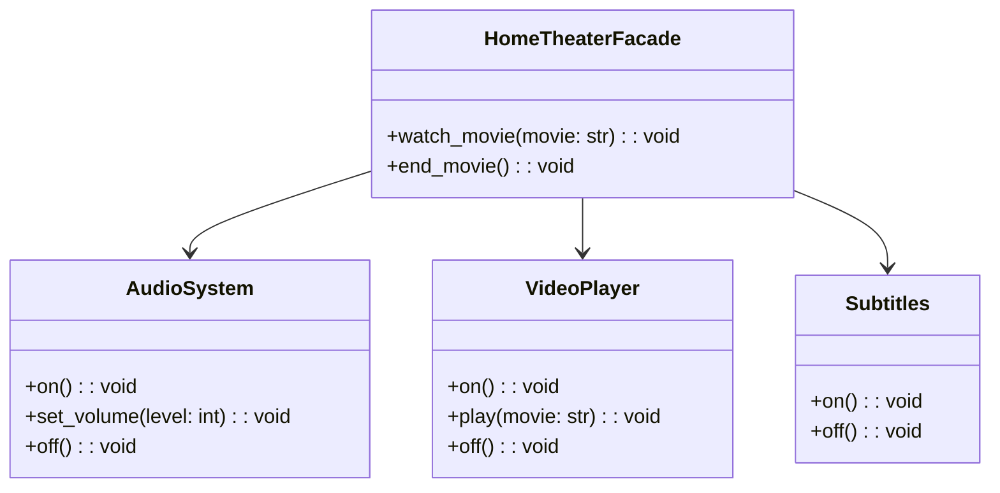

## Львівський Національний Університет Природокористування
## Кафедра Інформаційних систем та Технологій

### Звіт про виконання лабораторної роботи №3
# "Структурні шаблони проєктування"

| Виконав: студент групи КН-31 Халюк Денис |
|------------------------------------------|
| Перевірив: Татомир Андрій                |

**Мета: Познайомитися з групою структурних шаблонів**

Хід роботи

1. Дати теоретичний опис структурні групи шаблонів.
2. Дати теоретичний опис вибраного шаблону.
3. Навести приклад коду який реалізовує даний шаблон.
4. Скласти його UML-діаграму.

Структурні патерни проектування - це шаблони які відповідають за побудову зручних в підтримці ієрархій класів.

**Існують такі структурні патерни проєктування:**

- Адаптер — це структурний патерн проєктування, що дає змогу об’єктам із несумісними інтерфейсами працювати разом.

- Ланцюжок обов’язків — це поведінковий патерн проектування, що дає змогу передавати запити послідовно ланцюжком обробників. Кожен наступний обробник вирішує, чи може він обробити запит сам і чи варто передавати запит далі ланцюжком.

- Міст — це структурний патерн проєктування, який розділяє один або кілька класів на дві окремі ієрархії — абстракцію та реалізацію, дозволяючи змінювати код в одній гілці класів, незалежно від іншої.

- Команда — це поведінковий патерн проектування, який перетворює запити на об’єкти, дозволяючи передавати їх як аргументи під час виклику методів, ставити запити в чергу, логувати їх, а також підтримувати скасування операцій.

- Компонувальник — це структурний патерн проєктування, що дає змогу згрупувати декілька об’єктів у деревоподібну структуру, а потім працювати з нею так, ніби це одиничний об’єкт.

- Ітератор — це поведінковий патерн проектування, що дає змогу послідовно обходити елементи складових об’єктів, не розкриваючи їхньої внутрішньої організації.

- Посередник — це поведінковий патерн проектування, що дає змогу зменшити зв’язаність великої кількості класів між собою, завдяки переміщенню цих зв’язків до одного класу-посередника.

- Знімок — це поведінковий патерн проектування, що дає змогу зберігати та відновлювати минулий стан об’єктів, не розкриваючи подробиць їхньої реалізації.

- Легковаговик — це структурний патерн проєктування, що дає змогу вмістити більшу кількість об’єктів у відведеній оперативній пам’яті. Легковаговик заощаджує пам’ять, розподіляючи спільний стан об’єктів між собою, замість зберігання однакових даних у кожному об’єкті.

- Спостерігач — це поведінковий патерн проектування, який створює механізм підписки, що дає змогу одним об’єктам стежити й реагувати на події, які відбуваються в інших об’єктах.

- Замісник — це структурний патерн проєктування, що дає змогу підставляти замість реальних об’єктів спеціальні об’єкти-замінники. Ці об’єкти перехоплюють виклики до оригінального об’єкта, дозволяючи зробити щось до чи після передачі виклику оригіналові.

- Стан — це поведінковий патерн проектування, що дає змогу об’єктам змінювати поведінку в залежності від їхнього стану. Ззовні створюється враження, ніби змінився клас об’єкта.

- Стратегія — це поведінковий патерн проектування, який визначає сімейство схожих алгоритмів і розміщує кожен з них у власному класі. Після цього алгоритми можна заміняти один на інший прямо під час виконання програми.

- Шаблонний метод — це поведінковий патерн проектування, який визначає кістяк алгоритму, перекладаючи відповідальність за деякі його кроки на підкласи. Патерн дозволяє підкласам перевизначати кроки алгоритму, не змінюючи його загальної структури.

- Відвідувач — це поведінковий патерн проектування, що дає змогу додавати до програми нові операції, не змінюючи класи об’єктів, над якими ці операції можуть виконуватися.

**Для чого використовують шаблони проєктування:**

- На відміну від готових функцій чи бібліотек, патерн не можна просто взяти й скопіювати в програму. Патерн являє собою не якийсь конкретний код, а загальний принцип вирішення певної проблеми, який майже завжди треба підлаштовувати для потреб тієї чи іншої програми.

- Патерни часто плутають з алгоритмами, адже обидва поняття описують типові рішення відомих проблем. Але якщо алгоритм — це чіткий набір дій, то патерн — це високорівневий опис рішення, реалізація якого може відрізнятися у двох різних програмах.

- Якщо провести аналогії, то алгоритм — це кулінарний рецепт з чіткими кроками, а патерн — інженерне креслення, на якому намальовано рішення без конкретних кроків його отримання.

**Опис коду у файлі Lab_13:**

Клас AudioSystem: Відповідає за управління аудіосистемою.
- Метод on: Увімкнення аудіосистеми.
- Метод set_volume: Налаштування гучності.
- Метод off: Вимкнення аудіосистеми.

Клас Observer: Визначає інтерфейс для спостерігачів, які повинні реалізувати метод update(), що приймає температуру.

Клас VideoPlayer: Відповідає за управління відеоплеєром.
- Метод on: Увімкнення відеоплеєра.
- Метод play: Відтворення фільму.
- Метод off: Вимкнення відеоплеєра.

Клас WeatherStation: Відповідає за управління списком спостерігачів та їх сповіщенням про зміни температури.
- Метод register_observer: Додає нового спостерігача до списку.
- Метод remove_observer: Видаляє спостерігача зі списку.
- Метод set_temperature: Задає нове значення температури та сповіщає всіх зареєстрованих спостерігачів.
- Метод notify_observers: Сповіщає всіх спостерігачів про зміни температури, викликаючи їх метод update().
  
Клас Subtitles: Відповідає за керування субтитрами.
- Метод on: Увімкнення субтитрів.
- Метод off: Вимкнення субтитрів.
  
Клас TemperatureDisplay: Реалізує інтерфейс Observer та відображає температуру на екрані.
- Метод update: Виводить на екран поточну температуру.

Клас HomeTheaterFacade: Фасад для домашнього кінотеатру, який спрощує взаємодію з підсистемами (аудіо, відео та субтитрами).
- Метод watch_movie: Вмикає аудіосистему, відеоплеєр і субтитри для відтворення фільму.
- Метод end_movie: Вимикає всі підсистеми (субтитри, відеоплеєр та аудіосистему).

Клас TemperatureAlert: Реалізує інтерфейс Observer та реагує на зміни температури.
- Метод update: Перевіряє, чи температура перевищує 30°C, і, якщо так, видає попередження.

Використання:
- У головному блоці коду створюється об'єкт WeatherStation, а також два спостерігачі: TemperatureDisplay і TemperatureAlert.
- Спостерігачі реєструються в WeatherStation.
- Зміни температури у WeatherStation призводять до сповіщення спостерігачів, які виконують відповідні дії.

**Переваги цього підходу:**

Можливість легко додавати нові спостерігачі без зміни суб'єкта.
Зменшує зв'язність між компонентами.

**Можливі розширення:**

Реалізувати різні типи спостерігачів для різних функцій, наприклад, спостерігачі для вологості, тиску або прогнозу погоди, які реагують на зміни в інших параметрах.
Додати можливість відкладеного сповіщення спостерігачів, щоб вони могли отримувати дані не відразу, а через певний проміжок часу, що може бути корисним у випадках, коли дані часто змінюються.
Реалізувати можливість зберігання історії температури в об'єкті WeatherStation, щоб спостерігачі могли отримувати не лише останнє значення, а й історичні дані.

---

### Висновок
На даній лабораторній роботі я навчився принципам роботи з поведінковими патернами проектування, зокрема, з патерном **Спостерігач**. На практиці я засвоїв, як використовувати ітератори для послідовного доступу до елементів складних структур даних, а також розібрався з їх перевагами та недоліками.

---

