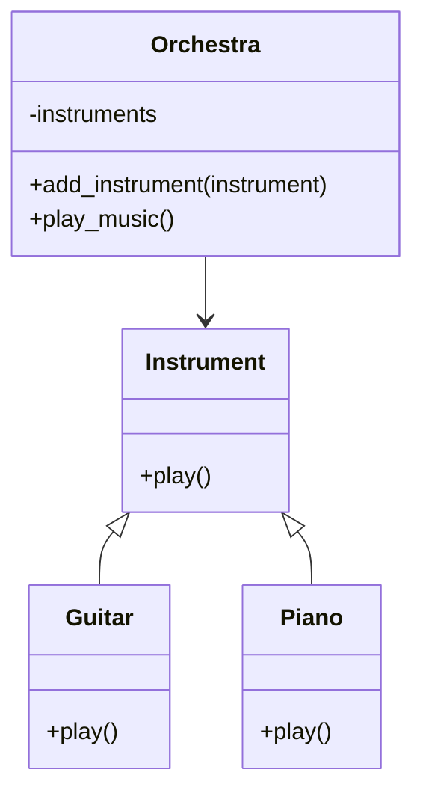

# Львівський Національний Університет Природокористування

## Кафедра Інформаційних систем та Технологій

### Звіт про виконання лабораторної роботи №14

### Тема: "Принципи проєктування програмного забезпечення"

| Виконав: студент групи КН-31 Халюк Денис |  
| -----------------------------------------|  
| Перевірив: Татомир Андрій                |  

### Мета

Познайомитися з найбільш поширеними сучасними принципами проєктування програмного забезпечення.

### Хід роботи

1. Теоретичний опис принципів проєктування.

2. Теоретичний опис вибраного принципу проєктування.

3. Приклад коду, що реалізовує вибраний принцип.

4. UML-діаграма для пояснення архітектури.

# SOLID принципи

SOLID - це акронім п'яти основних принципів об'єктно-орієнтованого програмування та проєктування, запропонованих Робертом Мартіном:

1. **S** - Single Responsibility Principle (Принцип єдиної відповідальності)

   - Клас повинен мати лише одну причину для змін

2. **O** - Open/Closed Principle (Принцип відкритості/закритості)

   - Програмні сутності повинні бути відкриті для розширення, але закриті для модифікації

3. **L** - Liskov Substitution Principle (Принцип підстановки Лісков)

   - Об'єкти в програмі можуть бути заміненими їх нащадками без зміни коректності програми

4. **I** - Interface Segregation Principle (Принцип розділення інтерфейсу)

   - Клієнти не повинні залежати від методів, які вони не використовують

5. **D** - Dependency Inversion Principle (Принцип інверсії залежностей)

   - Модулі високого рівня не повинні залежати від модулів нижчого рівня

# Принцип відкритості/закритості (Open/Closed Principle)

## Теоретичний опис

Принцип відкритості/закритості (OCP) стверджує, що програмні сутності (класи, модулі, функції тощо) повинні бути відкриті для розширення, але закриті для модифікації. Це означає, що ми повинні мати можливість додавати нову функціональність без зміни існуючого коду.

### Основні аспекти OCP:

1. **Розширюваність**: Можливість додавати нову функціональність без зміни існуючого коду

2. **Абстракція**: Використання інтерфейсів та абстрактних класів

3. **Поліморфізм**: Можливість використовувати різні реалізації через спільний інтерфейс

## Реалізація принципу

**Опис коду у файлі main.py:**

[Посилання на реалізацію](main.py)

## Реалізація принципу

У цьому простому прикладі OCP реалізований через:

1. Базовий клас `Instrument` з методом `play()`

2. Конкретні класи інструментів (`Guitar`, `Piano`), які перевизначають цей метод

3. Клас `Orchestra`, який працює з будь-яким інструментом через базовий клас

### Переваги такої реалізації:

- Можна легко додавати нові інструменти (наприклад, `Drums`, `Violin`)

- Не потрібно змінювати код `Orchestra` при додаванні нових інструментів

- Код простий для розуміння та розширення

### Висновок

На цій лабораторній роботі я ознайомився з принципами SOLID, зокрема з принципом відкритості/закритості (OCP). Практична реалізація цього принципу допомогла мені зрозуміти важливість проєктування гнучких та розширюваних систем. Використання абстракцій та поліморфізму дозволило створити код, який легко розширюється без необхідності змінювати існуючу функціональність. Такий підхід значно покращує якість коду, полегшує його тестування та подальшу підтримку.